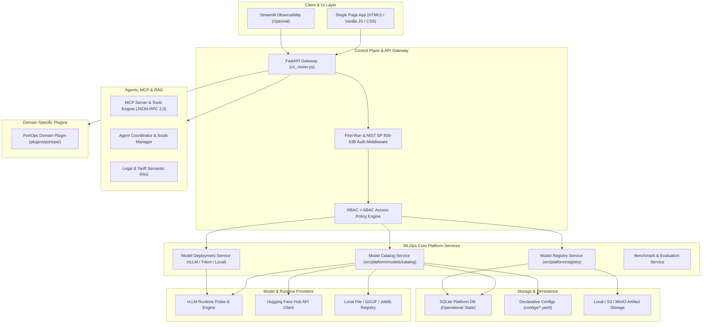

# Architecture Baseline — amp-cont-ai (v1.0.0)

**Project:** Panamá PortOps-AI / amp-cont-ai  
**Baseline Date:** September 2026  
**Version:** v1.0.0 (Strictly enforced)  
**License:** GNU General Public License v3.0 with Mandatory Attribution (Section 7)  
**Maintainer:** Ing. Miguel Benítez — Universidad Tecnológica de Panamá  

---

## 1. System Overview

`amp-cont-ai` is undergoing modernization from a monolithic maritime port analytics application into a **modular, reproducible, and extensible open-source MLOps framework** for classical ML, Deep Learning, LLMs/VLMs, embeddings, RAG, agents, MCP tools, and governance.

### Hardware Profile (Host Baseline)
- **OS:** Windows 11 Enterprise (x86_64, 8 physical / 16 logical cores)
- **RAM:** 32.0 GB Physical RAM
- **GPU:** NVIDIA GeForce RTX 3050 Laptop GPU (4096 MiB GDDR6 VRAM)
- **Compute Capability:** 8.6 (Ampere Architecture)
- **NVIDIA Driver:** 546.30 / CUDA 12.3 compatible
- **Python Runtime:** Python 3.12 (64-bit)

---

## 2. Platform Architecture Layers

---

## 3. Core Architectural Primitives

The modernization strictly decouples the following five concepts:

1. **Model Registry:** The authoritative store of verified, immutable model versions, revisions, artifact hashes, signatures, evaluation proofs, and lifecycle states (`DRAFT` to `ARCHIVED`).
2. **Runtime Model Catalog:** Dynamic inventory of models physically discovered, loaded, and served by active inference runtimes (vLLM, Ollama, local workers).
3. **Benchmark Catalog:** Static & empirical tournament benchmark records comparing model families on defined evaluation datasets.
4. **Model Access Catalog:** ABAC/RBAC authorization matrices mapping users, roles, and security clearings to specific model endpoints.
5. **Model Deployment Catalog:** Active deployment descriptors linking model versions to container/runtime instances, hardware allocations, and network endpoints.

---

## 4. Current Service Endpoints (v1 API)

- `GET /health`: Core gateway health and uptime check
- `GET /api/v1/auth/session-status`: Current session, MFA, and first-run wizard state
- `POST /api/v1/auth/force-change-password`: NIST SP 800-63B password change
- `POST /api/v1/auth/setup-admins`: Mandatory SysAdmin, SecOpsAdmin, MlopsAdmin initialization
- `GET /api/v1/models/catalog`: Dynamic model catalog
- `GET /api/v1/models/registry`: Registered models and versions
- `GET /api/v1/models/deployments`: Active deployment instances and health
- `POST /api/v1/models/deploy`: Deploy registered model to selected runtime
- `POST /api/v1/models/register`: Register new model or Hugging Face import
- `GET /api/v1/mcp/servers`: Active MCP servers and health
- `GET /api/v1/mcp/tools`: Registered MCP tools with schema and role permissions
- `POST /api/v1/mcp/call`: Secure JSON-RPC 2.0 tool invocation
- `GET /api/v1/agents/souls`: Agent soul profiles and governance configs
- `POST /api/v1/inference/cot`: Chain-of-thought maritime & general inference router
