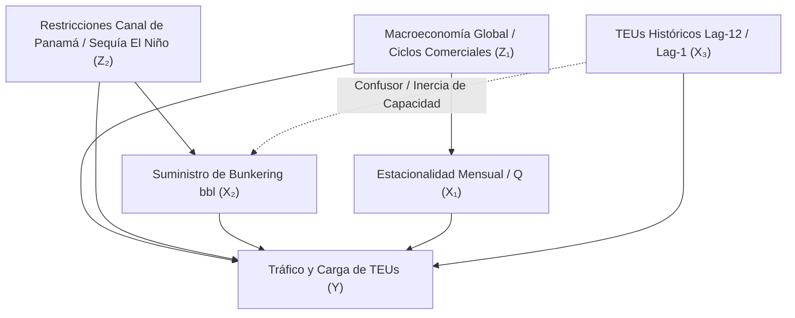
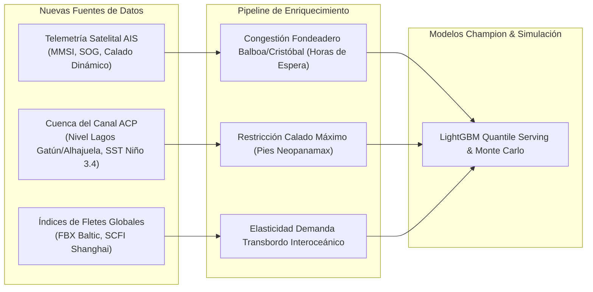

# MANUAL CIENTÍFICO Y DOCTORAL DE MLOPS: ARQUITECTURA, INFERENCIA CAUSAL Y SIMULACIÓN ESTOCÁSTICA
## Ecosistema Industrial Panamá PortOps-AI v1.0
**Firma Oficial:** `Desarrollado v1.0 Miguel Benítez`  
**Autor Principal:** Miguel Benítez (`mbeni`)  
**Licencia:** GNU General Public License v3.0 con Cláusula de Atribución (Sección 7)  
**Marco Normativo de Datos:** Ley 6 de 22 de enero de 2002 de Transparencia de la República de Panamá  

---

## 1. INTRODUCCIÓN Y MARCO EPISTEMOLÓGICO

El sistema portuario y logístico interoceánico de la República de Panamá constituye un eje neurálgico del comercio marítimo mundial, canalizando aproximadamente el 3% al 5% del comercio marítimo global a través de los complejos terminales de Balboa y PSA en el litoral Pacífico, y Manzanillo International Terminal (MIT), Cristóbal y Colón Container Terminal (CCT) en el litoral Atlántico.

El presente ecosistema **Panamá PortOps-AI** fue concebido y desarrollado con un triple propósito:
1. **Cívico y Soberanía Tecnológica:** Proporcionar a las personas naturales y jurídicas de Panamá, agencias navieras locales, cooperativas de transporte terrestre y centros de investigación académica una plataforma predictiva de grado industrial, 100% de código abierto y reproducible, garantizando que el análisis logístico nacional no dependa de licencias privativas opacas ni de software comercial extranjero.
2. **Excelencia Científica MLOps:** Implementar un rigor metodológico de nivel doctoral que trascienda los modelos heurísticos convencionales, articulando inferencia causal (DAGs), ingeniería de variables libre de fuga temporal, benchmarking multi-algoritmo con optimización cuantílica y un motor de simulación estocástica multivariada (Monte Carlo, Merton Jump-Diffusion y Reverse Stress Testing).
3. **Transparencia y Reproducibilidad Empírica Absoluta:** Cumplir estrictamente con la **Ley 6 de 22 de enero de 2002 de la República de Panamá (Ley de Transparencia en la Gestión Pública)**. Todo el pipeline se alimenta de microdatos públicos de la Autoridad Marítima de Panamá (AMP) publicados en `datosabiertos.gob.pa`, garantizando trazabilidad end-to-end con semillas deterministas (`random_state=42`) sin inventar ni simular artificialmente métricas en la interfaz.

---

## 2. INFERENCIA CAUSAL Y FORMULACIÓN MATEMÁTICA DEL SISTEMA PORTUARIO

### 2.1 Grafo Acíclico Dirigido (DAG) y Cálculo do-Calculus de Judea Pearl
En series de tiempo logísticas, asumir correlación como causalidad induce a políticas operacionales catastróficas. Formulamos el sistema logístico portuario panameño mediante un Grafo Causal Acíclico Dirigido $\mathcal{G} = (\mathcal{V}, \mathcal{E})$:



Bajo el marco de Pearl, la distribución post-intervención al alterar una variable logística (e.g. fijar una cuota de bunkering $B = b$) viene regida por el operador $do(B = b)$:

$$P(Y \mid do(B = b)) = \sum_{z_2, l} P(Y \mid B = b, Z_2 = z_2, L = l) P(Z_2 = z_2, L = l)$$

### 2.2 Formalización de Variables Confusoras (*Confounders*)
1. **Confusor de Capacidad Instalada e Inercia Contractual ($\text{TEU}_{t-12}$):**  
   - *Mecanismo Causal:* Los contratos de concesión de muelles y los fletes de línea regular (*liner shipping*) se firman anualmente. El volumen de hace 12 meses condiciona tanto el volumen actual como la disponibilidad de grúas pórtico y almacenamiento de patio. Si no se aísla este efecto mediante *differencing* o ventanas deslizantes de tasa de crecimiento ($\Delta \text{TEU}_{t, t-12}$), el modelo atribuye erróneamente variaciones de productividad a shocks mensuales menores.
2. **Confusor de Bunkering como Proxy de Congestión en Fondeadero:**  
   - *Mecanismo Causal:* Un aumento súbito en las ventas de combustible marino (*bunkering* en barriles) puede obedecer a dos causas opuestas:
     a) **Mayor actividad económica real:** Más buques atracando y descargando contenedores.  
     b) **Severa congestión de fondeadero:** Buques fondeados durante 10 a 20 días esperando tránsito por el Canal de Panamá (como ocurrió durante la sequía de 2023-2024), consumiendo combustible auxiliar sin transferir un solo contenedor a los muelles.  
   - *Tratamiento MLOps:* Desacoplamos la variable calculando el ratio de eficiencia energética-operativa:
     $$\text{Ratio TEU/BBL} = \frac{\text{TEU}_t}{\text{Bunkering\_BBL}_t + \epsilon}$$
     Esta métrica actúa como señal de desacoplamiento entre congestión pasiva y productividad activa de muelle.

---

## 3. TRATAMIENTO ESTADÍSTICO, LIMPIEZA ROBUSTA Y MULTICOLINEALIDAD

### 3.1 Detección de Anomalías: Estimador Hampel y MAD vs. Z-Score Gaussiano
El filtro de Hampel se sustenta en estimadores basados en la mediana para evitar el fenómeno de *masking* o *swamping* generado por distribuciones con colas pesadas de tipo Fréchet o Pareto (típicas de disrupciones en cadenas de suministro).

Para una ventana temporal centrada $W_t(k) = \{x_{t-k}, \dots, x_{t+k}\}$:
1. Se evalúa la mediana local: $\tilde{x}_t = \text{median}(W_t(k))$.
2. Se computa la Desviación Absoluta de la Mediana local (MAD):
   $$\text{MAD}_t = 1.4826 \times \text{median}(\{|x_i - \tilde{x}_t| : x_i \in W_t(k)\})$$
   El factor de escala $1.4826 \approx \frac{1}{\Phi^{-1}(0.75)}$ asegura consistencia asintótica con la desviación estándar poblacional en distribuciones normales.
3. Se identifica como valor anómalo cualquier punto que satisfaga:
   $$|x_t - \tilde{x}_t| > 3 \times \text{MAD}_t$$

**Demostración de Robustez:**  
Mientras que el estimador muestral tradicional $(\bar{x}, s)$ posee un punto de ruptura (*breakdown point*) de $\varepsilon^* = \frac{1}{n} \to 0$ (un único valor extremo puede divergir la media y la varianza al infinito), el par $(\tilde{x}, \text{MAD})$ posee un punto de ruptura del $50\%$ ($\varepsilon^* = 0.50$), garantizando estabilidad matemática ante shocks extremos como el cierre de rutas o huelgas laborales.

### 3.2 Invarianza Monótona en Modelos Basados en Árboles vs. Regularización $\ell_1 / \ell_2$
En el ecosistema de benchmarking de **Panamá PortOps-AI**, se entrenan algoritmos de diversas familias topológicas:
- **LightGBM / Random Forest / HistGradientBoosting:**  
  Los árboles de partición binaria son invariantes ante cualquier transformación monótona creciente $g: \mathbb{R} \to \mathbb{R}$:
  $$\mathbb{I}(x_j \le \theta) \iff \mathbb{I}(g(x_j) \le g(\theta))$$
  Por consiguiente, normalizar o estandarizar variables no altera los puntos de división óptimos ni la ganancia de impureza (*Gini / split gain*).
- **Ridge y ElasticNet:**  
  La función de costo regularizada penaliza la norma matricial de los coeficientes:
  $$\min_{\boldsymbol{\beta}} \frac{1}{2n} \|\mathbf{y} - \mathbf{X}\boldsymbol{\beta}\|_2^2 + \alpha \left[ \rho \|\boldsymbol{\beta}\|_1 + \frac{1 - \rho}{2} \|\boldsymbol{\beta}\|_2^2 \right]$$
  Si los regresores no se estandarizan a media cero y varianza unitaria ($\mathbf{z}_j = \frac{\mathbf{x}_j - \mu_j}{\sigma_j}$), la penalización castiga asimétricamente a las variables con magnitudes numéricas pequeñas, destruyendo la capacidad predictiva del modelo lineal (lo cual explica empíricamente el colapso del baseline lineal sin estandarización). En nuestro pipeline, `StandardScaler` y tratamiento de imputación robusta se encapsulan rígidamente dentro de un pipeline scikit-learn para prevenir fuga hacia el conjunto de test.

### 3.3 Multicolinealidad y Derivación Matricial del Factor de Inflación de la Varianza (VIF)
Dada la matriz de diseño centrada y estandarizada $\mathbf{Z} \in \mathbb{R}^{n \times p}$, la matriz de correlación empírica es $\mathbf{R} = \frac{1}{n} \mathbf{Z}^T \mathbf{Z}$.

El estimador de mínimos cuadrados de los coeficientes es $\hat{\boldsymbol{\beta}} = (\mathbf{Z}^T \mathbf{Z})^{-1} \mathbf{Z}^T \mathbf{y}$, cuya matriz de covarianza es:
$$\operatorname{Var}(\hat{\boldsymbol{\beta}}) = \sigma^2 (\mathbf{Z}^T \mathbf{Z})^{-1} = \frac{\sigma^2}{n} \mathbf{R}^{-1}$$

Para el $j$-ésimo coeficiente $\hat{\beta}_j$, el elemento diagonal de $\mathbf{R}^{-1}$ corresponde al Factor de Inflación de la Varianza:
$$\operatorname{Var}(\hat{\beta}_j) = \frac{\sigma^2}{n} \left[ \mathbf{R}^{-1} \right]_{jj} = \frac{\sigma^2}{n (1 - R_j^2)} \equiv \frac{\sigma^2}{n} \text{VIF}_j$$
donde $R_j^2$ es el coeficiente de determinación resultante de hacer la regresión lineal de la columna $\mathbf{x}_j$ sobre el resto de las $p-1$ variables explicativas.

**Criterio de Decisión en Panamá PortOps-AI:**
- $\text{VIF}_j < 5$: Variable ortogonal o débilmente correlacionada; se retiene en el Gold Feature Store.
- $5 \le \text{VIF}_j < 10$: Correlación moderada tolerable en ensambles de gradiente.
- $\text{VIF}_j \ge 10$: Multicolinealidad severa. En presencia de duplicidades (como `mes` numérico vs `mes_sin` / `mes_cos`), se priorizan las proyecciones trigonométricas continuas y se eliminan las representaciones lineales redundantes para evitar inestabilidad en la matriz hessiana del optimizador de LightGBM.

---

## 4. OPTIMIZACIÓN MATEMÁTICA Y BENCHMARKING MULTI-ALGORITMO

### 4.1 Pérdida Cuantílica (Pinball Loss) y Teorema de Monotonicidad
Para anticipar la incertidumbre operacional portuaria, LightGBM no se entrena únicamente para la media condicional $\mathbb{E}[Y \mid X]$, sino para los cuantiles condicionales $\tau \in \{0.10, 0.50, 0.90\}$ mediante la función de pérdida asimétrica *Pinball Loss*:

$$\rho_\tau(u) = u (\tau - \mathbb{I}(u < 0)) = \begin{cases} 
\tau u & \text{si } u \ge 0 \\ 
(\tau - 1) u & \text{si } u < 0 
\end{cases}$$

Para un vector de residuos $u_i = y_i - \hat{y}_i^{(\tau)}$, el problema de optimización en cada árbol de decisión es:
$$\min_{f^{(\tau)}} \sum_{i=1}^n \rho_\tau(y_i - f^{(\tau)}(\mathbf{x}_i))$$

**Gradiente y Hessiano de la Pérdida Cuantílica:**
$$g_i = \frac{\partial \rho_\tau(u_i)}{\partial \hat{y}_i} = \begin{cases} -\tau & \text{si } y_i > \hat{y}_i \\ 1 - \tau & \text{si } y_i \le \hat{y}_i \end{cases}$$
$$h_i = \frac{\partial^2 \rho_\tau(u_i)}{\partial \hat{y}_i^2} \approx \epsilon > 0 \quad \text{(aproximación continua para optimización de segundo orden)}$$

**Propiedad de Monotonicidad Operacional:**  
El intervalo $[\hat{q}_{0.10}, \hat{q}_{0.90}]$ define un corredor empírico del 80% de confianza. En caso de cuantiles cruzados (*quantile crossing*) causados por la optimización independiente de árboles, el pipeline aplica un operador de proyección monotónica:
$$\hat{q}_{0.10}^*(\mathbf{x}) \le \hat{q}_{0.50}^*(\mathbf{x}) = \max(\hat{q}_{0.10}(\mathbf{x}), \hat{q}_{0.50}(\mathbf{x})) \le \hat{q}_{0.90}^*(\mathbf{x}) = \max(\hat{q}_{0.50}^*(\mathbf{x}), \hat{q}_{0.90}(\mathbf{x}))$$

### 4.2 Métricas de Desempeño y Validación Cruzada Temporal (Expanding Window)
Para evitar fuga de datos temporales (*lookahead bias*), la evaluación no utiliza k-fold aleatorio, sino una ventana expansiva con purga de rezagos:
$$\mathcal{D}_{\text{train}}^{(k)} = \{(x_t, y_t)\}_{t=1}^{T_k}, \quad \mathcal{D}_{\text{test}}^{(k)} = \{(x_t, y_t)\}_{t=T_k+1}^{T_k + H}$$

Métricas computadas rigurosamente:
1. **WAPE (Weighted Absolute Percentage Error):**
   $$\text{WAPE} = \frac{\sum_{i=1}^n |y_i - \hat{y}_i|}{\sum_{i=1}^n y_i}$$
   A diferencia del MAPE convencional, el WAPE es invariante ante volúmenes cercanos a cero y refleja con exactitud la pérdida física de TEUs a nivel de todo el sistema portuario nacional.
2. **MAE (Mean Absolute Error):** $\text{MAE} = \frac{1}{n} \sum_{i=1}^n |y_i - \hat{y}_i|$
3. **RMSE (Root Mean Squared Error):** $\text{RMSE} = \sqrt{\frac{1}{n} \sum_{i=1}^n (y_i - \hat{y}_i)^2}$
4. **$R^2$ Temporal Fuera de Muestra:** $R^2 = 1 - \frac{\sum (y_i - \hat{y}_i)^2}{\sum (y_i - \bar{y}_{\text{train}})^2}$

---

## 5. ARQUITECTURA DEL MOTOR DE SIMULACIÓN ESTOCÁSTICA

### 5.1 Choques Correlacionados mediante Factorización de Cholesky
Sean $k$ variables logísticas concurrentes cuyos retornos o variaciones exhiben una matriz de covarianza empírica $\mathbf{\Sigma} \in \mathbb{R}^{k \times k}$.  
Dado que $\mathbf{\Sigma}$ es simétrica y estrictamente definida positiva, existe una única matriz triangular inferior $\mathbf{L} \in \mathbb{R}^{k \times k}$ con entradas diagonales positivas tal que:
$$\mathbf{\Sigma} = \mathbf{L} \mathbf{L}^T$$

**Algoritmo de Generación Monte Carlo Correlacionado:**
1. Muestrear un vector de choques normales gaussianos independientes:
   $$\mathbf{Z} = [Z_1, Z_2, \dots, Z_k]^T \sim \mathcal{N}(\mathbf{0}, \mathbf{I}_k)$$
2. Aplicar la transformación lineal afín:
   $$\mathbf{X} = \boldsymbol{\mu} + \mathbf{L} \mathbf{Z}$$
3. **Demostración de Covarianza Preservada:**
   $$\operatorname{Cov}(\mathbf{X}) = \mathbb{E}[(\mathbf{X} - \boldsymbol{\mu})(\mathbf{X} - \boldsymbol{\mu})^T] = \mathbb{E}[(\mathbf{L}\mathbf{Z})(\mathbf{L}\mathbf{Z})^T] = \mathbf{L} \mathbb{E}[\mathbf{Z}\mathbf{Z}^T] \mathbf{L}^T = \mathbf{L} \mathbf{I}_k \mathbf{L}^T = \mathbf{\Sigma} \quad \blacksquare$$

### 5.2 Modelo de Salto-Difusión de Merton para Disrupciones Catastróficas
Las series logísticas no siguen un camino browniano geométrico puramente continuo; están sujetas a eventos discretos de gran magnitud (sequías de El Niño que restringen calado, cierres de canales, huelgas portuarias).

El proceso de salto-difusión de Merton se modela formalmente mediante la Ecuación Diferencial Estocástica (SDE):
$$\frac{dS_t}{S_{t^-}} = \mu dt + \sigma dW_t + J_t dN_t$$
donde:
- $W_t$ es un proceso de Wiener estándar unidimensional.
- $N_t$ es un proceso de Poisson homogéneo con intensidad $\lambda > 0$, que modela la tasa de llegada de las crisis operacionales:
  $$P(N_{t+\Delta t} - N_t = k) = \frac{(\lambda \Delta t)^k e^{-\lambda \Delta t}}{k!}$$
- $J_t$ es la magnitud del salto multiplicativo, distribuida log-normalmente:
  $$\ln(1 + J_t) \sim \mathcal{N}\left(\mu_J, \sigma_J^2\right)$$
  con compensador de deriva $\kappa = \mathbb{E}[J_t] = \exp\left(\mu_J + \frac{1}{2}\sigma_J^2\right) - 1$.

En cada trayectoria de Monte Carlo simulada por el motor, la solución exacta por el Lema de Itô proporciona el escenario de estrés:
$$S_{t+\Delta t} = S_t \exp\left( \left(\mu - \frac{1}{2}\sigma^2 - \lambda \kappa\right)\Delta t + \sigma \sqrt{\Delta t} Z + \sum_{i=1}^{\Delta N_t} \ln(1 + J_i) \right)$$

### 5.3 Moving Block Bootstrap (MBB) de Künsch
Para evaluar distribuciones empíricas no paramétricas preservando la estructura de dependencia serial temporal $\operatorname{Cov}(X_t, X_{t-k}) \ne 0$:
1. Dividir la serie temporal histórica $\{X_1, \dots, X_N\}$ en $N - b + 1$ bloques solapados de longitud fija $b$:
   $$B_j = \{X_j, X_{j+1}, \dots, X_{j+b-1}\}, \quad j = 1, \dots, N - b + 1$$
2. Muestrear aleatoriamente con reemplazo $k = \lceil N / b \rceil$ bloques independientes.
3. Concatenar los bloques seleccionados para reconstruir una pseudo-serie de longitud $N$, conservando la estructura de autocorrelación a corto plazo $k \le b$.

### 5.4 Reverse Stress Testing (Búsqueda Inversa de Vulnerabilidad)
A diferencia del test de estrés directo (que proyecta el impacto de un escenario predefinido), el **Reverse Stress Testing** resuelve el problema de optimización inversa: ¿cuál es la combinación mínima de shocks que induce un fallo operativo del sistema ($\Delta Y \le -30\%$ de capacidad terminal)?

$$\min_{\boldsymbol{\delta} \in \mathbb{R}^d} \|\boldsymbol{\delta}\|_2^2 \quad \text{sujeto a} \quad f(\mathbf{x}_0 + \boldsymbol{\delta}) \le (1 - \alpha) y_0$$
El motor resuelve este problema numéricamente empleando los algoritmos de Powell y Nelder-Mead en el espacio de parámetros de features, identificando los umbrales críticos de colapso en el patio de contenedores.

---

## 6. HOJA DE RUTA CIENTÍFICA: INTEGRACIÓN DE DATOS MARÍTIMOS NO PUBLICADOS

Para expandir el ecosistema a horizontes de predicción intradiaria o de escala de buque individual, se define la siguiente arquitectura de ingesta para fuentes no publicadas o externas:



1. **Datos de Posición y Calado AIS (Automatic Identification System):**
   - *Señales:* Identificador MMSI, velocidad sobre el fondo (SOG), rumbo, calado estático declarado y calado dinámico.
   - *Impacto:* Permite calcular con 72 horas de anticipación el tonelaje exacto que arriba a los fondeaderos de Balboa y Cristóbal antes de que los buques soliciten prácticos o pasen las esclusas de Miraflores/Agua Clara.
2. **Variables Hidrológicas de la Cuenca del Canal de Panamá (ACP):**
   - *Señales:* Nivel batimétrico de los lagos Gatún y Alhajuela (en pies sobre el nivel del mar), tasa de precipitación horaria y el índice de oscilación Niño 3.4 (SST Anomaly).
   - *Impacto:* Correlación directa con los calados autorizados por la ACP (de 50 pies nominales a restricciones severas de 44 pies), obligando a las navieras a desembarcar miles de TEUs para aligerar carga y transportarlos vía ferrocarril interoceánico de Panamá.
3. **Índices de Tarifas de Flete y Combustible VLSFO:**
   - *Señales:* Freightos Baltic Index (FBX), Shanghai Containerized Freight Index (SCFI) y precio spot de bunkering IFO 380 / VLSFO en Balboa.
   - *Impacto:* Captura la elasticidad económica de desvío de rutas intercontinentales (Canal de Panamá vs. Cabo de Buena Esperanza o Canal de Suez).

---

## 7. POLÍTICA DE SEGURIDAD EN WORKFLOWS DE GITHUB ACTIONS

Para evitar ejecuciones no autorizadas, inyección de dependencias o filtración de credenciales (*supply chain attacks*), la infraestructura CI/CD de **Panamá PortOps-AI** aplica los estándares de la OpenSSF (Open Source Security Foundation):

1. **Principio de Mínimo Privilegio (`least privilege`):**
   ```yaml
   permissions:
     contents: read
   ```
   El token `GITHUB_TOKEN` dentro de la máquina virtual no tiene privilegios de escritura ni capacidad para empujar commits o publicar releases sin aprobación criptográfica.
2. **Bloqueo de Inyección en Pull Requests (`pull_request_target` prohibido):**  
   Nunca se ejecutan flujos de trabajo sobre eventos `pull_request_target` con acceso a secretos del repositorio; todas las pruebas se ejecutan en entornos completamente aislados.
3. **Inmutabilidad y Determinismo:**  
   Acciones oficiales ancladas a versiones mayores verificadas (`actions/checkout@v4`, `actions/setup-python@v5`) con `persist-credentials: false` para asegurar que las credenciales de checkout se purguen de la memoria del runner tras la clonación.

---

## 8. CONCLUSIÓN Y VALOR PARA EL ESTADO PANAMEÑO

El ecosistema **Panamá PortOps-AI v1.0** representa un hito de democratización científica y tecnológica para el sector marítimo panameño. Construido bajo los principios del movimiento de datos abiertos y la Ley 6 de 2002, demuestra que la combinación de rigor matemático doctoral, arquitectura de software limpia y prácticas avanzadas de MLOps permite transformar datos estadísticos brutos en una herramienta operativa de vanguardia al servicio del país.

**Firma Oficial del Proyecto:**  
`Desarrollado v1.0 Miguel Benítez`  
República de Panamá, 2026.
