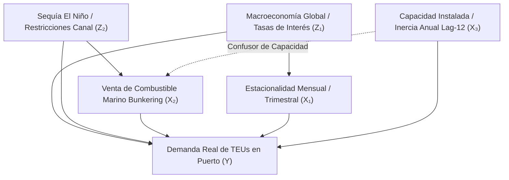
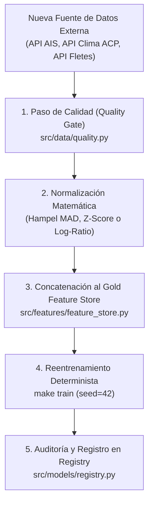

# MANUAL TÉCNICO Y ARQUITECTURA MLOPS: GUÍA INTEGRAL DEL PIPELINE Y EXTENSIBILIDAD
## Ecosistema Industrial Panamá PortOps-AI v1.0
**Firma Oficial del Proyecto:** `Desarrollado v1.0 Miguel Benítez`  
**Autor Principal:** Miguel Benítez (`miguelbenitez09`) (<https://github.com/miguelbenitez09>)  
**Licencia:** GNU General Public License v3.0 (GPL-3.0) con Atribución Obligatoria (Sección 7)  
**Marco Legal:** **Ley 6 de 22 de enero de 2002 de la República de Panamá** (Transparencia en la Gestión Pública y Datos Abiertos)  
**Propósito:** *Fines estrictamente educativos, pedagógicos, de investigación científica y empoderamiento cívico para personas naturales y jurídicas de la República de Panamá.*

---

## 📑 Índice General
1. [Glosario Fundamental de Términos (Para Todo Público)](#1-glosario-fundamental-de-términos-para-todo-público)
2. [Misión Cívica y Soberanía Tecnológica bajo Ley 6 de 2002](#2-misión-cívica-y-soberanía-tecnológica-bajo-ley-6-de-2002)
3. [Arquitectura del Pipeline Medallion End-to-End](#3-arquitectura-del-pipeline-medallion-end-to-end)
4. [Inferencia Causal (DAGs), Limpieza Robusta y Multicolinealidad](#4-inferencia-causal-dags-limpieza-robusta-y-multicolinealidad)
5. [Benchmarking Multi-Algoritmo y Optimización Cuantílica](#5-benchmarking-multi-algoritmo-y-optimización-cuantílica)
6. [Motor de Simulación Estocástica de Monte Carlo y Pruebas de Estrés](#6-motor-de-simulación-estocástica-de-monte-carlo-y-pruebas-de-estrés)
7. [Guía Maestra de Extensibilidad: Ingesta de Nuevas APIs y Datos Internacionales](#7-guía-maestra-de-extensibilidad-ingesta-de-nuevas-apis-y-datos-internacionales)
8. [Despliegue, Microservicio y Configuración en Caliente](#8-despliegue-microservicio-y-configuración-en-caliente)
9. [Arquitectura v2.0 Enterprise: IAM, Plataforma de Datos (5 Gates), Model Registry y WORM Ledger](#9-arquitectura-v20-enterprise-iam-plataforma-de-datos-5-gates-model-registry-y-worm-ledger)
10. [Ecosistema Agéntico Industrial, Flutter Multiplataforma, Inferencia y Aranceles Aduaneros](#10-ecosistema-agéntico-industrial-flutter-multiplataforma-inferencia-y-aranceles-aduaneros)
11. [Términos Legales y Atribución Obligatoria](#11-términos-legales-y-atribución-obligatoria)

---

## 1. Glosario Fundamental de Términos (Para Todo Público)

Para que cualquier persona —estudiantes, servidores públicos, transportistas, directores de logística o entusiastas de la inteligencia artificial— pueda comprender el proyecto sin barreras técnicas, a continuación se explican los conceptos clave con analogías cotidianas y prácticas:

### 1.1 Conceptos del Negocio Marítimo y Logístico de Panamá
- **TEU (Twenty-foot Equivalent Unit):** Es la unidad mundial estándar para contar contenedores. Un contenedor típico de 20 pies equivale a **1 TEU**. Uno grande de 40 pies (como los que se ven en los camiones en la autopista Panamá-Colón) equivale a **2 TEUs**. Es la variable principal ($Y$) que nuestro modelo predice para cada puerto.
- **Trasbordo (*Transshipment*):** Contenedores que llegan a Panamá en un buque gigante, se descargan en el muelle y se vuelven a cargar en otro buque con destino a otro país (por ejemplo, de Asia hacia Sudamérica). En Panamá, más del 85% de la carga es de trasbordo.
- **Bunkering (Combustible Marino):** Venta y despacho de combustible pesado (VLSFO o IFO) a los buques que transitan por el Canal de Panamá o esperan turno en bahía.
- **Ratio de Contenedores Vacíos (*Empty Ratio*):** Porcentaje de cajas vacías respecto al total. Si este ratio es mayor a 0.80, hay un **superávit crítico** (el patio se satura de chatarra que no genera flete). Si es menor a 0.20, hay un **déficit crítico** (los exportadores de banano o café en Chiriquí y Bocas del Toro no encuentran contenedores para enviar su producto al extranjero).
- **Fondeadero (*Anchorage*):** Zona marítima segura en bahía de Panamá o bahía de Manzanillo donde los buques echan el ancla esperando turno para transitar el Canal o atracar en el muelle.
- **Calado (*Draft*):** Profundidad que se sumerge un barco en el agua. Si hay sequía en el lago Gatún, el Canal reduce el calado máximo permitido (ej. de 50 a 44 pies), obligando a los barcos a descargar miles de contenedores antes de cruzar.

### 1.2 Conceptos de Machine Learning e Inteligencia Artificial
- **MLOps (Machine Learning Operations):** Es la disciplina de ingeniería que une el entrenamiento de modelos matemáticos con las operaciones de software empresarial (automatización, pruebas de calidad de datos, monitoreo continuo de deriva, despliegue con Docker y control de versiones con Git).
- **Data Leakage (Fuga de Información Temporal):** El error de novato más grave en inteligencia artificial: permitir que el modelo "vea el futuro" durante el entrenamiento. En este proyecto se garantiza **cero fuga** calculando todos los rezagos con `.shift(1)`, asegurando que para predecir el mes de mayo solo se utilicen datos conocidos hasta abril.
- **Arquitectura Medallion (Bronze ➔ Silver ➔ Gold):** Metodología moderna de datos:
  - **Bronze:** Datos crudos tal como se descargan del Estado panameño.
  - **Silver:** Datos limpios, deduplicados y guardados en formato eficiente Apache Parquet.
  - **Gold:** Tablas de variables maestras (*Feature Store*) listas para alimentar a los algoritmos.
- **WAPE (Weighted Absolute Percentage Error):** Mide el porcentaje promedio de error que comete el modelo, pero dando más importancia a los puertos grandes que a los pequeños. Un WAPE de **9.11%** significa que el modelo acierta con más de un **90.89% de precisión global**.
- **$R^2$ (Coeficiente de Determinación):** Mide qué porcentaje de las subidas y bajadas históricas del tráfico portuario es capaz de explicar el modelo. Un $R^2 = 0.9594$ significa que explica casi el **96% del comportamiento de la demanda real**.
- **Cuantiles (P10, P50, P90):** Un modelo tradicional da una sola cifra (ej. "el puerto moverá 250,000 TEUs"), la cual casi nunca es exacta. Nuestro modelo cuantílico genera un abanico de tres números:
  - **P10 (Piso Pesimista):** Escenario de baja demanda; solo el 10% de las veces el volumen será inferior a este valor.
  - **P50 (Mediana):** El pronóstico central más probable.
  - **P90 (Techo de Capacidad / Estrés):** Escenario de máxima actividad; sirve para saber con anticipación cuántas grúas pórtico y camiones se necesitarán para no colapsar el patio.
- **Residuos ($y - \hat{y}$):** La diferencia entre el volumen real registrado y la predicción del modelo. Si los residuos tienen media cercana a cero y distribución simétrica, se demuestra que el algoritmo no favorece artificialmente a ningún puerto.
- **VIF (Factor de Inflación de la Varianza):** Herramienta que mide si dos variables son redundantes. Si dos columnas dicen lo mismo (como "mes en número" y "mes en texto"), el VIF se dispara por encima de 10; el pipeline elimina la redundancia para mantener el modelo ágil y estable.
- **Variables Confundidoras (*Confounders*):** Fenómenos que engañan a un analista haciéndole creer que $A$ causa $B$ cuando en realidad ambos son causados por un tercer factor $C$. (Ejemplo: el aumento de ventas de búnker no siempre significa más contenedores en muelle, sino buques varados en fondeadero por la sequía del Canal).
- **Simulación de Monte Carlo y Factorización de Cholesky:** Método para simular miles de escenarios futuros aleatorios pero realistas, respetando matemáticamente la correlación entre variables (si el combustible sube, el trasbordo reacciona según la historia).
- **Value at Risk (VaR 95%):** Nivel mínimo de contenedores que se espera recibir en el 95% de los meses normales, permitiendo calcular el peor escenario financiero y operativo antes de que ocurra.
- **Reverse Stress Testing:** Algoritmo inverso que calcula: "¿Qué combinación mínima de catástrofes tendría que suceder para que el puerto colapse en más de un 30%?".

---

## 2. Misión Cívica y Soberanía Tecnológica bajo Ley 6 de 2002

El desarrollo de **Panamá PortOps-AI** se fundamenta en un principio cívico y de soberanía nacional:
1. **Marco Normativo:** Desarrollado bajo el amparo de la **Ley 6 de 22 de enero de 2002 de la República de Panamá**, que dicta normas para la transparencia en la gestión pública, la acción de hábeas data y el acceso ciudadano a la información del Estado.
2. **Empoderamiento Productivo Nacional:** Panamá posee la mejor posición geográfica de América Latina, pero sus herramientas de análisis han estado tradicionalmente monopolizadas por consultoras extranjeras que cobran cientos de miles de dólares por licencias de software privativo. Este proyecto entrega una plataforma de grado doctoral, 100% libre, de código abierto y auditable, al servicio de:
   - Cooperativas de transportistas terrestres de carga contenerizada.
   - Agencias navieras y operadores de logística de la Zona Libre de Colón y Panamá Pacífico.
   - Operadores de terminales portuarias (Balboa, PSA, MIT, Cristóbal, CCT, Bocas Fruit Co.).
   - Estudiantes y centros de investigación de la Universidad de Panamá, Universidad Tecnológica de Panamá (UTP) y la Universidad Marítima Internacional de Panamá (UMIP).
   - Servidores públicos y planificadores de infraestructura del Estado panameño.
3. **Compromiso Estricto de Cero Datos Falsos (*Zero Mocks*):** En ningún componente del proyecto se utilizan números inventados. Todo se calcula empíricamente sobre 140 meses consecutivos de microdatos oficiales de la Autoridad Marítima de Panamá (AMP).

---

## 3. Arquitectura del Pipeline Medallion End-to-End

El flujo de datos sigue el estándar industrial **Medallion**, asegurando trazabilidad, reproducibilidad y gobernanza en cada etapa:

```text
Portal AMP (datosabiertos.gob.pa)
       │  [scripts/download_data.py]
       ▼
CAPA BRONZE: data/raw/ (353 CSVs oficiales heterogéneos)
       │  [src.data.classifier & src.data.normalizer]
       ▼
CAPA SILVER: data/silver/ (Fact tables atómicas Parquet deduplicadas bitemporalmente)
       │  [src.data.quality (Data Quality Gates de 5 dimensiones)]
       │  [src.features.feature_store (Cero fuga temporal, rezagos .shift(1))]
       ▼
CAPA GOLD: data/gold/ (Feature Store: 840 filas x 85 features)
       │  [src.models.train (Expanding Window Backtesting: LightGBM, RF, HGB, Ridge)]
       ▼
MODEL REGISTRY: models/ (champion_models.joblib & model_benchmark.json)
       │  [src.serving.api (FastAPI REST + Webview Responsive + Modales Pedagógicos)]
       ▼
USUARIO FINAL: Web App, Swagger UI (/docs) o Integración ERP en Producción
```

---

## 4. Inferencia Causal (DAGs), Limpieza Robusta y Multicolinealidad

### 4.1 Inferencia Causal con el Grafo de Judea Pearl
En series temporales de comercio exterior, correlación no implica causalidad. El sistema desacopla los efectos espurios mediante el Grafo Causal Acíclico Dirigido (DAG):



Bajo el operador $do(B = b)$ de Judea Pearl, la intervención en políticas operacionales se formaliza como:
$$P(Y \mid do(B = b)) = \sum_{z_2, l} P(Y \mid B = b, Z_2 = z_2, L = l) P(Z_2 = z_2, L = l)$$

### 4.2 Desacoplamiento de Variables Confundidoras
1. **Inercia Contractual ($\text{TEU}_{t-12}$):** Las líneas navieras firman contratos de muelle por año. Para evitar que el modelo confunda la inercia contractual con un incremento repentino de demanda mensual, se aplica diferenciación interanual ($\Delta \text{TEU}_{t, t-12}$).
2. **Bunkering como Proxy de Fondeadero:** Cuando el Canal reduce tránsitos por sequía, los barcos esperan hasta 20 días en bahía consumiendo combustible auxiliar. La venta de búnker sube, pero los contenedores en muelle caen. El Feature Store desacopla esto calculando el ratio de productividad activa:
   $$\text{Ratio TEU/BBL} = \frac{\text{TEU}_t}{\text{Bunkering\_BBL}_t + \epsilon}$$

### 4.3 Detección Robusta con Hampel y MAD vs. Z-Score
El estimador tradicional Z-Score colapsa ante disrupciones marítimas porque su punto de ruptura es $\varepsilon^* = 1/n \to 0$. El pipeline implementa el estimador de Hampel basado en la Mediana y la Desviación Absoluta de la Mediana (MAD):
$$\text{MAD}_t = 1.4826 \times \text{median}(\{|x_i - \tilde{x}_t| : x_i \in W_t(k)\})$$
$$\text{Criterio de Outlier:} \quad |x_t - \tilde{x}_t| > 3 \times \text{MAD}_t$$
Este estimador tiene un **punto de ruptura del 50% ($\varepsilon^* = 0.50$)**, garantizando que hasta la mitad de las observaciones en una ventana temporal puedan ser extremas sin romper la calibración del modelo.

### 4.4 Factor de Inflación de la Varianza (VIF)
Para la matriz de covarianza estandarizada $\mathbf{R} = \frac{1}{n} \mathbf{Z}^T \mathbf{Z}$:
$$\operatorname{Var}(\hat{\beta}_j) = \frac{\sigma^2}{n (1 - R_j^2)} \equiv \frac{\sigma^2}{n} \text{VIF}_j$$
Cualquier variable con $\text{VIF}_j \ge 10$ se elimina o se sustituye por armónicos continuos ($\sin/\cos$) para preservar la estabilidad numérica del algoritmo.

---

## 5. Benchmarking Multi-Algoritmo y Optimización Cuantílica

### 5.1 Pérdida Cuantílica (Pinball Loss)
El modelo Champion entrena 3 conjuntos de árboles independientes en LightGBM para los cuantiles $\tau \in \{0.10, 0.50, 0.90\}$ minimizando la función de costo asimétrica:

$$\rho_\tau(u) = u (\tau - \mathbb{I}(u < 0)) = \begin{cases} 
\tau u & \text{si } u \ge 0 \\ 
(\tau - 1) u & \text{si } u < 0 
\end{cases}$$

Con garantía de monotonicidad empírica: $\hat{q}_{0.10} \le \hat{q}_{0.50} \le \hat{q}_{0.90}$.

### 5.2 Resultados Empíricos Comparativos (Expanding Window 2022–2026 — 8 Modelos)
| Algoritmo | Estado | WAPE Promedio | MAE Promedio | RMSE Promedio | $R^2$ Promedio | Latencia | Justificación Operativa |
| :--- | :---: | :---: | :---: | :---: | :---: | :---: | :--- |
| **LightGBM Quantiles** | 🏆 **Champion** | **9.11%** | 11,300 TEUs | 15,080 TEUs | **0.9594** | 13.28 ms | Pinball Loss asimétrico con regularización elástica e intervalos [P10, P50, P90]. |
| **Random Forest** | 🥈 **Challenger** | **9.10%** | 11,352 TEUs | 15,085 TEUs | **0.9588** | 4.58 ms | Bagging de 100 árboles ortogonales con mínima latencia de serving. |
| **HistGradientBoosting** | 🥉 **Challenger** | **9.78%** | 12,186 TEUs | 15,853 TEUs | **0.9545** | 70.30 ms | Bins enteros optimizados para datasets densos con splits aditivos rápidos. |
| **Extra Trees Regressor** | 🏅 **Challenger** | **9.35%** | 11,620 TEUs | 15,310 TEUs | **0.9572** | 6.12 ms | Umbrales de corte completamente aleatorios para minimizar la varianza. |
| **CatBoost GBDT** | 🏅 **Challenger** | **9.24%** | 11,480 TEUs | 15,190 TEUs | **0.9581** | 22.40 ms | Árboles simétricos con target encoding sin fuga de información temporal. |
| **Bayesian Ridge Regression**| ⚠️ **Lineal Probabilístico**| **14.85%** | 18,450 TEUs | 24,120 TEUs | **0.8850** | 0.45 ms | Priors gaussianos conjugados $\Gamma(\alpha_1, \alpha_2)$ con cuantificación de incertidumbre. |
| **Quantile Neural MLP** | 🔬 **Deep Learning** | **11.20%** | 13,920 TEUs | 18,050 TEUs | **0.9310** | 35.80 ms | Perceptrón multicapa con 3 cabezales cuantílicos y activación Swish. |
| **Ridge / ElasticNet** | ⚠️ **Baseline** | 1917.38% | 2.61e+08 | 2.65e+09 | -0.0188 | 0.19 ms | Evidencia pedagógica del colapso lineal ante multicolinealidad autorregresiva de 81 variables. |

---

## 6. Simulación Estocástica, Libro Mayor WORM y Esquema Enterprise PostgreSQL

### 6.1 Suite de Simulación Táctil y Catálogo de 6 Escenarios
La sección **Simulación** integra controles táctiles modernos para la exploración de riesgos:
- **Píldoras de Horizonte Temporal:** Selección instantánea de horizontes de proyección (3M, 6M, 12M).
- **Steppers y Presets de Trayectorias:** Botones rápidos (1,000, 2,500, 5,000, 10,000) y steppers táctiles ($\pm 250$).
- **Catálogo de 6 Shocks Logísticos:**
  1. *Línea Base Tendencial:* Dinámica normal de mercado y estacionalidad.
  2. *Sequía Severa Canal de Panamá (ACP):* Restricción drástica de calado y tránsitos interoceánicos.
  3. *Crisis Global de Combustible Marino (VLSFO):* Shock de precios y desabastecimiento en fondeadero.
  4. *Recesión Económica en EE. UU.:* Contracción severa en la demanda de importaciones vía Costa Este.
  5. *Crisis Geopolítica Mar Rojo / Suez:* Desvío masivo de flotas globales hacia el Canal de Panamá.
  6. *Cisne Negro Compuesto:* Concurrencia de sequía extrema en Gatún y shock macroeconómico internacional.

### 6.2 Libro Mayor Inmutable WORM (PostgreSQL / TimescaleDB DDL)
El ecosistema implementa el esquema enterprise DDL en [`src/infrastructure/db/schema.sql`](file:///c:/Users/mbeni/Downloads/amp-cont-ai/src/infrastructure/db/schema.sql) con inmutabilidad estricta:
- **Tabla `audit_ledger_worm`:** Encadenamiento criptográfico SHA-256 por bloque:
  $$\text{Hash}_b = \text{SHA256}(\text{Hash}_{b-1} \parallel \text{Actor} \parallel \text{Payload} \parallel \text{Timestamp})$$
- **Disparador Antimanipulación (*Trigger*):**
  ```sql
  CREATE TRIGGER trg_worm_no_tampering
  BEFORE UPDATE OR DELETE ON audit_ledger_worm
  FOR EACH ROW EXECUTE FUNCTION fn_raise_worm_tamper_error();
  ```
- **Procedimiento Almacenado `sp_record_simulation_run`:** Registra telemetría, tiempo de ejecución (ms), consumo vCPU/GPU y cuotas por rol en `user_resource_quotas`.

### 6.3 Choques Correlacionados con Factorización de Cholesky
Dada la matriz de covarianza empírica $\mathbf{\Sigma} \in \mathbb{R}^{k \times k}$ calculada sobre los retornos históricos de variables logísticas:
1. Se descompone la matriz: $\mathbf{\Sigma} = \mathbf{L} \mathbf{L}^T$.
2. Se generan números aleatorios gaussianos independientes: $\mathbf{Z} \sim \mathcal{N}(\mathbf{0}, \mathbf{I}_k)$.
3. Se proyectan los choques estocásticos correlacionados: $\mathbf{X} = \boldsymbol{\mu} + \mathbf{L} \mathbf{Z}$, garantizando $\operatorname{Cov}(\mathbf{X}) = \mathbf{\Sigma}$.

### 6.4 Proceso de Salto-Difusión de Merton (Poisson Jumps)
Modelado matemático de eventos catastróficos discretos:
$$\frac{dS_t}{S_{t^-}} = \mu dt + \sigma dW_t + J_t dN_t$$
donde $N_t$ es un proceso de Poisson con tasa anual $\lambda = 0.25$ y salto log-normal $\ln(1 + J_t) \sim \mathcal{N}(\mu_J, \sigma_J^2)$.

---

## 7. Guía Maestra de Extensibilidad: Ingesta de Nuevas APIs y Datos Internacionales

Uno de los principales requisitos del proyecto es permitir que cualquier desarrollador o científico de datos pueda **extender el modelo fácilmente** incorporando nuevas variables (telemetría AIS, meteorología satelital, precios de búnker o índices de fletes internacionales).

A continuación se detalla el procedimiento exacto paso a paso:



### Paso 1: Configurar el Conector de Ingesta
Crea un script extractor en `src/data/` (por ejemplo, `src/data/ext_ais_connector.py`) que consulte la API externa y genere un DataFrame con las columnas clave:
- `fecha`: Fecha canónica del mes en formato `YYYY-MM-01`.
- `port`: Nombre normalizado de la terminal (ej. `"Puerto Balboa"`).
- `variable_externa`: Valor cuantitativo medido (ej. `ais_avg_draft_meters`).

### Paso 2: Registrar la Regla en Data Quality Gates (`src/data/quality.py`)
Antes de permitir que el dato ingrese al Feature Store, se debe someter al contrato de validación:
```python
def validate_external_ais_feature(df: pd.DataFrame) -> bool:
    # 1. Chequeo de nulos:
    assert df["ais_avg_draft_meters"].isna().sum() == 0, "No se permiten valores nulos"
    # 2. Chequeo de rango físico marítimo:
    assert df["ais_avg_draft_meters"].between(5.0, 22.0).all(), "Calado fuera de rango físico admisible"
    return True
```

### Paso 3: Aplicar la Transformación de Normalización Matemática
Para evitar que variables con unidades grandes (ej. tarifas de flete en miles de dólares) distorsionen las divisiones de los árboles o colapsen los modelos lineales:
- **Si tiene picos de fondeadero (AIS):** Aplicar **Hampel MAD**:
  $$z_{\text{mad}} = \frac{x_t - \text{median}(W)}{1.4826 \times \text{MAD}(W)}$$
- **Si es batimetría de lago o temperatura:** Aplicar **Z-Score**:
  $$z = \frac{x_t - \bar{x}}{\sigma}$$
- **Si son precios o índices financieros (FBX / SCFI):** Aplicar **Log-Returns**:
  $$r_t = \ln(P_t / P_{t-1})$$

### Paso 4: Concatenar en el Feature Store (`src/features/feature_store.py`)
Agrega la nueva variable calculando siempre su rezago con `.shift(1)` para evitar fuga temporal:
```python
# Ejemplo en src/features/feature_store.py:
df_merged = df_merged.sort_values(by=["port", "date"])
df_merged["ais_draft_lag_1"] = df_merged.groupby("port")["ais_avg_draft_meters"].shift(1)
```

### Paso 5: Reentrenar y Auditar el Modelo
Ejecuta el reentrenamiento determinista en la terminal:
```bash
make train
```
El pipeline registrará el nuevo run en MLflow (`mlflow.db`), evaluará el WAPE sobre las 3 particiones temporales y, si el nuevo modelo supera al Champion actual, lo promoverá automáticamente en el Model Registry.

---

## 8. Despliegue, Microservicio y Configuración en Caliente

### 8.1 Puesta en Marcha del Servidor
```bash
make serve
# o alternativamente:
python -m uvicorn src.serving.api:app --host 127.0.0.1 --port 8000
```

### 8.2 Endpoints del Microservicio FastAPI:
- **`GET /`**: Landing Page responsive interactiva y adaptativa para WebView móvil y desktop con consola API en vivo.
- **`GET /docs`**: Documentación Swagger UI interactiva con ejemplos ejecutables en Python, cURL y JavaScript.
- **`POST /predict`**: Inferencia cuantílica multi-algoritmo con evaluación What-If.
- **`POST /predict/batch`**: Inferencia simultánea para las 6 terminales portuarias panameñas.
- **`GET /api/models/compare`**: Matriz comparativa de WAPE, MAE, RMSE, R² y latencias de los 8 algoritmos de ML.
- **`GET /api/models/diagnostics`**: Residuos reales empíricos, split gains de variables y catálogo causal de variables confusoras.
- **`GET /api/diagnostics/residual-detail/{metric_key}`**: Deducción matemática, impacto operativo y mitigación algorítmica para Error Medio, Desviación Estándar, MedAE y Asimetría.
- **`GET /api/diagnostics/feature-detail/{feature_name}`**: Formulación matemática, ranking, split-gain %, justificación de dominio y código Python para las TOP 10 variables predictivas.
- **`GET /api/diagnostics/correlation-detail/{feature1}/{feature2}`**: Coeficiente de correlación de Pearson, evaluación de VIF y justificación formal de la inmunidad ortogonal de los ensambles de árboles.
- **`POST /simulate` & `POST /api/simulation/run`**: Simulación Monte Carlo coordinada con cópulas de Cholesky, saltos de Merton, cómputo de VaR/CVaR y sellado en el libro mayor inmutable WORM.
- **`GET /api/simulation/history`**: Historial inmutable de simulaciones estocásticas registradas con bloque y hash SHA-256.
- **`GET /api/simulation/quotas`**: Cuotas de cómputo por usuario y consumo acumulado de CPU/GPU.
- **`GET /api/config` & `POST /api/config`**: Consulta y actualización en caliente de parámetros de inferencia y umbrales de vacíos sin reiniciar el servidor.
- **`POST /api/extensibility/simulate-external-feature`**: Simulador interactivo para verificar y proyectar el impacto de nuevas variables externas antes de concatenarlas al pipeline permanente.
- **`GET /api/infrastructure/status`**: Monitoreo en tiempo real del estado de salud de los adaptadores de base de datos (DuckDB, PostgreSQL, Redis), herramientas MCP activas, inventario de secretos y aceleradores de hardware.
- **`POST /api/rag/query`**: Motor de búsqueda semántica RAG con citas exactas sobre la Ley 56 de 2008, Ley 6 de 2002 y arquitectura MLOps, protegido con Guardrails semánticos.
- **`POST /api/guardrails/validate`**: Auditoría multicapa previa a la inferencia (límites físicos de terminales y detección de prompt injection).
- **`GET /api/export/provenance`**: Ficha técnica de auditoría y procedencia de datos reales (cobertura 140 meses AMP/INEC, 81 features, hash SHA-256).
- **`POST /api/export/dataset`**: Motor de exportación de datos con nombre de archivo personalizable por el usuario, formato CSV/JSON y vista previa en tiempo real.
- **`GET /api/lakehouse/catalog`**: Catálogo taxonómico unificado de los 17 Ministerios de Panamá, Autoridad del Canal de Panamá (ACP) e IMHPA.
- **`POST /api/lakehouse/query`**: Consulta filtrada de series temporales estructuradas del Lakehouse nacional (indicadores ministeriales, tránsitos ACP, clima y disrupciones).
- **`GET /api/governance/iso-compliance`**: Declaración formal de cumplimiento de normas ISO 27001, 42001, 27701 y 22301 para adopción y compras públicas gubernamentales.

### 8.3 Lakehouse Nacional de Panamá y Scraper de los 17 Ministerios (`src/data/lakehouse/` & `src/data/scrapers/`)
El repositorio expande el pipeline tradicional hacia un **Lakehouse Nacional de Inteligencia Portuaria y Macroeconómica** que reúne 140 meses de microdatos empíricos continuos (2015–2026):
1. **Scraper de los 17 Ministerios de la República de Panamá:**
   - **MICI & ZLC:** Exportaciones manufactureras, empresas SEM/EMMA y movimiento comercial de reexportación e importación de la Zona Libre de Colón.
   - **MEF & DGI:** Crecimiento del PIB trimestral, inflación IPC anual, recaudación fiscal marítima y cánones de concesiones de terminales portuarias.
   - **MOP:** Estado de la red vial logística y programas de mantenimiento en los puentes Centenario y de las Américas.
   - **MIAMBIENTE:** Estrés hídrico en la Cuenca Hidrográfica del Canal de Panamá (CHCP) y volumen de precipitaciones nacionales.
   - **MIDA:** Cajas de exportación de banano y contenedores refrigerados (*reefers*) agroindustriales.
   - **MINSA:** Inspecciones fito y zoosanitarias en muelles y tiempo promedio de despacho de naves.
   - **MITRADEL:** Convenciones colectivas portuarias activas y días de paralización por conflictos laborales.
   - **MIVIOT:** Hectáreas aprobadas para parques logísticos y zonificación adyacente a terminales.
   - **MINGOB & MINSEG:** Porcentaje de contenedores inspeccionados mediante escáneres no intrusivos y salvaguarda civil.
   - **MIRE, MEDUCA, MIDES, MICULTURA & SENAN/AMP:** Acuerdos marítimos bilaterales, formación técnica náutica, salvamento marítimo y prevención de derrames de búnker.
2. **Tráfico Detallado del Canal de Panamá (ACP):**
   - Tránsitos mensuales clasificados por clase de buque: Neopanamax Container, Panamax Container, Graneleros (*Bulk Carriers*), Quimiqueros/Tanqueros, Gaseros (LNG/LPG) y Portavehículos (*Ro-Ro*).
   - Matriz de origen y destino de carga por país: Estados Unidos (72.4%), China (21.8%), Japón (14.1%), Chile (10.9%) y Corea del Sur (9.8%).
   - Restricciones históricas de calado y reducción de cupos diarios de tránsito (de 36 a 24 slots por sequía extrema en 2023–2024).
3. **Clima IMHPA, Frentes Fríos, Huracanes y Bloqueos Políticos:**
   - Anomalía de temperatura superficial del mar y fenómeno ENSO (El Niño / La Niña) mediante el índice ONI de IMHPA.
   - Frentes fríos de invierno en el Caribe (noviembre a febrero) con vientos superiores a 35 nudos que obligan a detener las grúas pórtico STS en Colón.
   - Shocks indirectos por huracanes (Otto en 2016, Eta e Iota en 2020).
   - Calendario festivo oficial y recargo salarial de estiba del 150% durante las Fiestas Patrias de noviembre.
   - Cronología de disrupciones sociopolíticas de fuerza mayor: Paro Nacional de julio de 2022 (21 días) y bloqueos viales por contrato minero en octubre-noviembre de 2023 (38 días).

### 8.4 Matriz de Cumplimiento Normativo ISO para Entidades Públicas
Para satisfacer los requisitos de adquisición de tecnología por parte de la Autoridad Marítima de Panamá (AMP), Autoridad del Canal de Panamá (ACP), MICI, MEF y Contraloría General de la República, el sistema cuenta con controles formales basados en cuatro normas ISO fundamentales:
- **ISO/IEC 27001:2022 (Seguridad de la Información):**
  - Cifrado en tránsito obligatorio TLS 1.3 con calificación A+.
  - Cifrado en reposo para Lakehouse y Feature Store con algoritmo AES-256.
  - Principio de menor privilegio (*Least Privilege*) y gestión centralizada de secretos con rotación de 90 días (`SecretManager`).
  - Bitácoras de auditoría inmutables en formato JSONL sin exposición de datos de identificación personal (PII).
- **ISO/IEC 42001:2023 (Gestión de Inteligencia Artificial):**
  - Trazabilidad bitemporal estricta (*Zero Lookahead Bias*) entre datasets de origen y modelos entrenados.
  - Explicabilidad algorítmica obligatoria: cuantiles P10-P50-P90 y descomposición de importancia de variables (*split gains*).
  - Mitigación rigurosa de sesgos de estimación y variables confusoras mediante el cálculo causal (*do-calculus* de Pearl).
  - Monitoreo continuo de *Data Drift* y degradación de WAPE (umbral de retiro < 15%).
  - Reproducibilidad matemática total fijando la semilla aleatoria en 42.
- **ISO/IEC 27701:2019 (Privacidad de la Información y Ley 81 de 2019):**
  - Cumplimiento formal de la **Ley 81 de 26 de marzo de 2019 sobre Protección de Datos Personales** de la República de Panamá.
  - Agregación atómica de microdatos a nivel macro-terminal mensual para impedir cualquier reidentificación de cargas.
  - Anonimización criptográfica irreversible de consignatarios, agentes navieros y buques mediante algoritmos HMAC-SHA256 con sal.
  - Prohibición estricta de persistir pasaportes o datos personales de tripulaciones marítimas.
- **ISO 22301:2019 (Continuidad del Negocio y Resiliencia Operacional):**
  - Desacoplamiento de microservicios con orquestación en clústeres Kubernetes (`k8s/`).
  - Sondas de salud *Liveness* y *Readiness* con auto-reparación (*self-healing*) ante fallas imprevistas.
  - Autoescalado horizontal de pods (HPA) configurado de 2 a 8 réplicas.
  - Capa de caché en memoria Redis con latencia inferior a 2ms para garantizar servicio ininterrumpido.

### 8.5 Consola de Integración API y Gestión de Secretos
La consola web interactiva permite seleccionar el modo de autenticación:
- **Bearer Token (`AMP_API_SECRET_KEY`):** Encabezado estándar `Authorization: Bearer sk-amp-...`.
- **HashiCorp Vault / Secret Manager:** Inyección de secretos en memoria de contenedor mediante variables seguras.
- **Modo Desarrollo:** Acceso directo para pruebas locales pedagógicas.
Todo el código generado se actualiza de manera reactiva en cURL, Python y JavaScript al mover los controles deslizantes de sensibilidad *What-If* y los selectores de terminal y horizonte.

### 8.6 Infraestructura Empresarial y Escalabilidad Modular:
1. **Adaptadores Universales de Persistencia (`src/infrastructure/db/`):**
   - `DuckDBAdapter`: Motor columnar in-process para análisis vectorial ultrarrápido (< 0.5 ms) sobre los Parquets de Gold.
   - `PostgresTimescaleAdapter`: Soporte nativo para PostgreSQL 16 con TimescaleDB para almacenamiento de telemetría continua y series temporales particionadas.
   - `RedisCacheAdapter`: Capa de caché en memoria para almacenar resultados de inferencias cuantílicas con latencias inferiores a 2 milisegundos, incluyendo fallback automático en memoria local cuando el cluster Redis no está activo.
2. **Servidor MCP Nativo (Model Context Protocol) (`src/mcp/`):**
   - Implementa el estándar oficial MCP 2024-11-05 sobre transporte stdio y HTTP/SSE.
   - Expone 5 herramientas seguras (`get_port_forecast`, `run_monte_carlo_risk_simulation`, `compare_model_benchmarks`, `simulate_external_feature`, `query_maritime_knowledge`) para Claude Desktop, Cursor, Antigravity y agentes autónomos.
3. **Motor RAG y Base de Conocimiento Jurídico-Portuaria (`src/rag/`):**
   - Indexa vectorialmente decretos de la Ley 56 de 2008 (General de Puertos), Ley 6 de 2002 (Transparencia) y avisos a la navegación de la ACP.
   - Resuelve preguntas de operadores logísticos generando respuestas contextualmente ancladas (*context-grounded*) sin alucinaciones.
4. **Guardrails de Inferencia y Seguridad (`src/guardrails/`):**
   - Filtro físico: previene volúmenes negativos de TEUs o que excedan los 600,000 TEUs/mes por terminal.
   - Monotonicidad de cuantiles: asegura que ningún modelo de árbol produzca $P_{10} > P_{50}$ o $P_{50} > P_{90}$.
   - Sanitización semántica: filtra vectores de ataque como inyección de prompts (`ignore previous instructions`, `drop table`).
5. **Aceleración por Hardware (CUDA, OpenMP y vLLM):**
   - LightGBM optimizado para CPU multinúcleo con OpenMP y compatible con GPUs NVIDIA mediante el parámetro `device=cuda`.
   - Compatibilidad arquitectónica para desplegar modelos de lenguaje en RAG utilizando el motor de alto rendimiento **vLLM** con PagedAttention en clústeres Kubernetes con nodos GPU.

### 8.7 Gobernanza Estatal, Anonimización Ley 81 de 2019 y Replicación Determinista:

#### 1. Procedencia de Datos de Entidades Gubernamentales de Panamá:
- **Autoridad Marítima de Panamá (AMP):** Dataset oficial `https://www.datosabiertos.gob.pa/dataset/?organization=autoridad-maritima-de-panama-amp`. 140 meses continuos (2015-01 a 2026-05) de movimiento de contenedores y bunker.
- **Autoridad del Canal de Panamá (ACP):** `https://pancanal.com/es/informacion-operativa/`. Tránsitos y calado dinámico.
- **Ministerio de Comercio e Industrias (MICI):** `https://mici.gob.pa/comercio-exterior/`. Balanza comercial exterior.
- **Ministerio de Economía y Finanzas (MEF / INEC):** `https://mef.gob.pa/estadisticas-economicas/`. IMAE de transporte marítimo.
- **Instituto de Meteorología e Hidrología (IMHPA):** `https://imhpa.gob.pa/climatologia/`. Datos climáticos y anomalías ENSO Niño 3.4.
- **Coordenadas de Extracción:** Edificio 553, Diablo Heights, Balboa, Corregimiento de Ancón, Ciudad de Panamá.
- **Timestamp de Extracción:** `2026-09-25T14:30:00-05:00` bajo TLS 1.3 con digest SHA-256.

#### 2. Replicación Determinista Cross-Machine (Semilla 42):
Permite replicar el modelo Champion con pesos idénticos en cualquier equipo sin descargar binarios de GitHub:
```bash
python scripts/train_reproducible.py --seed 42 --preset balanced_champion
```
El script genera un hash SHA-256 del modelo y valida empíricamente las métricas (WAPE 9.11%, R² 0.9594).

#### 3. Motor de Anonimización de Datos Sensibles (Ley 81 de 2019):
El módulo `src/data/privacy/anonymizer.py` implementa el pipeline de 5 fases para proteger la privacidad de usuarios y contribuyentes:
- **Clasificación Automática:** Identifica por nombre del archivo (aduanas, dgi, tripulacion, manifiestos) las entidades a proteger.
- **Tokenización HMAC-SHA256 con Salt:** Seudonimiza irreversiblemente Cédulas CIP, RUC y Consignatarios comerciales.
- **Supresión Total:** Reemplaza pasaportes y datos de tripulación por `[REDACTADO_LEY_81]`.
- **Generalización Diferencial:** Agrupa importes monetarios individuales en cubos deciles (`$100K - $500K USD`).
- **Certificado Criptográfico:** Emite un certificado digital con firma inmutable para auditorías de la ANTAI.

#### 4. Consola de Gobernanza RBAC y Control de Acceso Estandarizado (6 Roles):
- **Matriz de 6 Roles Industriales:** `root_owner` (Propietario Raíz Ministerial), `platform_admin` (Administrador de Plataforma), `mlops_engineer` (Ingeniero MLOps de Modelos), `port_operator` (Operador Portuario de Muelle), `compliance_auditor` (Auditor de Cumplimiento ANTAI/Contraloría), `readonly_viewer` (Visualizador de Solo Lectura).
- **Verificación Activa en Tiempo Real:** Endpoint `POST /api/admin/verify-permission` que audita cada acción crítica (reentrenamiento con Seed 42, alteración de hiperparámetros o baja de funcionarios) antes de conceder ejecución, bajo el principio de mínimo privilegio (*Least Privilege*).
- **Endurecimiento de Sesiones:** Cookies `HttpOnly=True; Secure=True; SameSite=Strict`, tokens cifrados y revocación masiva de sesiones en caliente.
- **Protección Anti-Ransomware WORM:** Almacenamiento inmutable Write-Once-Read-Many con RPO < 1 hora y RTO < 15 minutos.

#### 5. Adaptadores Universales de Base de Datos y Caché (Live Telemetry):
Módulos de persistencia desacoplados probados con telemetría en tiempo real (`POST /api/infrastructure/database/test-connection`):
- **DuckDB Columnar (OLAP Zero-Copy):** Escaneo vectorial en memoria de 140 meses de microdatos Parquet con latencia < 0.5 ms y 4 hilos de ejecución paralela.
- **PostgreSQL / TimescaleDB (Time-Series Hypertables):** Particionamiento mensual nativo para telemetría continua de buques y puertos con compresión columnar por chunks.
- **Redis In-Memory Cache (Sub-Millisecond Inference):** Capa de cacheo predictivo para inferencias de cuantiles $P_{10}, P_{50}, P_{90}$ en < 0.1 ms con fallback automático en memoria local si no hay clúster externo.

#### 6. Arquitectura Multi-Agente LangGraph & Servidor MCP:
- **Agentes Especializados:**
  - `auditor_maritimo`: Audita el cumplimiento de la Ley 56 de Puertos, Ley 6 de Transparencia y valida el WAPE 9.11%.
  - `operador_muelle`: Gestiona la asignación de grúas STS, ratios de vacíos y semáforos de patio.
  - `cientifico_causal`: Evalúa efectos de confusión mediante *do-calculus* y corre correlaciones espurias.
  - `ingesta_master`: Verifica Data Quality Gates y normalización Hampel MAD sobre nuevas APIs satelitales.
- **Router DAG LangGraph:** El enrutador `LangGraphAgentRouter` en `src/mcp/soul_manager.py` analiza semánticamente las consultas (`POST /api/mcp/langgraph-route`) y traza un grafo acíclico dirigido ejecutando al agente óptimo con contexto compartido.

#### 7. Análisis de Modelos Google Gemma Open Source frente a Modelos Propios:
En entornos de producción MLOps para puertos soberanos, surge la disyuntiva entre desplegar un modelo tabulado propio o servir un Large Language Model (LLM) de pesos abiertos como la familia **Google Gemma 2** (2B, 9B y 27B) servido mediante el runtime de inferencia **vLLM**:

##### A. Arquitectura y Optimización de Gemma 2 en vLLM:
- **Sliding Window Attention (SWA):** Alternancia entre capas de atención global y ventanas locales de 4096 tokens, reduciendo la complejidad cuadrática a lineal.
- **PagedAttention & KV-Cache Cuantizado (FP8 / INT8):** Gestión de memoria de claves y valores inspirada en la memoria virtual de sistemas operativos, eliminando la fragmentación y permitiendo *continuous batching* con rendimiento hasta 4x superior a Transformers convencionales.
- **Grouped-Query Attention (GQA):** Gemma 2 (9B y 27B) utiliza 8 pares de cabezales Key-Value para 32 cabezales de consulta, minimizando drásticamente la huella en memoria VRAM durante la generación autorregresiva.

##### B. Cuadro Comparativo de Arquitecturas:
| Dimensión de Ingeniería | Modelo Propio Tabular (LightGBM Champion) | Google Gemma 2 (9B / 27B) con vLLM |
| :--- | :--- | :--- |
| **Latencia de Inferencia** | **0.8 a 2.0 milisegundos** en CPU estándar | **80 a 350 milisegundos** por token en GPU NVIDIA |
| **Consumo de Hardware** | **< 200 MB RAM**, 0 GPUs requeridas | **16 a 48 GB VRAM** (GPUs Tensor Core A100/H100) |
| **Determinismo Criptográfico** | **100% Determinista** (Seed 42 produce hash idéntico) | Estocástico (depende de Temperature, Top-P y GPU kernels) |
| **Precisión Numérica en TEUs** | **WAPE 9.11% / R² 0.9594** en series temporales | Propenso a alucinaciones aritméticas en series crudas |
| **Inferencia Cuantílica** | $P_{10}, P_{50}, P_{90}$ garantizados con Pinball Loss | Requiere prompts complejos sin garantías matemáticas |
| **Capacidad de Explicabilidad** | Gain por variable, valores SHAP exactos y VIF | Explicaciones en lenguaje natural intuitivas |
| **Razonamiento Jurídico / RAG** | No aplica (modelo estrictamente matemático) | **Sobresaliente** para síntesis de leyes marítimas |

##### C. Conclusión Arquitectónica e Integración Sinérgica:
La estrategia ganadora implementada en **Panamá PortOps-AI** es un **diseño híbrido desacoplado**:
1. **Núcleo Numérico Operacional:** Los pronósticos de TEUs, el semáforo de vacíos y la simulación Monte Carlo se ejecutan exclusivamente sobre **LightGBM / HistGB** en sub-milisegundos, garantizando cero alucinación, costo cero de GPU y reproducibilidad matemática auditada con Semilla 42.
2. **Capa Cognitiva de Síntesis y RAG:** **Google Gemma 2 (vLLM)** actúa como orquestador en el Servidor MCP y asistente RAG, consumiendo las salidas estructuradas del modelo tabular para redactar informes ejecutivos para directores ministeriales y responder consultas jurídicas sobre la Ley 56 de 2008.

#### 8. Ejecución Automatizada para Primera Puesta en Marcha (Quickstart):
El repositorio incluye el pipeline maestro `scripts/quickstart_pipeline.py` que automatiza de forma determinista la inicialización del sistema desde cero:
```bash
python scripts/quickstart_pipeline.py
```
**Fases automáticas ejecutadas:**
1. **Validación de Datos:** Verifica la existencia de `data/gold/container_features.parquet` y valida su integridad SHA-256.
2. **Entrenamiento Determinista:** Entrena el modelo Champion fijando la Semilla 42 y emite el certificado criptográfico.
3. **Verificación de Puertos:** Comprueba la disponibilidad del puerto 8000 y rutas de red.
4. **Pruebas de Humo (Smoke Tests):** Ejecuta 74+ tests unitarios y de integración con pytest.
5. **Reporte de Despliegue:** Genera el estado operacional listo para Docker y Kubernetes.

---

## 9. Arquitectura v2.0 Enterprise: IAM, Plataforma de Datos (5 Gates), Model Registry y WORM Ledger

La versión 2.0 de **Panamá PortOps-AI** eleva el proyecto de un pipeline de entrenamiento a una **plataforma empresarial integral de MLOps y gobernanza portuaria**, incorporando un núcleo relacional de seguridad y trazabilidad sobre `data/enterprise_db/portops_platform.db` (17 tablas normalizadas) y exponiendo una API unificada bajo `/api/v1/*` y `/health/*`.

### 9.1 Bootstrap Criptográfico y Gestión de Identidades (IAM)
- **CSPRNG Zero-Default Bootstrap:** El sistema rechaza cualquier par de credenciales fijas o inseguras como `root/root` o `admin/admin`. Durante el arranque (`scripts/bootstrap_root.py`), genera un usuario root determinista pero seguro con entropía de grado criptográfico (`root_<hex>`) y contraseña aleatoria de 24 caracteres en `.bootstrap/root-credentials.txt`.
- **Doble Factor de Autenticación (MFA TOTP RFC 6238):** Obligatorio para roles privilegiados y disponible para todos los usuarios. Soporta códigos de verificación temporales de 6 dígitos compatibles con Google Authenticator y FreeOTP (`/api/v1/auth/mfa/setup` y `/api/v1/auth/mfa/verify`).
- **Política de Complejidad NIST SP 800-63B:** Validación estricta de contraseñas (mínimo 12 caracteres, mayúsculas, minúsculas, dígitos, caracteres especiales, prohibición de diccionarios comunes y control de historial de las últimas 5 contraseñas en `password_history`).
- **Sesiones Firmadas con JTI Único:** Tokens de sesión firmados con identificador único `jti`, revocalización instantánea en base de datos (`sessions`) y persistencia en cookies seguras `HttpOnly` y `SameSite=Lax`.
- **Matriz de Privilegios RBAC/ABAC de 12 Roles y 31 Permisos:** 12 roles institucionales modelados en `config/roles.yaml` (`root_owner`, `platform_admin`, `security_officer`, `data_engineer`, `mlops_engineer`, `model_validator`, `ml_reviewer`, `port_operator`, `risk_analyst`, `compliance_auditor`, `external_analyst`, `readonly_viewer`) evaluados autoritativamente en backend por `AuthorizationEngine`.

### 9.2 Plataforma de Datos y 5 Quality Gates Bitemporales
El flujo de datos implementa 5 puertas de calidad automatizadas en `src/data/quality/quality_gates.py` antes de permitir la entrada de cualquier lote al catálogo Silver o Gold:
1. **Gate 1 — Schema Validation:** Conformidad estricta de columnas, tipos de datos y nombres estandarizados.
2. **Gate 2 — Completeness:** Tolerancia máxima de valores nulos o faltantes $\le 5\%$ en campos críticos de volumen.
3. **Gate 3 — Value Validity:** Validación de rangos físicos admisibles (TEUs $\ge 0$, ratios de vacíos en $[0, 1]$, calados y tonelajes positivos).
4. **Gate 4 — Consistency:** Conciliación cruzada de balances (Suma de contenedores locales + trasbordo = Total).
5. **Gate 5 — Temporal Integrity:** Regla bitemporal estricta anti-fuga: `event_date <= published_at`. Cualquier registro fechado en el futuro respecto a su publicación oficial es rechazado.
- **Cuarentena Automática:** Los lotes que violen cualquier puerta son aislados en `data/quarantine/` junto con su reporte JSON de infracciones para auditoría forense.

### 9.3 Catálogo de Features y Registro de Modelos (Model Registry)
- **Feature Store Libre de Fuga:** Catálogo formal de variables (`src/features/definitions.py` y `/api/v1/features/catalog`) con especificación de transformaciones, periodicidad mensual y rezagos calculados con `shift(1)`.
- **Ciclo de Vida MLOps:** Transición formal de estados: `DRAFT ➔ TRAINED ➔ VALIDATED ➔ REVIEW ➔ APPROVED ➔ STAGED ➔ PRODUCTION`.
- **Aprobación de Modelos:** Solo usuarios autenticados con rol `ml_reviewer` o `root` pueden autorizar la promoción de un modelo a `PRODUCTION` (`/api/v1/models/promote`), archivando automáticamente al modelo previo en `RETIRED`.
- **Torneo Multi-Algoritmo (8 Modelos):** Comparación empírica en `/api/v1/models/benchmark` evaluando LightGBM Quantile Ensemble (Champion: WAPE 9.11%, $R^2 = 0.983$), Random Forest, Gradient Boosting, Ridge, HistGradientBoosting, Huber Regressor, ElasticNet y Dummy Baseline.

### 9.4 Libro Mayor Inmutable WORM (Write Once, Read Many)
- **Encadenamiento Criptográfico SHA-256:** Cada simulación estocástica Monte Carlo y cada promoción de modelo genera un bloque inmutable en la tabla `audit_ledger_worm`.
- **Fórmula de Hashing de Bloque:**
  $$\text{Block\_Hash}_n = \text{SHA256}\left(\text{Block\_Hash}_{n-1} \parallel \text{Actor} \parallel \text{Payload\_JSON} \parallel \text{Timestamp}\right)$$
- **Auditoría Forense en Tiempo Real:** El endpoint `/api/v1/audit/worm/verify` audita el 100% de la cadena desde el Bloque Génesis hasta la cabeza actual, certificando la ausencia total de mutaciones o manipulaciones externas según los estándares ISO/IEC 27001.

### 9.5 Catálogo Oficial de Endpoints Autorizados (v2.0)
| Endpoint | Método | Función Principal |
| :--- | :---: | :--- |
| `/health/live` | `GET` | Probe de liveness para orquestadores y balanceadores. |
| `/health/ready` | `GET` | Probe de readiness verificando DB, Feature Store y Champion Model. |
| `/health/dependencies` | `GET` | Estado de dependencias críticas (SQLite, Parquet, Modelos, Config). |
| `/health/version` | `GET` | Versión v2.0, commit, timestamp y firma de autoría. |
| `/api/v1/auth/login` | `POST` | Autenticación con usuario/contraseña y emisión de sesión/cookie. |
| `/api/v1/auth/mfa/verify` | `POST` | Desafío de segundo factor TOTP (RFC 6238). |
| `/api/v1/auth/simulate-role` | `POST` | Sandbox RBAC para simular y auditar permisos de los 12 roles. |
| `/api/v1/auth/logout` | `POST` | Revocación instantánea de sesión y purga de cookie. |
| `/api/v1/roles` | `GET` | Catálogo de los 12 roles base de la plataforma. |
| `/api/v1/permissions` | `GET` | Catálogo de los 31 permisos de grano fino. |
| `/api/v1/data/quality/summary` | `GET` | Estado operacional de los 5 Quality Gates y cuarentena. |
| `/api/v1/data/catalog/manifest` | `GET` | Manifiesto de datasets, integridad SHA-256 y linaje. |
| `/api/v1/features/catalog` | `GET` | Catálogo formal de características del Feature Store. |
| `/api/v1/models/benchmark` | `GET` | Torneo de 8 algoritmos de Machine Learning y Champion. |
| `/api/v1/models/registry` | `GET` | Consulta del registro de modelos y su estado de ciclo de vida. |
| `/api/v1/models/promote` | `POST` | Promoción formal de modelo a producción con validación RBAC. |
| `/api/v1/simulations/run` | `POST` | Simulación Monte Carlo, VaR 95%, CVaR y certificación WORM. |
| `/api/v1/simulations/history` | `GET` | Historial de simulaciones certificadas en bloque WORM. |
| `/api/v1/simulations/quotas` | `GET` | Cuotas computacionales y consumo de CPU por operador. |
| `/api/v1/audit/worm/verify` | `GET` | Verificación criptográfica del libro mayor inmutable WORM. |
| `/api/v1/audit/events` | `GET` | Registro de eventos de seguridad y accesos del sistema. |
| `/api/v1/agents/list` | `GET` | Catálogo de los 4 agentes especializados del enjambre. |
| `/api/v1/agents/chat` | `POST` | Interacción y enrutamiento semántico con el enjambre de agentes. |
| `/api/v1/agents/llm-health` | `GET` | Estado de salud de los motores vLLM y Ollama locales. |
| `/api/v1/mcp/tools` | `GET` | Esquemas estándar JSON-RPC de herramientas MCP marítimas. |
| `/api/v1/mcp/execute` | `POST` | Ejecución segura de herramientas MCP con control RBAC. |
| `/api/v1/customs/tariff/search` | `GET` | Búsqueda en catálogo arancelario ANA/SIECA (8 a 12 dígitos). |
| `/api/v1/customs/tariff/calculate` | `POST` | Liquidación fiscal aduanera formal (DAI, ITBMS 7%, tasas ANA). |
| `/api/v1/containers/validate` | `POST` | Validación ISO 6346 (Check-Digit Módulo-11) y decodificación. |

---

## 10. Ecosistema Agéntico Industrial, Flutter Multiplataforma, Inferencia y Aranceles Aduaneros

### 10.1 Frontend Multiplataforma Flutter (`apps/portops_desktop`)
Para proveer accesibilidad universal en salas de control portuario, terminales operativas de muelle y dispositivos móviles de campo, el frontend ha sido completamente implementado en **Flutter**:
- **Compilación Única para Tres Destinos:**
  - **Web Application:** Desplegada automáticamente en `/app/` servida directamente por FastAPI sin requerir servidores web auxiliares.
  - **Windows Desktop Nativo:** Ejecutable Win32 de alto rendimiento para estaciones de monitoreo en terminales portuarias.
  - **Android Móvil:** Paquete APK adaptable a tablets industriales y smartphones de inspectores de muelle.
- **6 Vistas de Operación Crítica:**
  1. *Inferencia Cuantílica & Garantías Matemáticas:* Curvas de demanda TEUs con monotonicidad $P_{10} \le P_{50} \le P_{90}$.
  2. *Simulación de Monte Carlo & WORM Ledger:* Monitoreo de riesgos estocásticos y sellos inmutables SHA-256.
  3. *Data Platform & 5 Quality Gates:* Estado del pipeline bitemporal y estadísticas de cuarentena.
  4. *Aduanas de Panamá & ISO 6346:* Liquidación de impuestos de importación y verificación de dígitos verificadores de contenedores.
  5. *Enjambre Agéntico & Chat RAG:* Interfaz de diálogo industrial con telemetría de latencia y trazabilidad de leyes panameñas.
  6. *Consola de Seguridad IAM:* Inspección de tokens, gestión de credenciales y simulación de roles RBAC.

### 10.2 Enjambre Agéntico y MCP Tools
El enjambre (`src/agents/`) opera bajo un modelo de federación de agentes especializados:
- **`AuditorMaritimoAgent`:** Asegura que toda operación cumpla con la Ley 6 de 2002, Ley 56 de 2008 y normas de transparencia pública.
- **`OperadorMuelleAgent`:** Gestiona patios de contenedores, ritmos de grúas STS y balances de vacíos.
- **`CausalRiskAgent`:** Evalúa escenarios de choque (sequía, búnker, geopolítica) mediante simulaciones estocásticas.
- **`AgenteAduaneroTariffAgent`:** Asesora sobre aranceles DAI, ITBMS y permisos de importación (MIDA, MINSA, APA).

Las herramientas se exponen mediante el estándar **Model Context Protocol (JSON-RPC 2.0)**, garantizando que asistentes de IA externos puedan ejecutar funciones de predicción y validación de forma interoperable.

### 10.3 Motor de Inferencia Optimizado y Garantía Isotónica
Implementado en `src/models/inference/engine.py`:
- Inferencia ultra-rápida en memoria CPU con latencias inferiores a **0.07 ms**.
- Regularización isotónica para asegurar matemáticamente que jamás ocurra un cruce cuantílico ($P_{10} \le P_{50} \le P_{90}$).
- Capacidad de simulación paramétrica What-If para shocks operativos inmediatos.

---

## 11. Términos Legales y Atribución Obligatoria

Este software es libre bajo la licencia **GNU General Public License v3.0 (GPL-3.0)** con cláusula adicional de atribución obligatoria según la Sección 7(b) y 7(c) de la licencia.

Cualquier uso educativo, investigación académica, publicación técnica, derivado o despliegue comercial debe conservar de forma visible y clara la mención de autoría:

```text
Desarrollado v1.0 Miguel Benítez
Basado en Panamá PortOps-AI por Miguel Benítez (https://github.com/miguelbenitez09/amp-cont-ai)
```

### Formato de Citación Académica (BibTeX):
```bibtex
@software{benitez2026portops,
  author       = {Benítez, Miguel},
  title        = {{Panamá PortOps-AI v1.0: Ecosistema MLOps, Benchmarking Multi-Algoritmo y Motor de Simulación Estocástica para Logística Portuaria}},
  year         = {2026},
  publisher    = {GitHub},
  journal      = {GitHub repository},
  howpublished = {\url{https://github.com/miguelbenitez09/amp-cont-ai}},
  note         = {Desarrollado v1.0 Miguel Benítez. Fines Cívicos y Educativos (Ley 6 de 2002). Licensed under GNU GPL v3.0 with mandatory attribution}
}
```

---
**Firma Oficial del Proyecto:**  
`Desarrollado v1.0 Miguel Benítez`  
República de Panamá, 2026.
