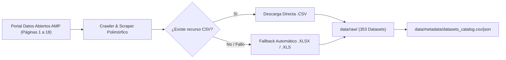
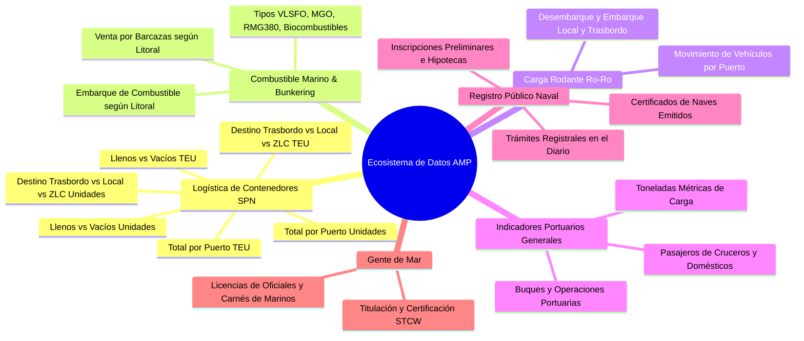
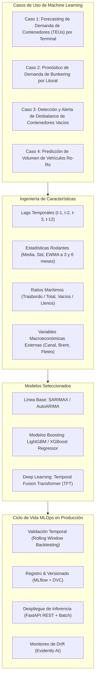
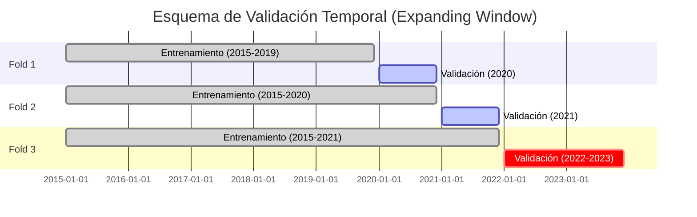
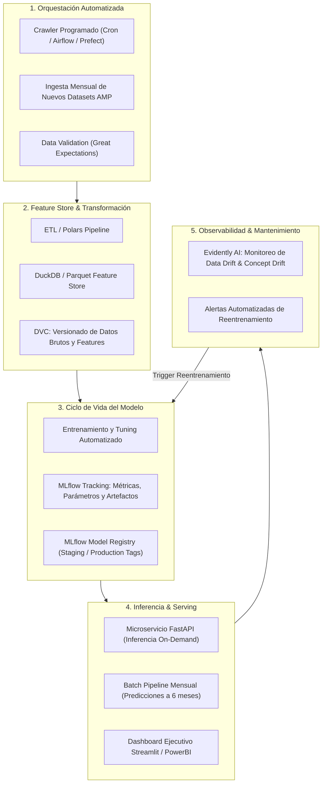

# Plan Maestro de Ingeniería de Datos y Pipeline de Machine Learning para el Sistema Portuario Nacional (AMP - Panamá)

---

## 1. Resumen Ejecutivo y Resultados del Proceso de Extracción

### 1.1 Alcance y Origen de los Datos
El presente plan estratégico se fundamenta en la ingesta, inspección y modelado analítico de los datos abiertos suministrados por la **Autoridad Marítima de Panamá (AMP)** a través de la plataforma nacional de datos abiertos:
`https://www.datosabiertos.gob.pa/dataset/?organization=autoridad-maritima-de-panama-amp`

### 1.2 Resultados Cuantitativos del Proceso de Descarga
- **Total de páginas web iteradas en el portal:** 18 páginas (de `page=1` a `page=18`).
- **Total de datasets identificados:** 353 conjuntos de datos.
- **Total de archivos descargados con éxito:** 353 archivos (100% de tasa de completitud).
- **Formato primario descargado:** Formato plano delimitado `.csv` (353 archivos).
- **Mecanismo de contingencia (Fallback):** Protocolo automático configurado para buscar e ingerir la versión en hojas de cálculo Excel (`.xlsx` / `.xls`) en caso de enlaces `.csv` no disponibles o fallidos.
- **Volumen total en disco:** ~8.54 MB de datos brutos estructurados.
- **Ubicación de almacenamiento local:**
  - Datos brutos: `data/raw/`
  - Catálogo y metadatos JSON/CSV: `data/metadata/datasets_catalog.csv` y `data/metadata/datasets_catalog.json`



---

## 2. Taxonomía, Clasificación y Agrupación Contextual de los Datasets

El análisis exhaustivo de los 353 conjuntos de datos revela que no se trata de tablas aisladas e inconexas, sino de **series estadísticas temporales publicadas periódicamente (mensual y anualmente)** que cubren las actividades neurálgicas del hub marítimo, logístico y portuario de la República de Panamá.

Se identificaron **6 grandes familias temáticas o clusters contextuales**:



### 2.1 Cluster 1: Logística y Movimiento de Contenedores en el SPN (177 Datasets)
Representa el núcleo operativo del comercio exterior y trasbordo interoceánico panameño. Este grupo se descompone en 6 subgrupos analíticos:

1. **Movimiento Total en TEUs (Twenty-Foot Equivalent Unit) por Puerto (30 datasets):**
   - *Variables:* Año, Mes, Bocas Fruit Co., Colon Container Terminal (CCT), SSA Marine MIT (Manzanillo), Puerto Balboa, Puerto Cristóbal, PSA Panama International Terminal.
   - *Propósito:* Medición de volumen estandarizado internacional de contenedores.
2. **Movimiento Total en Unidades Físicas por Puerto (32 datasets):**
   - *Variables:* Conteo físico de cajas/contenedores sin ponderar por longitud (20, 40 o 45 pies).
   - *Propósito:* Medición de ocupación física de muelle, grúas pórtico y patios de almacenamiento.
3. **Movimiento por Tipo de Carga en TEU: Llenos vs. Vacíos (30 datasets):**
   - *Variables:* Desglose para cada una de las 6 terminales de contenedores llenos (*laden*) versus vacíos (*empty*).
   - *Propósito:* Diagnóstico de balanza comercial, reposicionamiento de equipo vacío y congestión de patios.
4. **Movimiento por Tipo de Carga en Unidades: Llenos vs. Vacíos (30 datasets):**
   - *Variables:* Equivalente en cajas físicas del subgrupo anterior.
5. **Movimiento por Destino Operativo en TEU (26 datasets):**
   - *Variables:* Desglose por terminal entre:
     - **Trasbordo:** Contenedores que llegan por mar y continúan por vía marítima hacia terceros países (la gran mayoría del volumen del hub panameño).
     - **Local:** Carga de importación o exportación que ingresa o sale del territorio aduanero panameño.
     - **Zona Libre:** Carga destinada o procedente de la Zona Libre de Colón (ZLC).
6. **Movimiento por Destino Operativo en Unidades (29 datasets):**
   - *Variables:* Desglose en unidades físicas para cada categoría de destino.

### 2.2 Cluster 2: Combustible Marino y Servicios de Bunkering (60 Datasets)
Panamá es uno de los principales centros de suministro de combustible para buques del mundo gracias a las entradas del Canal de Panamá.
1. **Venta de Combustible Marino a través de Barcazas según Litoral (30 datasets):**
   - *Variables:* Año, Mes, Naves Atendidas Pacífico, Barcazas Operando Pacífico, VLSFO (Very Low Sulphur Fuel Oil - Toneladas Métricas), RMG 380 (TM), MGO (Marine Gas Oil - TM), LSMGO (Low Sulphur MGO - TM), Biocombustibles (TM), y sus análogos para el Sector Atlántico.
   - *Propósito:* Análisis de la demanda energética de la flota mercante global en tránsito o fondeo.
2. **Embarque de Combustible Marino según Litoral (30 datasets):**
   - *Variables:* Embarque mensual en barriles y toneladas métricas de Fuel Oil y Diesel Marino en ambos litorales.

### 2.3 Cluster 3: Carga Rodante / Movimiento de Vehículos (Ro-Ro) (51 Datasets)
1. **Movimiento de Vehículos por Terminal Portuaria:**
   - *Variables:* Terminal portuaria (SSA Marine MIT, Balboa, Cristóbal), Producto (automóviles, equipo rodante), Desembarque Local, Desembarque Trasbordo, Embarque Local, Embarque Trasbordo.
   - *Propósito:* Gestión logística del hub automotriz regional para América Latina y el Caribe.

### 2.4 Cluster 4: Indicadores Portuarios Macroeconómicos Generales (40 Datasets)
1. **Consolidados Nacionales de Carga y Pasaje:**
   - *Variables:* Movimiento total de contenedores (TEU y Unidades), Movimiento de vehículos, Carga total en Toneladas Métricas (graneles líquidos, sólidos, carga general), Movimiento de pasajeros de cruceros (turismo marítimo internacional), Movimiento de pasajeros domésticos (cabotaje insular y nacional), Licencias emitidas y marinos.

### 2.5 Cluster 5: Registro Naval y Propiedad de Naves (24 Datasets)
Panamá ostenta el registro de abanderamiento de naves más grande del mundo.
1. **Indicadores de Trámite del Registro Público de Títulos:**
   - *Variables:* Documentos ingresados al diario, Número de certificados de naves emitidos, Inscripciones preliminares de hipotecas navales realizadas, Alteraciones de turnos solicitados, Informaciones registrales emitidas.
   - *Propósito:* Monitoreo de la actividad jurídica, financiera y registral de la flota mercante abanderada bajo pabellón panameño.

### 2.6 Cluster 6: Gente de Mar y Formación Marítima (1 Dataset)
1. **Dirección General de la Gente de Mar:**
   - *Variables:* Ingresos y trámites de emisión de licencias de oficiales, carnés de marinos bajo el convenio STCW (Standards of Training, Certification and Watchkeeping for Seafarers).

---

## 3. Diagnóstico Técnico, Calidad de Datos y Profiling (Anomalías Detectadas)

Durante la inspección algorítmica de los 353 archivos descargados en `data/raw`, se detectaron anomalías estructurales y desafíos de calidad que condicionan la estrategia de ingeniería de datos:

| Desafío / Anomalía | Evidencia Concreta en los Archivos | Impacto Técnico |
| :--- | :--- | :--- |
| **Naturaleza Acumulativa de Publicaciones** | Archivos como `amp-embarque-de-combustible-marino-agosto-2021.csv` contienen columnas desde enero hasta agosto; mientras que el archivo de diciembre contiene todo el año. Igual ocurre en contenedores donde cada mes añade una fila. | Una unión simple (`pd.concat`) causaría **duplicación masiva y artificial de observaciones** históricas. |
| **Schema Drift Léxico** | La columna `Año` aparece como `Año`, `Ao`, `Ao`, `Años`, `YEAR`. El puerto de Manzanillo aparece como `SSA Marine MIT`, `Puerto MIT`, `MIT`. | Falla inmediata en parsers estáticos sin normalización previa. |
| **Encodings Heterogéneos** | **332 archivos** codificados en `ISO-8859-1 / Latin-1 / Windows-1252` y **21 archivos** en `UTF-8`. | Errores de decodificación (`UnicodeDecodeError`) o corrupción de caracteres (`Balboa`, `Cristbal`, `Vacos`). |
| **Delimitadores Mixtos** | **269 archivos** usan coma (`,`), mientras que **84 archivos** usan punto y coma (`;`). | Inconsistencia en la separación de columnas al cargar de forma automatizada. |
| **Marcadores de Preliminaridad** | La columna de año frecuentemente contiene valores con sufijo textual como `2026(p)` o `2021(P)` (p = dato preliminar). | Conversión fallida a tipos numéricos enteros o fechas. |
| **Orientación Dimensional Inversa** | Los archivos de combustible marino presentan los meses como **columnas** (`ene-21`, `feb-21`), mientras que los de contenedores presentan los meses como **filas**. | Necesidad de operaciones de des-pivotado (*unpivoting / melt*) para uniformar a formato *Tidy Data*. |
| **Columnas Espurias Flotantes** | Columnas residuales como `Unnamed: 20` generadas por delimitadores sobrantes al final de cada línea en los archivos generados por Excel. | Contaminación del espacio dimensional y valores `NaN` innecesarios. |

---

## 4. Plan de Procesamiento y Normalización de Datos

Para convertir estos 353 archivos crudos heterogéneos en una base analítica impecable, se adopta una **Arquitectura Medallion (Bronze $\rightarrow$ Silver $\rightarrow$ Gold)**.

```mermaid
flowchart TD
    subgraph Bronze Layer ["Capa Bronze (Raw Data)"]
        B1["353 Datasets .CSV Crudos en data/raw/"]
        B2["Metadatos de Ingesta en data/metadata/"]
    end

    subgraph Silver Layer ["Capa Silver (Harmonized & Cleansed)"]
        S1["Parser Polimórfico (Encoding & Delimiter Sniffer)"]
        S2["Deduplicador Bitemporal (Resolución de Snapshots)"]
        S3["Estandarizador de Esquemas & Alias Mapping"]
        S4["Unpivoting / Reshaping a Formato Tidy"]
        S5["Tablas Parquet Limpias: fact_containers, fact_bunkering, fact_roro"]
    end

    subgraph Gold Layer ["Capa Gold (Analytical Marts & Feature Store)"]
        G1["Data Marts Agregados Mensuales"]
        G2["Feature Store para Machine Learning (Lags, Ratios, Rolling)"]
        G3["Validación Automatizada (Great Expectations / Pydantic)"]
    end

    Bronze Layer --> Silver Layer
    Silver Layer --> Gold Layer
```

### 4.1 Paso 1: Ingesta y Detección Heurística de Formato (Qué, Cómo y Por Qué)
- **Qué se hace:** Se implementa un motor de lectura resiliente que detecta dinámicamente la codificación (`chardet` / prueba secuencial de `utf-8`, `latin-1`, `cp1252`) y el delimitador (`csv.Sniffer` sobre las primeras líneas).
- **Cómo se hace:**
  ```python
  def read_resilient_csv(filepath):
      with open(filepath, 'rb') as f:
          raw = f.read(4096)
      enc = 'utf-8'
      try:
          raw.decode('utf-8')
      except UnicodeDecodeError:
          enc = 'latin-1'
      sample = raw.decode(enc, errors='replace')
      delim = ';' if ';' in sample.splitlines()[0] else ','
      df = pd.read_csv(filepath, sep=delim, encoding=enc, on_bad_lines='skip')
      return df
  ```
- **Por qué se hace:** Elimina excepciones en tiempo de ejecución causadas por la disparidad entre delimitadores (`;` vs `,`) y juegos de caracteres de las herramientas de oficina gubernamentales.

### 4.2 Paso 2: Deduplicación y Resolución Temporal Bitemporal (Qué, Cómo y Por Qué)
- **Qué se hace:** Dado que los reportes de la AMP son acumulativos a lo largo del año (el archivo de agosto contiene de enero a agosto, y el de diciembre contiene de enero a diciembre), se aplica una regla estricta de **resolución de snapshot más reciente**.
- **Cómo se hace:**
  1. Para cada registro se extrae la tupla clave temporal: `(año, mes, terminal, métrica)`.
  2. Cada archivo se vincula con su fecha de publicación (`metadata_modified` o nombre de corte mensual).
  3. Si existen múltiples observaciones para el mismo `(año, mes)`, se selecciona el registro del último corte disponible (reemplazando versiones preliminares `(p)` por cifras definitivas o consolidadas).
- **Por qué se hace:** Evita que el volumen de enero se contabilice 12 veces si se concatenan los 12 reportes del año. Garantiza la fidelidad matemática de las series temporales históricas.

### 4.3 Paso 3: Limpieza de Esquemas y Mapeo Canónico de Entidades (Qué, Cómo y Por Qué)
- **Qué se hace:** Se construye un diccionario de normalización de entidades portuarias, tipos de carga y métricas.
- **Cómo se hace:**
  - **Mapeo de Terminales:**
    - `{'bocas fruit', 'bocas fruit co.'} -> 'Bocas Fruit Co.'` (Litoral Atlántico)
    - `{'cct', 'colon container terminal', 'colon container terminal s.a.'} -> 'Colon Container Terminal'` (Litoral Atlántico)
    - `{'mit', 'ssa marine mit', 'manzanillo international terminal'} -> 'SSA Marine MIT'` (Litoral Atlántico)
    - `{'puerto balboa', 'balboa'} -> 'Puerto Balboa'` (Litoral Pacífico)
    - `{'puerto cristobal', 'puerto cristóbal', 'cristobal'} -> 'Puerto Cristóbal'` (Litoral Atlántico)
    - `{'psa', 'psa panama', 'psa panama international terminal'} -> 'PSA Panama International Terminal'` (Litoral Pacífico)
  - **Mapeo de Meses:**
    - `{'enero': 1, 'febrero': 2, ..., 'diciembre': 12}`
  - **Limpieza de Años:**
    - Extracción con expresión regular `^(\d{4})` para limpiar marcas `(p)`.
  - **Construcción de Timestamp Estándar:**
    - `fecha = pd.to_datetime(f"{año}-{mes:02d}-01")`
- **Por qué se hace:** La concordancia semántica es indispensable para realizar uniones relacionales (*joins*), agrupaciones (*group by*) y análisis longitudinales sin fragmentación de categorías.

### 4.4 Paso 4: Des-pivotado (Unpivoting / Melt) hacia Formato Tidy (Qué, Cómo y Por Qué)
- **Qué se hace:** Se transforman las tablas anchas con múltiples métricas en columnas hacia una estructura atómica dimensional:
  $$\text{Registro} = (\text{Fecha}, \text{Terminal}, \text{Litoral}, \text{Categoría}, \text{Operación}, \text{Unidad\_Medida}, \text{Valor})$$
- **Cómo se hace:**
  Para los datasets de contenedores por destino, columnas como `Puerto Balboa Trasbordo` se descomponen en:
  - `terminal = 'Puerto Balboa'`
  - `litoral = 'Pacífico'`
  - `operacion = 'Trasbordo'`
  - `unidad = 'TEU'`
  - `valor = 200394.0`
- **Por qué se hace:** Los modelos de Machine Learning y motores analíticos (DuckDB, Spark, Polars) operan óptimamente sobre estructuras columnares largas (*tall/tidy tables*), facilitando la extracción masiva de *features* y agregaciones dinámicas.

### 4.5 Paso 5: Almacenamiento en Capa Silver y Gold (Parquet) (Qué, Cómo y Por Qué)
- **Qué se hace:** Se persisten los datos limpios en formato binario columnar **Apache Parquet**, organizados en las siguientes entidades:
  1. `fact_container_movements.parquet`
  2. `fact_bunkering_sales.parquet`
  3. `fact_roro_movements.parquet`
  4. `fact_port_macro_indicators.parquet`
  5. `fact_vessel_registry.parquet`
- **Cómo se hace:** Usando compresión Snappy y particionamiento por año y categoría temática.
- **Por qué se hace:** Parquet preserva estrictamente los tipos de datos (evita reconvertir cadenas de texto a enteros en cada sesión), reduce el uso de memoria RAM en más del 80% y acelera las consultas analíticas hasta 100 veces frente a CSVs planos.

---

## 5. Estrategias y Arquitectura Integral para el Pipeline de Machine Learning

A partir de los datos consolidados y normalizados de la AMP, se diseñan **cuatro casos de uso reales de Machine Learning** de alto impacto para la toma de decisiones en el sector marítimo-portuario:



---

### 5.1 Caso de Uso 1: Forecasting de Tráfico de Contenedores (TEUs) por Terminal Portuaria
- **Objetivo de Negocio:** Predecir con 1 a 6 meses de anticipación el volumen de TEUs a movilizar en cada terminal portuaria (Balboa, MIT, Cristóbal, CCT, PSA).
- **Impacto:** Planificación de cuadrillas operativas, asignación de ventanas de atraque, mantenimiento preventivo de grúas STS (*Ship-to-Shore*) y gestión de capacidad de almacenamiento en patio.

### 5.2 Caso de Uso 2: Pronóstico de Demanda de Bunkering (Combustible Marino) en el Hub Interoceánico
- **Objetivo de Negocio:** Predecir el consumo mensual en toneladas métricas de VLSFO, LSMGO y RMG 380 en los litorales Pacífico y Atlántico.
- **Impacto:** Optimización de la flota de barcazas de suministro (*bunker barges*), negociación anticipada de inventarios de hidrocarburos y prevención de desabastecimiento en naves en espera de tránsito por el Canal de Panamá.

### 5.3 Caso de Uso 3: Alerta Temprana de Desbalance de Contenedores Vacíos (Empty Repositioning)
- **Objetivo de Negocio:** Estimar la brecha entre contenedores llenos de importación/exportación y unidades vacías retenidas en los patios terminales.
- **Impacto:** Los contenedores vacíos generan costo de almacenamiento pasivo y saturan los muelles; predecir el ratio `Vacíos / Llenos` permite a las líneas navieras coordinar buques de evacuación de vacíos (*sweeper vessels*) de forma programada.

### 5.4 Caso de Uso 4: Predicción de Carga Rodante (Vehículos Ro-Ro)
- **Objetivo de Negocio:** Anticipar los picos de desembarque y trasbordo de vehículos en MIT y Balboa, vinculados a la estacionalidad del mercado automotriz internacional.

---

## 6. Ingeniería de Características (Feature Engineering) para Series Temporales Portuarias

Para alimentar los modelos de Machine Learning supervisados (LightGBM, XGBoost, CatBoost), se estructura un conjunto exhaustivo de variables explicativas generadas a partir del histórico normalizado:

### 6.1 Variables Temporales y Cíclicas
- **Mes del año (estacionalidad anual):** Codificado mediante transformaciones seno y coseno para preservar la naturaleza circular del calendario:
  $$\text{mes\_sin} = \sin\left(\frac{2 \pi \cdot \text{mes}}{12}\right), \quad \text{mes\_cos} = \cos\left(\frac{2 \pi \cdot \text{mes}}{12}\right)$$
- **Trimestre (Quarter):** Dummies que capturan ciclos comerciales trimestrales (ej. pico de compras navideñas previas al Q4).
- **Indicadores de Año Nuevo Chino:** Variable binaria que captura el impacto del cierre fabril asiático entre enero y febrero en los tránsitos y trasbordos.

### 6.2 Retardos Autorregresivos (Lag Features)
- **Lags de Corto Plazo:** $y_{t-1}, y_{t-2}, y_{t-3}$ (capturan inercia y autocorrelación inmediata).
- **Lags Estacionales:** $y_{t-12}$ (captura el nivel operativo del mismo mes en el año precedente).

### 6.3 Métricas Rodantes y Estadísticas de Ventana (Rolling Windows)
- **Media Móvil a 3 y 6 meses:**
  $$\text{Rolling\_Mean}_3(t) = \frac{1}{3} \sum_{i=1}^{3} y_{t-i}$$
  Suaviza el ruido mensual e identifica la tendencia macro subyacente.
- **Desviación Estándar Rodante (Volatilidad Operativa):**
  $$\text{Rolling\_Std}_6(t) = \sqrt{\frac{1}{5} \sum_{i=1}^{6} (y_{t-i} - \mu)^2}$$
  Mide periodos de turbulencia en la cadena de suministro (huelgas, restricciones de calado en el Canal, disrupciones globales).
- **EWMA (Media Móvil Ponderada Exponencialmente):** Da mayor peso a las observaciones recientes frente a las lejanas.

### 6.4 Ratios de Dominio Marítimo
- **Ratio de Trasbordo:**
  $$\text{Transshipment\_Ratio}_t = \frac{\text{TEU\_Trasbordo}_t}{\text{TEU\_Total}_t}$$
  Indica si la terminal está operando predominantemente como centro de conexión o como puerto de consumo doméstico.
- **Ratio de Vacíos:**
  $$\text{Empty\_Ratio}_t = \frac{\text{TEU\_Vacíos}_t}{\text{TEU\_Llenos}_t}$$
- **Factor de Conversión TEU/Unidad:**
  $$\text{TEU\_Unit\_Factor}_t = \frac{\text{Total\_TEU}_t}{\text{Total\_Unidades}_t}$$
  Aproxima la proporción de contenedores de 40 pies (2 TEUs) vs 20 pies (1 TEU) movilizados en la terminal.

### 6.5 Variables Exógenas del Ecosistema Marítimo (Propuesta de Fusión)
- Precios internacionales de combustible marino (Bunker Brent / Singapore / Rotterdam).
- Número de tránsitos mensuales reportados por la Autoridad del Canal de Panamá (ACP).
- Índices de fletes marítimos globales: *Shanghai Containerized Freight Index (SCFI)* y *Baltic Dry Index (BDI)*.

---

## 7. Selección de Modelos, Entrenamiento y Validación

### 7.1 Zoo de Modelos
1. **Modelos Estadísticos Clásicos (Línea Base):**
   - **SARIMAX:** $(p, d, q) \times (P, D, Q)_{12}$ con variables exógenas.
   - *Ventaja:* Interpretable, robusto para series univariadas lineales con fuerte estacionalidad.
2. **Modelos de Ensamble y Boosting Tabular:**
   - **LightGBM Regressor / XGBoost Regressor:**
   - *Ventaja:* Capacidad superior para modelar no linealidades, interacciones complejas entre terminales y manejo natural de covariables numéricas y categóricas.
3. **Modelos de Deep Learning para Series Temporales Multivariadas:**
   - **Temporal Fusion Transformer (TFT):**
   - *Ventaja:* Arquitectura de atención que procesa simultáneamente covariables estáticas (litoral, calado del puerto), variables conocidas a futuro (estacionalidad, calendario) y variables históricas observadas. Proporciona interpretabilidad mediante pesos de atención temporal y cuantiles predictivos (P10, P50, P90).

### 7.2 Esquema de Validación: Backtesting Temporal sin Data Leakage
En series temporales portuarias, el remuestreo aleatorio (*Random K-Fold Cross-Validation*) es inadmisible porque incurre en **fuga de datos del futuro hacia el pasado**.
Se implementa **Time Series Split con Ventana Expandible (Expanding Window Backtesting)**:



### 7.3 Métricas de Evaluación
- **WAPE (Weighted Absolute Percentage Error):**
  $$\text{WAPE} = \frac{\sum_{i=1}^n |y_i - \hat{y}_i|}{\sum_{i=1}^n y_i}$$
  Métrica primordial en logística; evita la distorsión del MAPE clásico cuando los volúmenes son pequeños en terminales menores (como Bocas Fruit).
- **RMSE (Root Mean Squared Error):** Penaliza fuertemente los errores de gran magnitud en terminales de alto volumen (Balboa o MIT).
- **MAE (Mean Absolute Error):** Magnitud promedio del error en TEUs o Toneladas Métricas.

---

## 8. Arquitectura MLOps y Operación en Producción

Para garantizar que los modelos no queden en meros cuadernos experimentales, se define un flujo de producción continuo:



### 8.1 Componentes Tecnológicos Recomendados
1. **Orquestación de Datos:** Apache Airflow o Prefect. Ejecución de DAGs mensuales al publicarse nuevos boletines en el portal de datos abiertos.
2. **Validación de Calidad:** *Great Expectations* o *Pydantic*. Valida que no existan valores negativos de TEU, que la suma por destino cuadre con el total por puerto y que no falten terminales críticas.
3. **Versionado de Datos y Modelos:**
   - **DVC (Data Version Control):** Rastrea cambios en los archivos Parquet de la capa Silver y Gold.
   - **MLflow:** Registra experimentos, hiperparámetros (árboles, tasa de aprendizaje, profundidad) y almacena los artefactos de los modelos aprobados.
4. **Despliegue (Serving):**
   - API REST en **FastAPI** para consultas interactivas de pronóstico.
   - Pipelines Batch mensuales para poblar tablas analíticas consumidas por dashboards directivos en **Streamlit** o **PowerBI**.
5. **Detección de Deriva (Drift Monitoring):**
   - Herramienta: **Evidently AI**.
   - Evalúa **Data Drift** (cambios en la distribución de las variables predictoras, ej. caída de tránsitos del canal por sequía) y **Concept Drift** (degradación del WAPE en producción). Si el WAPE supera el 12%, se dispara automáticamente el reentrenamiento supervisado.

---

## 9. Justificación Teórico-Práctica Detallada: ¿Qué, Cómo y Por Qué?

| Etapa del Pipeline | ¿Qué se hace? | ¿Cómo se hace? | ¿Por qué se hace? |
| :--- | :--- | :--- | :--- |
| **Ingesta y Extracción** | Scraping e iteración sobre las 18 páginas del portal de la AMP. Descarga de 353 datasets en CSV con fallback a Excel. | Paginación sistemática vía peticiones HTTP con emulación de navegador y consulta concurrente con reintentos a la API CKAN. | Asegura la recolección íntegra de la totalidad de la historia estadística publicada por la institución sin omisión de periodos. |
| **Profilado y Diagnóstico** | Análisis de codificación (Latin-1 vs UTF-8), delimitadores (`;` vs `,`) y detección de esquemas acumulativos. | Inspección de cabeceras en bytes crudos y análisis de distribuciones de valores con Python. | Evita fallos silenciosos, corrupción de texto en nombres de terminales panameñas y duplicación artificial de filas. |
| **Normalización (Capa Silver)** | Homogeneización de alias de puertos, limpieza de sufijos `(p)`, unpivoting a formato Tidy Data y persistencia en Parquet. | Expresiones regulares, diccionarios canónicos de puertos, función `pd.melt()` y compresión Snappy en Parquet. | Convierte un conjunto desarticulado de 353 archivos en un repositorio estructurado, relacional y optimizado para analítica de alta velocidad. |
| **Ingeniería de Features** | Construcción de lags ($t-1, t-12$), ventanas móviles (medias y volatilidades), componentes cíclicos y ratios marítimos. | Desplazamientos temporales por terminal (`groupby('terminal').shift()`) y funciones trigonométricas. | Los algoritmos predictivos no tienen noción de calendario ni inercia si no se les suministran patrones históricos y ratios operativos explícitos. |
| **Modelado Predictivo** | Entrenamiento de modelos de Boosting (LightGBM) y redes neuronales especializadas (TFT) para forecasting portuario y de bunkering. | Optimización bayesiana de hiperparámetros y validación temporal estricta mediante *Expanding Window*. | Garantiza pronósticos robustos con estimación de incertidumbre que reflejan fielmente la dinámica del comercio global sin sobreajuste (*overfitting*). |
| **Operación MLOps** | Automatización del ciclo de vida: orquestación, registro en MLflow, servicio en FastAPI y monitoreo de deriva con Evidently AI. | Contenedorización con Docker, pipelines CI/CD y alertas automáticas ante cambios estructurales en el comercio marítimo. | Transforma la analítica retrospectiva en una capacidad operativa proactiva que genera valor continuo y medible para la toma de decisiones portuarias. |

---

## 10. Conclusión y Hoja de Ruta de Implementación

Con la descarga exitosa de los **353 datasets** y la creación del catálogo exhaustivo en `data/metadata/datasets_catalog.csv`, se dispone de la materia prima completa para construir el primer **Sistema Integral de Inteligencia Artificial Portuaria para la Autoridad Marítima de Panamá**.

### Pasos Inmediatos Recomendados:
1. **Ejecutar el script de normalización y construcción de la Capa Silver** (`fact_container_movements.parquet`, `fact_bunkering_sales.parquet`, `fact_roro_movements.parquet`).
2. **Generar el Feature Store consolidado** con variables exógenas marítimas.
3. **Entrenar y registrar en MLflow los modelos basales de LightGBM y SARIMAX** para el forecasting de TEUs de las terminales de Balboa, MIT y Cristóbal.
4. **Desplegar un panel de control interactivo** que visualice los pronósticos a 6 meses con sus intervalos de confianza para las autoridades y operadores portuarios.
