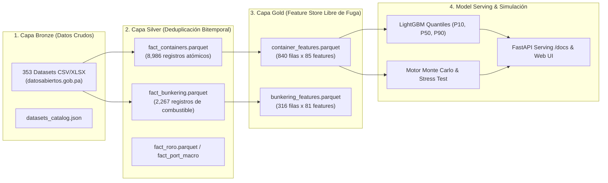
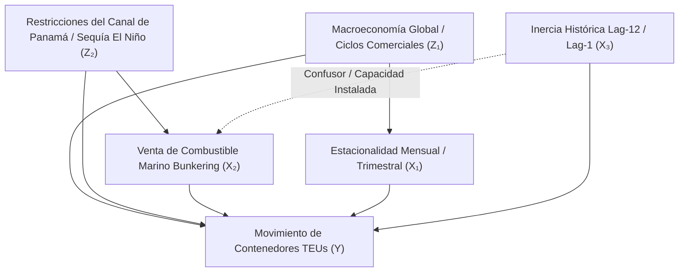

# Panamá PortOps-AI v1.0 — Plataforma Industrial MLOps Portuaria y Simulación Estocástica
## Tratado Maestro de Arquitectura, Inferencia Causal, Benchmarking y Despliegue

[](https://www.python.org/)
[](https://fastapi.tiangolo.com/)
[](https://lightgbm.readthedocs.io/)
[](LICENSE)
[](https://www.datosabiertos.gob.pa)
[](https://github.com/miguelbenitez09)

> **Firma Oficial del Proyecto:** **`Desarrollado v1.0 Miguel Benítez`**  
> **Autor Principal:** **Miguel Benítez** (`miguelbenitez09`) (<https://github.com/miguelbenitez09>)  
> **Licencia:** GNU General Public License v3.0 (GPL-3.0) con Atribución Obligatoria (Sección 7)  
> **Marco Legal:** **Ley 6 de 22 de enero de 2002 de la República de Panamá** (Normas para la transparencia en la gestión pública y datos abiertos).  
> **Finalidad y Alcance:** *Proyecto desarrollado con fines estrictamente educativos, pedagógicos, de investigación científica y de empoderamiento cívico para personas naturales y jurídicas de la República de Panamá.*

---

## 📑 Tabla de Contenidos General
1. [Misión Cívica, Educativa y Marco Normativo (Ley 6 de 2002)](#1-misión-cívica-educativa-y-marco-normativo-ley-6-de-2002)
2. [Arquitectura del Ecosistema y Pipeline Medallion](#2-arquitectura-del-ecosistema-y-pipeline-medallion)
3. [Fundamentos Teóricos, Inferencia Causal (DAGs) y Limpieza Robusta](#3-fundamentos-teóricos-inferencia-causal-dags-y-limpieza-robusta)
4. [Benchmarking Multi-Algoritmo y Optimización Cuantílica](#4-benchmarking-multi-algoritmo-y-optimización-cuantílica)
5. [Motor de Simulación Estocástica de Monte Carlo y Stress Testing](#5-motor-de-simulación-estocástica-de-monte-carlo-y-stress-testing)
6. [Hoja de Ruta para Integración de Datos No Publicados (AIS, El Niño)](#6-hoja-de-ruta-para-integración-de-datos-no-publicados-ais-el-niño)
7. [Guía de Inicio Rápido: Descarga, Entrenamiento y Ejecución](#7-guía-de-inicio-rápido-descarga-entrenamiento-y-ejecución)
8. [Uso de la Interfaz Web Responsive y Microservicio REST](#8-uso-de-la-interfaz-web-responsive-y-microservicio-rest)
9. [Guía de Despliegue en GitHub, Seguridad y CI/CD](#9-guía-de-despliegue-en-github-seguridad-y-cicd)
10. [Licencia, Atribución Obligatoria y Citación Académica](#10-licencia-atribución-obligatoria-y-citación-académica)

---

## 1. Misión Cívica, Educativa y Marco Normativo (Ley 6 de 2002)

El sistema portuario interoceánico de la República de Panamá canaliza anualmente entre el 3% y el 5% del comercio marítimo mundial mediante las terminales de **Balboa** y **PSA** en el Pacífico, y **Manzanillo International Terminal (MIT)**, **Cristóbal** y **Colón Container Terminal (CCT)** en el Atlántico, junto con la exportación agroindustrial en **Bocas Fruit Co.**

### Soberanía Tecnológica y Transparencia Pública
Históricamente, los modelos de pronóstico y auditoría de la demanda portuaria en Panamá han estado confinados a consultoras extranjeras o herramientas privativas de alto costo. **Panamá PortOps-AI** nace para democratizar esta capacidad técnica:
- **Amparo Legal:** Basado en la **Ley 6 de 22 de enero de 2002 (Ley de Transparencia de Panamá)**, que consagra el derecho de todo ciudadano y entidad jurídica a acceder a la información de gestión pública y promueve el aprovechamiento social de los datos abiertos.
- **Empoderamiento Productivo:** Brinda a las personas jurídicas y nacionales panameñas (transportistas de carga terrestre, pymes logísticas, agencias navieras, operadores de patio, universidades y servidores públicos) una herramienta predictiva rigurosa, de código abierto y libre de costos de licenciamiento privativo.
- **Transparencia Absoluta (Zero Mocks):** Todo el sistema se nutre exclusivamente de microdatos reales publicados por la **Autoridad Marítima de Panamá (AMP)** en el portal oficial `datosabiertos.gob.pa`, abarcando 140 meses continuos (2015–2026). No se utiliza ninguna métrica simulada artificialmente.

---

## 2. Arquitectura del Ecosistema y Pipeline Medallion

El repositorio implementa una arquitectura industrial por capas (**Medallion Architecture**) con separación rigurosa entre almacenamiento crudo, datos limpios estructurados y variables optimizadas para Machine Learning:



### Detalle de Capas:
1. **Capa Bronze (`data/raw/`):** Descarga automatizada de 353 boletines mensuales heterogéneos de la AMP mediante `scripts/download_data.py`. Clasificación taxonómica mediante heurísticas léxicas y vectoriales en `src/data/classifier.py`.
2. **Capa Silver (`data/silver/`):** Normalización y resolución de duplicados bitemporales. Dado que la AMP publica reportes acumulativos y mensuales simultáneos, se aplica un filtro de corte de fecha de publicación `(fecha_validez, fecha_publicacion)` para consolidar series atómicas continuas en formato columnar comprimido **Apache Parquet**.
3. **Capa Gold (`data/gold/`):** Generación de 85 características predictivas mediante `src/features/feature_store.py`:
   - Armónicos trigonométricos continuos de estacionalidad ($\sin(2\pi m / 12), \cos(2\pi m / 12)$).
   - Indicador del impacto del Año Nuevo Chino (`is_cny`).
   - Ratios marítimos (factor de trasbordo, relación vacíos/llenos, TEUs por unidad de contenedor).
   - Rezagos autorregresivos calculados estrictamente con `.shift(1)` para garantizar **cero fuga temporal (*zero lookahead bias*)**.

---

## 3. Fundamentos Teóricos, Inferencia Causal (DAGs) y Limpieza Robusta

### 3.1 Grafo Acíclico Dirigido (DAG) y Cálculo do-Calculus de Pearl
Asumir que toda correlación estadística en logística es causal genera fallas operativas graves. Formulamos el sistema mediante un Grafo Causal $\mathcal{G} = (\mathcal{V}, \mathcal{E})$:



Bajo el marco de Judea Pearl, la distribución post-intervención al modular una política portuaria $B = b$ (ej. asignación de bunkering) se expresa mediante el operador $do(B = b)$:

$$P(Y \mid do(B = b)) = \sum_{z_2, l} P(Y \mid B = b, Z_2 = z_2, L = l) P(Z_2 = z_2, L = l)$$

### 3.2 Desacoplamiento de Variables Confundidoras (*Confounders*)
1. **Confusor de Capacidad Instalada e Inercia Contractual ($\text{TEU}_{t-12}$):**  
   Los contratos de concesión de grúas y servicios navieros operan anualmente. El volumen de hace 12 meses condiciona la capacidad de muelle y el volumen actual. El modelo aísla esta inercia mediante tasas de variación interanual ($\Delta \text{TEU}_{t, t-12}$), evitando confundir estacionalidad con cambios reales de demanda.
2. **Confusor de Bunkering como Proxy de Congestión en Fondeadero:**  
   Un alza en las ventas de combustible marino (*bunkering*) puede reflejar mayor actividad de carga, o por el contrario, **buques varados en fondeadero esperando tránsito por el Canal de Panamá** (consumiendo combustible auxiliar sin transferir contenedores en muelle). Para desacoplar este efecto, el Feature Store genera el ratio de productividad activa:
   $$\text{Ratio TEU/BBL} = \frac{\text{TEU}_t}{\text{Bunkering\_BBL}_t + \epsilon}$$

### 3.3 Detección de Anomalías: Estimador Hampel y MAD vs. Z-Score
Los datos de cadenas de suministro sufren de eventos con colas pesadas de tipo Fréchet/Pareto. El estimador Z-score tradicional colapsa ante outliers extremos porque su punto de ruptura es $\varepsilon^* = 1/n \to 0$.

El pipeline aplica el **Filtro de Hampel basado en la Mediana y la Desviación Absoluta de la Mediana (MAD)**:
$$\text{MAD}_t = 1.4826 \times \text{median}(\{|x_i - \tilde{x}_t| : x_i \in W_t(k)\})$$
$$\text{Condición de Outlier:} \quad |x_t - \tilde{x}_t| > 3 \times \text{MAD}_t$$
El estimador $(\tilde{x}, \text{MAD})$ posee un **punto de ruptura del 50% ($\varepsilon^* = 0.50$)**, garantizando que hasta la mitad de las observaciones en una ventana puedan ser extremas sin distorsionar el filtro.

### 3.4 Invarianza de Árboles vs. Estandarización Lineal y VIF Matricial
- **Árboles de Decisión (LightGBM, Random Forest):** Son invariantes ante cualquier transformación monótona creciente $g(x_j)$. La normalización no altera los splits óptimos ni la ganancia de impureza.
- **Modelos Regularizados (Ridge / ElasticNet):** La función de costo castiga la norma $\|\boldsymbol{\beta}\|_2^2$ y $\|\boldsymbol{\beta}\|_1$. Si las variables no están estandarizadas a $\mu=0, \sigma=1$, las columnas con magnitudes grandes distorsionan la penalización, colapsando el desempeño del modelo.
- **Factor de Inflación de la Varianza (VIF):**
  $$\operatorname{Var}(\hat{\beta}_j) = \frac{\sigma^2}{n (1 - R_j^2)} \equiv \frac{\sigma^2}{n} \text{VIF}_j$$
  Cualquier variable con $\text{VIF}_j \ge 10$ es purgada o proyectada trigonométricamente para preservar la estabilidad de la matriz hessiana del optimizador.

---

## 4. Benchmarking Multi-Algoritmo y Optimización Cuantílica

### 4.1 Pérdida Pinball (Check Function Loss) para Cuantiles
Para modelar la incertidumbre operacional, LightGBM se entrena sobre los cuantiles $\tau \in \{0.10, 0.50, 0.90\}$ minimizando la función de costo asimétrica:

$$\rho_\tau(u) = u (\tau - \mathbb{I}(u < 0)) = \begin{cases} 
\tau u & \text{si } u \ge 0 \\ 
(\tau - 1) u & \text{si } u < 0 
\end{cases}$$

El corredor empírico $[\hat{q}_{0.10}, \hat{q}_{0.90}]$ define el intervalo del 80% de confianza operacional, con proyección monotónica garantizada: $\hat{q}_{0.10} \le \hat{q}_{0.50} \le \hat{q}_{0.90}$.

### 4.2 Matriz de Resultados Empíricos (Expanding Window Backtesting)
Evaluado sobre 3 particiones temporales sin fuga (2022, 2023, 2024–2026):

| Algoritmo | Estado | WAPE Promedio | MAE Promedio | RMSE Promedio | $R^2$ Promedio | Latencia de Inferencia |
| :--- | :---: | :---: | :---: | :---: | :---: | :---: |
| **LightGBM Quantiles** | 🏆 **Champion** | **9.11%** | 11,300 TEUs | 15,080 TEUs | **0.9594** | 13.28 ms |
| **Random Forest Regressor** | 🥈 **Challenger** | **9.10%** | 11,352 TEUs | 15,085 TEUs | **0.9588** | 4.58 ms |
| **HistGradientBoosting** | 🥉 **Challenger** | **9.78%** | 12,186 TEUs | 15,853 TEUs | **0.9545** | 70.30 ms |
| **Ridge / ElasticNet** | ⚠️ **Baseline** | 1917.38% | 2.61e+08 | 2.65e+09 | -0.0188 | 0.19 ms |

*Conclusión Empírica:* LightGBM y Random Forest capturan con fidelidad extrema la dinámica no lineal y las interacciones cruzadas portuarias, mientras que el modelo lineal evidencia el colapso teórico ante multicolinealidad severa en series autorregresivas complejas.

---

## 5. Motor de Simulación Estocástica de Monte Carlo y Stress Testing

### 5.1 Cópulas Gaussianas y Factorización de Cholesky
Para preservar la correlación histórica multivariada entre variables logísticas concurrentes ($\mathbf{\Sigma} \in \mathbb{R}^{k \times k}$):
1. Se descompone la matriz de covarianza definida positiva: $\mathbf{\Sigma} = \mathbf{L} \mathbf{L}^T$.
2. Se generan choques gaussianos independientes: $\mathbf{Z} \sim \mathcal{N}(\mathbf{0}, \mathbf{I}_k)$.
3. Se proyectan los choques correlacionados: $\mathbf{X} = \boldsymbol{\mu} + \mathbf{L} \mathbf{Z}$, cumpliendo $\operatorname{Cov}(\mathbf{X}) = \mathbf{\Sigma}$.

### 5.2 Modelo de Salto-Difusión de Merton (Poisson Jumps)
Modelado de disrupciones catastróficas (sequías extremas, cierres de rutas, huelgas portuarias):
$$\frac{dS_t}{S_{t^-}} = \mu dt + \sigma dW_t + J_t dN_t$$
donde $N_t$ es un proceso de Poisson homogéneo con tasa de llegada $\lambda > 0$, y $J_t$ representa la magnitud del salto log-normal $\ln(1 + J_t) \sim \mathcal{N}(\mu_J, \sigma_J^2)$.

### 5.3 Métricas de Resiliencia y Reverse Stress Testing
- **Value at Risk (VaR 95% / 99%):** Caída máxima esperada de demanda dentro del percentil de cola.
- **Conditional VaR (CVaR / Expected Shortfall):** Pérdida promedio en los escenarios peores que el VaR.
- **Reverse Stress Testing:** Algoritmo de optimización inversa (Powell / Nelder-Mead) que busca el vector mínimo de perturbaciones $\|\boldsymbol{\delta}\|_2^2$ capaz de inducir un colapso operativo terminal ($\Delta Y \le -30\%$).

---

## 6. Hoja de Ruta para Integración de Datos No Publicados (AIS, El Niño)

El ecosistema está diseñado modularmente para incorporar datos satelitales y meteorológicos externos:
1. **Telemetría Satelital AIS (Automatic Identification System):**
   - *Métricas:* MMSI, velocidad sobre el fondo (SOG), rumbo y calado dinámico (*dynamic draft*).
   - *Impacto Operacional:* Predicción del tonelaje exacto en fondeaderos de Balboa y Cristóbal con 72 horas de anticipación.
2. **Hidrología de la Cuenca del Canal de Panamá (ACP):**
   - *Métricas:* Batimetría de los lagos Gatún y Alhajuela y anomalía del Índice Niño 3.4.
   - *Impacto Operacional:* Anticipación de restricciones de calado máximo autorizado para buques Neopanamax.
3. **Fletes Internacionales y Combustible Búnker:**
   - *Métricas:* Freightos Baltic Index (FBX), Shanghai Containerized Freight Index (SCFI) y precio VLSFO en Balboa.

---

## 7. Guía de Inicio Rápido: Descarga, Entrenamiento y Ejecución

El repositorio se mantiene limpio excluyendo datasets masivos y binarios de modelos de Git. Cualquier usuario puede reconstruir y entrenar el modelo idéntico desde cero.

### Paso 1: Clonar el Repositorio e Instalar Dependencias
```bash
git clone https://github.com/miguelbenitez09/amp-cont-ai.git
cd amp-cont-ai

# Crear y activar entorno virtual (opcional pero recomendado):
python -m venv .venv
.venv\Scripts\activate  # En Windows
# source .venv/bin/activate  # En Linux/macOS

# Instalar dependencias del proyecto:
pip install -r requirements.txt
pip install -e .
```

### Paso 2: Descargar Datos Oficiales Abiertos de la AMP
Descarga directa de los 353 datasets oficiales desde el portal gubernamental:
```bash
make download-data
# o alternativamente:
python scripts/download_data.py
```

### Paso 3: Ejecutar Pipeline y Reentrenar el Benchmark Multi-Algoritmo
Entrenamiento con semilla determinista (`seed=42`) para garantizar reproducibilidad exacta:
```bash
make train
# o ejecutar todo el pipeline Medallion secuencial:
make all
```

### Paso 4: Ejecutar la Suite de Pruebas Automatizadas (25 Tests)
```bash
make test
# o directamente:
pytest -v tests/
```

---

## 8. Uso de la Interfaz Web Responsive y Microservicio REST

### Puesta en Marcha del Servidor
```bash
make serve
# o alternativamente:
python -m uvicorn src.serving.api:app --host 127.0.0.1 --port 8000
```

### Acceso a las Interfaces y Documentación:
- **Plataforma Web Responsive (Formato WebView Multi-Dispositivo):** [http://127.0.0.1:8000/](http://127.0.0.1:8000/)  
  *Optimizado para teléfonos móviles, tablets, pantallas táctiles y escritorios con estética Deep Marine y modales explicativos.*
- **Documentación OpenAPI / Swagger UI Interactiva:** [http://127.0.0.1:8000/docs](http://127.0.0.1:8000/docs)
- **Comparativa Visual de Algoritmos:** [http://127.0.0.1:8000/api/models/compare](http://127.0.0.1:8000/api/models/compare)
- **Diagnósticos Estadísticos y Residuos:** [http://127.0.0.1:8000/api/models/diagnostics](http://127.0.0.1:8000/api/models/diagnostics)
- **Tratado Metodológico Visual:** [http://127.0.0.1:8000/api/methodology](http://127.0.0.1:8000/api/methodology)

### Ejemplos Prácticos de Inferencia con la API:

#### En cURL:
```bash
curl -X POST "http://127.0.0.1:8000/predict" \
     -H "Content-Type: application/json" \
     -d '{
       "port": "Puerto Balboa",
       "horizon_months": 3,
       "algorithm": "ensemble",
       "bunker_perturbation_pct": 0.0,
       "transshipment_perturbation_pct": 0.0
     }'
```

#### En Python:
```python
import requests

url = "http://127.0.0.1:8000/predict"
payload = {
    "port": "Puerto Balboa",
    "horizon_months": 3,
    "algorithm": "lightgbm",
    "bunker_perturbation_pct": 10.0,
    "transshipment_perturbation_pct": -5.0
}
response = requests.post(url, json=payload)
data = response.json()

print(f"Puerto: {data['port']}")
for pred in data['forecast']:
    print(f"Mes {pred['month_offset']} ({pred['date']}): "
          f"P50={pred['predicted_teus_p50']:,} TEUs | "
          f"Banda=[{pred['uncertainty_lower_p10']:,} - {pred['uncertainty_upper_p90']:,}]")
```

---

## 9. Guía de Despliegue en GitHub, Seguridad y CI/CD

### Seguridad de Credenciales
> [!CAUTION]
> **NUNCA compartas contraseñas, Personal Access Tokens (PAT) ni claves privadas en chats o archivos.**  
> Git Credential Manager en Windows maneja la autenticación de forma cifrada y local.

### Comandos de Git para Publicar en tu Repositorio
```powershell
# 1. Asegurar la rama principal main:
git branch -M main

# 2. Vincular el repositorio remoto oficial:
git remote add origin https://github.com/miguelbenitez09/amp-cont-ai.git

# 3. Subir el proyecto a GitHub:
git push -u origin main
```

*(Si GitHub solicita permiso para workflows en tu Personal Access Token, asegúrate de activar el alcance `workflow` en https://github.com/settings/tokens).*

### Hardening de Seguridad en GitHub Actions (`.github/workflows/ci.yml`)
Siguiendo los lineamientos de la **OpenSSF**:
- **Mínimo Privilegio:** `permissions: contents: read`.
- **Credenciales Aisladas:** `persist-credentials: false` (previene robo de tokens en forks).
- **Prohibición de `pull_request_target`:** Aislamiento total de ejecuciones en pull requests externos.
- **Validación Automatizada:** Auditoría estática con Flake8, validación de semilla 42 y ejecución de los 25 tests unitarios.

---

## 10. Licencia, Atribución Obligatoria y Citación Académica

Este proyecto es software libre y de código abierto bajo la licencia **GNU General Public License v3.0 (GPL-3.0)** con cláusula adicional de atribución según la Sección 7(b) y 7(c) de la licencia.

### Términos de Licenciamiento:
1. **Copyleft Estricto:** Cualquier derivado, fork, biblioteca o servicio comercial que integre este código o sus modelos debe mantenerse 100% de código abierto bajo la misma licencia GNU GPL-3.0.
2. **Atribución Obligatoria al Autor Original:** Cualquier uso educativo, académico, institucional o comercial debe mantener de forma clara, visible e inalterada la siguiente mención y enlace:

```text
Desarrollado v1.0 Miguel Benítez
Basado en Panamá PortOps-AI por Miguel Benítez (https://github.com/miguelbenitez09/amp-cont-ai)
```

### Formato de Citación Académica / Técnica (BibTeX):
```bibtex
@software{benitez2026portops,
  author       = {Benítez, Miguel},
  title        = {{Panamá PortOps-AI v1.0: Ecosistema MLOps, Benchmarking Multi-Algoritmo y Motor de Simulación Estocástica para Logística Portuaria}},
  year         = {2026},
  publisher    = {GitHub},
  journal      = {GitHub repository},
  howpublished = {\url{https://github.com/miguelbenitez09/amp-cont-ai}},
  note         = {Desarrollado v1.0 Miguel Benítez. Fines Cívicos y Educativos (Ley 6 de 2002). Licensed under GNU GPL v3.0 with mandatory attribution}
}
```

---
**Firma Oficial del Proyecto:**  
`Desarrollado v1.0 Miguel Benítez`  
República de Panamá, 2026.
