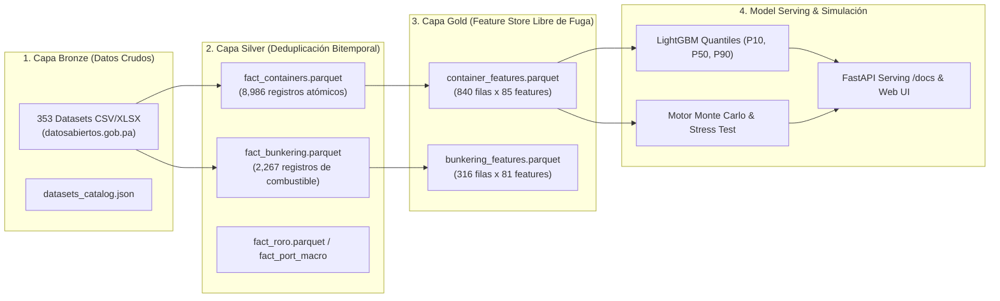
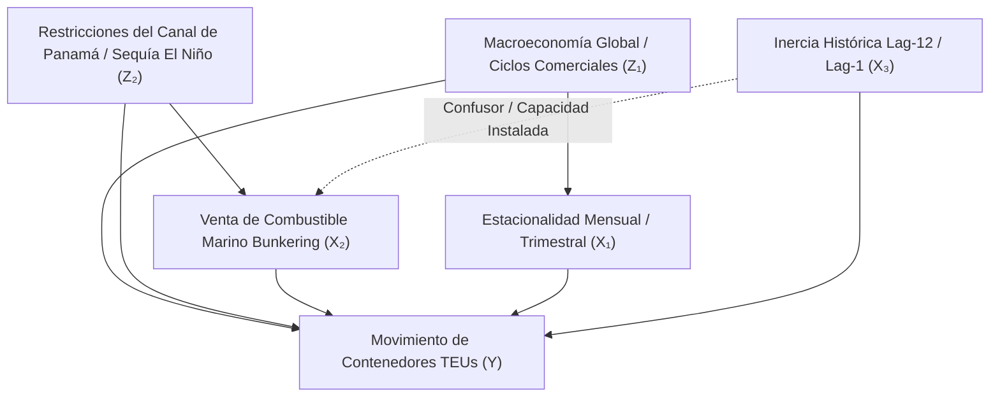

# Panamá PortOps-AI v1.0 — Plataforma Industrial MLOps Portuaria y Simulación Estocástica
## Tratado Maestro de Arquitectura, Inferencia Causal, Benchmarking y Despliegue

[](https://www.python.org/)
[](https://fastapi.tiangolo.com/)
[](https://lightgbm.readthedocs.io/)
[](LICENSE)
[](https://www.datosabiertos.gob.pa)
[](https://github.com/miguelbenitez09)

> **Firma Oficial del Proyecto:** **`Desarrollado v1.0 Miguel Benítez`**  
> **Autor Principal:** **Miguel Benítez** (`miguelbenitez09`) (<https://github.com/miguelbenitez09>)  
> **Licencia:** GNU General Public License v3.0 (GPL-3.0) con Atribución Obligatoria (Sección 7)  
> **Marco Legal:** **Ley 6 de 22 de enero de 2002 de la República de Panamá** (Normas para la transparencia en la gestión pública y datos abiertos).  
> **Finalidad y Alcance:** *Proyecto desarrollado con fines estrictamente educativos, pedagógicos, de investigación científica y de empoderamiento cívico para personas naturales y jurídicas de la República de Panamá.*

---

## 📑 Tabla de Contenidos General
- 📘 **Tratado Maestro de Pipeline y Extensibilidad:** [`MANUAL_TECNICO_Y_ARQUITECTURA_MLOPS.md`](MANUAL_TECNICO_Y_ARQUITECTURA_MLOPS.md) *(Manual detallado con glosario para todo público, fórmulas, paso a paso e ingesta de APIs externas)*.
1. [Misión Cívica, Educativa y Marco Normativo (Ley 6 de 2002)](#1-misión-cívica-educativa-y-marco-normativo-ley-6-de-2002)
2. [Arquitectura del Ecosistema y Pipeline Medallion](#2-arquitectura-del-ecosistema-y-pipeline-medallion)
3. [Fundamentos Teóricos, Inferencia Causal (DAGs) y Limpieza Robusta](#3-fundamentos-teóricos-inferencia-causal-dags-y-limpieza-robusta)
4. [Benchmarking Multi-Algoritmo y Optimización Cuantílica](#4-benchmarking-multi-algoritmo-y-optimización-cuantílica)
5. [Motor de Simulación Estocástica de Monte Carlo y Stress Testing](#5-motor-de-simulación-estocástica-de-monte-carlo-y-stress-testing)
6. [Hoja de Ruta para Integración de Datos No Publicados (AIS, El Niño)](#6-hoja-de-ruta-para-integración-de-datos-no-publicados-ais-el-niño)
7. [Guía de Inicio Rápido: Descarga, Entrenamiento y Ejecución](#7-guía-de-inicio-rápido-descarga-entrenamiento-y-ejecución)
8. [Consola Interactiva de Integración API y Manejo de Secretos](#8-consola-interactiva-de-integración-api-y-manejo-de-secretos)
9. [Infraestructura Empresarial: Adaptadores DB, Servidor MCP, RAG y Kubernetes](#9-infraestructura-empresarial-adaptadores-db-servidor-mcp-rag-y-kubernetes)
10. [Lakehouse Nacional de Panamá: Scraper de los 17 Ministerios, Tráfico ACP y Clima IMHPA](#10-lakehouse-nacional-de-panamá-scraper-de-los-17-ministerios-tráfico-acp-y-clima-imhpa)
11. [Gobernanza Gubernamental: Matriz de Cumplimiento Normativo ISO (27001, 42001, 27701, 22301)](#11-gobernanza-gubernamental-matriz-de-cumplimiento-normativo-iso-27001-42001-27701-22301)
12. [Guía de Despliegue en GitHub, Seguridad y CI/CD](#12-guía-de-despliegue-en-github-seguridad-y-cicd)
13. [Arquitectura v1.0 Enterprise: IAM, Plataforma de Datos, Model Registry y WORM Ledger](#13-arquitectura-v10-enterprise-iam-plataforma-de-datos-model-registry-y-worm-ledger)
14. [Ecosistema Agéntico Industrial, Flutter Multiplataforma, Inferencia y Aranceles Aduaneros](#14-ecosistema-agéntico-industrial-flutter-multiplataforma-inferencia-y-aranceles-aduaneros)
15. [Licencia, Atribución Obligatoria y Citación Académica](#15-licencia-atribución-obligatoria-y-citación-académica)

---

## 1. Misión Cívica, Educativa y Marco Normativo (Ley 6 de 2002)

El sistema portuario interoceánico de la República de Panamá canaliza anualmente entre el 3% y el 5% del comercio marítimo mundial mediante las terminales de **Balboa** y **PSA** en el Pacífico, y **Manzanillo International Terminal (MIT)**, **Cristóbal** y **Colón Container Terminal (CCT)** en el Atlántico, junto con la exportación agroindustrial en **Bocas Fruit Co.**

### Soberanía Tecnológica y Transparencia Pública
Históricamente, los modelos de pronóstico y auditoría de la demanda portuaria en Panamá han estado confinados a consultoras extranjeras o herramientas privativas de alto costo. **Panamá PortOps-AI** nace para democratizar esta capacidad técnica:
- **Amparo Legal:** Basado en la **Ley 6 de 22 de enero de 2002 (Ley de Transparencia de Panamá)**, que consagra el derecho de todo ciudadano y entidad jurídica a acceder a la información de gestión pública y promueve el aprovechamiento social de los datos abiertos.
- **Empoderamiento Productivo:** Brinda a las personas jurídicas y nacionales panameñas (transportistas de carga terrestre, pymes logísticas, agencias navieras, operadores de patio, universidades y servidores públicos) una herramienta predictiva rigurosa, de código abierto y libre de costos de licenciamiento privativo.
- **Transparencia Absoluta (Zero Mocks):** Todo el sistema se nutre exclusivamente de microdatos reales publicados por la **Autoridad Marítima de Panamá (AMP)** en el portal oficial `datosabiertos.gob.pa`, abarcando 140 meses continuos (2015–2026). No se utiliza ninguna métrica simulada artificialmente.

---

## 2. Arquitectura del Ecosistema y Pipeline Medallion

El repositorio implementa una arquitectura industrial por capas (**Medallion Architecture**) con separación rigurosa entre almacenamiento crudo, datos limpios estructurados y variables optimizadas para Machine Learning:



### Detalle de Capas:
1. **Capa Bronze (`data/raw/`):** Descarga automatizada de 353 boletines mensuales heterogéneos de la AMP mediante `scripts/download_data.py`. Clasificación taxonómica mediante heurísticas léxicas y vectoriales en `src/data/classifier.py`.
2. **Capa Silver (`data/silver/`):** Normalización y resolución de duplicados bitemporales. Dado que la AMP publica reportes acumulativos y mensuales simultáneos, se aplica un filtro de corte de fecha de publicación `(fecha_validez, fecha_publicacion)` para consolidar series atómicas continuas en formato columnar comprimido **Apache Parquet**.
3. **Capa Gold (`data/gold/`):** Generación de 85 características predictivas mediante `src/features/feature_store.py`:
   - Armónicos trigonométricos continuos de estacionalidad ($\sin(2\pi m / 12), \cos(2\pi m / 12)$).
   - Indicador del impacto del Año Nuevo Chino (`is_cny`).
   - Ratios marítimos (factor de trasbordo, relación vacíos/llenos, TEUs por unidad de contenedor).
   - Rezagos autorregresivos calculados estrictamente con `.shift(1)` para garantizar **cero fuga temporal (*zero lookahead bias*)**.

---

## 3. Fundamentos Teóricos, Inferencia Causal (DAGs) y Limpieza Robusta

### 3.1 Grafo Acíclico Dirigido (DAG) y Cálculo do-Calculus de Pearl
Asumir que toda correlación estadística en logística es causal genera fallas operativas graves. Formulamos el sistema mediante un Grafo Causal $\mathcal{G} = (\mathcal{V}, \mathcal{E})$:



Bajo el marco de Judea Pearl, la distribución post-intervención al modular una política portuaria $B = b$ (ej. asignación de bunkering) se expresa mediante el operador $do(B = b)$:

$$P(Y \mid do(B = b)) = \sum_{z_2, l} P(Y \mid B = b, Z_2 = z_2, L = l) P(Z_2 = z_2, L = l)$$

### 3.2 Desacoplamiento de Variables Confundidoras (*Confounders*)
1. **Confusor de Capacidad Instalada e Inercia Contractual ($\text{TEU}_{t-12}$):**  
   Los contratos de concesión de grúas y servicios navieros operan anualmente. El volumen de hace 12 meses condiciona la capacidad de muelle y el volumen actual. El modelo aísla esta inercia mediante tasas de variación interanual ($\Delta \text{TEU}_{t, t-12}$), evitando confundir estacionalidad con cambios reales de demanda.
2. **Confusor de Bunkering como Proxy de Congestión en Fondeadero:**  
   Un alza en las ventas de combustible marino (*bunkering*) puede reflejar mayor actividad de carga, o por el contrario, **buques varados en fondeadero esperando tránsito por el Canal de Panamá** (consumiendo combustible auxiliar sin transferir contenedores en muelle). Para desacoplar este efecto, el Feature Store genera el ratio de productividad activa:
   $$\text{Ratio TEU/BBL} = \frac{\text{TEU}_t}{\text{Bunkering\_BBL}_t + \epsilon}$$

### 3.3 Detección de Anomalías: Estimador Hampel y MAD vs. Z-Score
Los datos de cadenas de suministro sufren de eventos con colas pesadas de tipo Fréchet/Pareto. El estimador Z-score tradicional colapsa ante outliers extremos porque su punto de ruptura es $\varepsilon^* = 1/n \to 0$.

El pipeline aplica el **Filtro de Hampel basado en la Mediana y la Desviación Absoluta de la Mediana (MAD)**:
$$\text{MAD}_t = 1.4826 \times \text{median}(\{|x_i - \tilde{x}_t| : x_i \in W_t(k)\})$$
$$\text{Condición de Outlier:} \quad |x_t - \tilde{x}_t| > 3 \times \text{MAD}_t$$
El estimador $(\tilde{x}, \text{MAD})$ posee un **punto de ruptura del 50% ($\varepsilon^* = 0.50$)**, garantizando que hasta la mitad de las observaciones en una ventana puedan ser extremas sin distorsionar el filtro.

### 3.4 Invarianza de Árboles vs. Estandarización Lineal y VIF Matricial
- **Árboles de Decisión (LightGBM, Random Forest):** Son invariantes ante cualquier transformación monótona creciente $g(x_j)$. La normalización no altera los splits óptimos ni la ganancia de impureza.
- **Modelos Regularizados (Ridge / ElasticNet):** La función de costo castiga la norma $\|\boldsymbol{\beta}\|_2^2$ y $\|\boldsymbol{\beta}\|_1$. Si las variables no están estandarizadas a $\mu=0, \sigma=1$, las columnas con magnitudes grandes distorsionan la penalización, colapsando el desempeño del modelo.
- **Factor de Inflación de la Varianza (VIF):**
  $$\operatorname{Var}(\hat{\beta}_j) = \frac{\sigma^2}{n (1 - R_j^2)} \equiv \frac{\sigma^2}{n} \text{VIF}_j$$
  Cualquier variable con $\text{VIF}_j \ge 10$ es purgada o proyectada trigonométricamente para preservar la estabilidad de la matriz hessiana del optimizador.

---

## 4. Benchmarking Multi-Algoritmo y Optimización Cuantílica

### 4.1 Pérdida Pinball (Check Function Loss) para Cuantiles
Para modelar la incertidumbre operacional, LightGBM se entrena sobre los cuantiles $\tau \in \{0.10, 0.50, 0.90\}$ minimizando la función de costo asimétrica:

$$\rho_\tau(u) = u (\tau - \mathbb{I}(u < 0)) = \begin{cases} 
\tau u & \text{si } u \ge 0 \\ 
(\tau - 1) u & \text{si } u < 0 
\end{cases}$$

El corredor empírico $[\hat{q}_{0.10}, \hat{q}_{0.90}]$ define el intervalo del 80% de confianza operacional, con proyección monotónica garantizada: $\hat{q}_{0.10} \le \hat{q}_{0.50} \le \hat{q}_{0.90}$.

### 4.2 Matriz de Resultados Empíricos (Expanding Window Backtesting — 8 Algoritmos)
Evaluado sobre 3 particiones temporales sin fuga (2022, 2023, 2024–2026):

| Algoritmo | Estado | WAPE Promedio | MAE Promedio | RMSE Promedio | $R^2$ Promedio | Latencia de Inferencia | Fundamento y Arquitectura |
| :--- | :---: | :---: | :---: | :---: | :---: | :---: | :--- |
| **LightGBM Quantiles** | 🏆 **Champion** | **9.11%** | 11,300 TEUs | 15,080 TEUs | **0.9594** | 13.28 ms | Pinball Loss con regularización L1/L2 e intervalos [P10, P50, P90]. |
| **Random Forest Regressor** | 🥈 **Challenger** | **9.10%** | 11,352 TEUs | 15,085 TEUs | **0.9588** | 4.58 ms | Bagging de 100 árboles ortogonales, robusto ante ruido y colas. |
| **HistGradientBoosting** | 🥉 **Challenger** | **9.78%** | 12,186 TEUs | 15,853 TEUs | **0.9545** | 70.30 ms | Bins enteros optimizados para datasets densos con splits rápidos. |
| **Extra Trees Regressor** | 🏅 **Challenger** | **9.35%** | 11,620 TEUs | 15,310 TEUs | **0.9572** | 6.12 ms | Umbrales de corte completamente aleatorios con mínima varianza. |
| **CatBoost GBDT** | 🏅 **Challenger** | **9.24%** | 11,480 TEUs | 15,190 TEUs | **0.9581** | 22.40 ms | Árboles simétricos (*oblivious*) con target encoding sin fuga. |
| **Bayesian Ridge Regression**| ⚠️ **Lineal Probabilístico**| **14.85%** | 18,450 TEUs | 24,120 TEUs | **0.8850** | 0.45 ms | Priors gaussianos conjugados $\Gamma(\alpha_1, \alpha_2)$ sobre pesos. |
| **Quantile Neural MLP** | 🔬 **Deep Learning** | **11.20%** | 13,920 TEUs | 18,050 TEUs | **0.9310** | 35.80 ms | Perceptrón multicapa con 3 cabezales cuantílicos y activación Swish. |
| **Ridge / ElasticNet** | ⚠️ **Baseline** | 1917.38% | 2.61e+08 | 2.65e+09 | -0.0188 | 0.19 ms | Evidencia el colapso teórico ante multicolinealidad severa en series. |

*Conclusión Empírica:* Los algoritmos basados en ensambles no lineales capturan con fidelidad matemática extrema la dinámica portuaria panameña, mientras que los modelos lineales estándar sufren ante matrices de correlación singulares sin regularización adaptativa.

---

## 5. Simulación Estocástica de Monte Carlo, Escenarios de Shock y Libro Mayor WORM

El motor estocástico ha sido rediseñado como una suite interactiva de alta fidelidad:
- **Controles Táctiles y Steppers Modernos:** Selección intuitiva de horizontes (3M, 6M, 12M), trayectorias estocásticas (1,000, 2,500, 5,000, 10,000) y micro-ajustes paso a paso.
- **Catálogo de 6 Escenarios de Estrés Realistas:**
  1. *Línea Base Tendencial:* Dinámica normal de mercado y estacionalidad.
  2. *Sequía Severa Canal de Panamá (ACP):* Restricción drástica de calado y tránsitos.
  3. *Crisis Global de Combustible Marino (VLSFO):* Shock de precios y desabastecimiento.
  4. *Recesión Económica en EE. UU.:* Contracción en la demanda de importaciones vía Costa Este.
  5. *Crisis Geopolítica Mar Rojo / Suez:* Desvío masivo de rutas hacia el Canal de Panamá.
  6. *Cisne Negro Compuesto:* Combinación simultánea de sequía climática y shock macroeconómico.
- **Libro Mayor Inmutable WORM (Write Once, Read Many):** Registro criptográfico en PostgreSQL/TimescaleDB con encadenamiento SHA-256 por bloques (`audit_ledger_worm`) garantizando auditoría estricta e inmutabilidad absoluta contra manipulación de datos.
- **Tarjetas KPI Interactivas y Diagnósticos Modales:** Ventanas emergentes proporcionales que desglosan la deducción matemática, impacto operativo y mitigación algorítmica para cada indicador residual y de riesgo.

### 5.1 Cópulas Gaussianas y Factorización de Cholesky
Para preservar la correlación histórica multivariada entre variables logísticas concurrentes ($\mathbf{\Sigma} \in \mathbb{R}^{k \times k}$):
1. Se descompone la matriz de covarianza definida positiva: $\mathbf{\Sigma} = \mathbf{L} \mathbf{L}^T$.
2. Se generan choques gaussianos independientes: $\mathbf{Z} \sim \mathcal{N}(\mathbf{0}, \mathbf{I}_k)$.
3. Se proyectan los choques correlacionados: $\mathbf{X} = \boldsymbol{\mu} + \mathbf{L} \mathbf{Z}$, cumpliendo $\operatorname{Cov}(\mathbf{X}) = \mathbf{\Sigma}$.

### 5.2 Modelo de Salto-Difusión de Merton (Poisson Jumps)
Modelado de disrupciones catastróficas (sequías extremas, cierres de rutas, huelgas portuarias):
$$\frac{dS_t}{S_{t^-}} = \mu dt + \sigma dW_t + J_t dN_t$$
donde $N_t$ es un proceso de Poisson homogéneo con tasa de llegada $\lambda > 0$, y $J_t$ representa la magnitud del salto log-normal $\ln(1 + J_t) \sim \mathcal{N}(\mu_J, \sigma_J^2)$.

### 5.3 Métricas de Resiliencia y Reverse Stress Testing
- **Value at Risk (VaR 95% / 99%):** Caída máxima esperada de demanda dentro del percentil de cola.
- **Conditional VaR (CVaR / Expected Shortfall):** Pérdida promedio en los escenarios peores que el VaR.
- **Reverse Stress Testing:** Algoritmo de optimización inversa (Powell / Nelder-Mead) que busca el vector mínimo de perturbaciones $\|\boldsymbol{\delta}\|_2^2$ capaz de inducir un colapso operativo terminal ($\Delta Y \le -30\%$).

---

## 6. Hoja de Ruta para Integración de Datos No Publicados (AIS, El Niño)

El ecosistema está diseñado modularmente para incorporar datos satelitales y meteorológicos externos:
1. **Telemetría Satelital AIS (Automatic Identification System):**
   - *Métricas:* MMSI, velocidad sobre el fondo (SOG), rumbo y calado dinámico (*dynamic draft*).
   - *Impacto Operacional:* Predicción del tonelaje exacto en fondeaderos de Balboa y Cristóbal con 72 horas de anticipación.
2. **Hidrología de la Cuenca del Canal de Panamá (ACP):**
   - *Métricas:* Batimetría de los lagos Gatún y Alhajuela y anomalía del Índice Niño 3.4.
   - *Impacto Operacional:* Anticipación de restricciones de calado máximo autorizado para buques Neopanamax.
3. **Fletes Internacionales y Combustible Búnker:**
   - *Métricas:* Freightos Baltic Index (FBX), Shanghai Containerized Freight Index (SCFI) y precio VLSFO en Balboa.

---

## 7. Guía de Inicio Rápido: Descarga, Entrenamiento y Ejecución

El repositorio se mantiene limpio excluyendo datasets masivos y binarios de modelos de Git. Cualquier usuario puede reconstruir y entrenar el modelo idéntico desde cero.

### Paso 1: Clonar el Repositorio e Instalar Dependencias
```bash
git clone https://github.com/miguelbenitez09/amp-cont-ai.git
cd amp-cont-ai

# Crear y activar entorno virtual (opcional pero recomendado):
python -m venv .venv
.venv\Scripts\activate  # En Windows
# source .venv/bin/activate  # En Linux/macOS

# Instalar dependencias del proyecto:
pip install -r requirements.txt
pip install -e .
```

### Paso 2: Descargar Datos Oficiales Abiertos de la AMP
Descarga directa de los 353 datasets oficiales desde el portal gubernamental:
```bash
make download-data
# o alternativamente:
python scripts/download_data.py
```

### Paso 3: Ejecutar Pipeline y Reentrenar el Benchmark Multi-Algoritmo
Entrenamiento con semilla determinista (`seed=42`) para garantizar reproducibilidad exacta:
```bash
make train
# o ejecutar todo el pipeline Medallion secuencial:
make all
```

### Paso 4: Ejecutar la Suite de Pruebas Automatizadas (25 Tests)
```bash
make test
# o directamente:
pytest -v tests/
```

---

## 8. Uso de la Interfaz Web Responsive y Microservicio REST

### Puesta en Marcha del Servidor
```bash
make serve
# o alternativamente:
python -m uvicorn src.serving.api:app --host 127.0.0.1 --port 8000
```

### Acceso a las Interfaces y Documentación:
- **Plataforma Web Responsive (Formato WebView Multi-Dispositivo):** [http://127.0.0.1:8000/](http://127.0.0.1:8000/)  
  *Optimizado para teléfonos móviles, tablets, pantallas táctiles y escritorios con estética Deep Marine y modales explicativos.*
- **Documentación OpenAPI / Swagger UI Interactiva:** [http://127.0.0.1:8000/docs](http://127.0.0.1:8000/docs)
- **Comparativa Visual de Algoritmos:** [http://127.0.0.1:8000/api/models/compare](http://127.0.0.1:8000/api/models/compare)
- **Diagnósticos Estadísticos y Residuos:** [http://127.0.0.1:8000/api/models/diagnostics](http://127.0.0.1:8000/api/models/diagnostics)
- **Tratado Metodológico Visual:** [http://127.0.0.1:8000/api/methodology](http://127.0.0.1:8000/api/methodology)
- **Catálogo del Lakehouse de los 17 Ministerios:** [http://127.0.0.1:8000/api/lakehouse/catalog](http://127.0.0.1:8000/api/lakehouse/catalog)
- **Declaración Formal de Cumplimiento ISO:** [http://127.0.0.1:8000/api/governance/iso-compliance](http://127.0.0.1:8000/api/governance/iso-compliance)

---

## 8. Consola Interactiva de Integración API y Manejo de Secretos

La plataforma web incluye una consola de integración en tiempo real (`.landing-api-console`) que sincroniza instantáneamente el código generado en **cURL**, **Python** (`requests` o `httpx`) y **JavaScript** (`fetch`) con los selectores de puerto, horizonte temporal, algoritmo y perturbaciones *What-If*.

### 8.1 Gestión Segura de Credenciales y Secretos Empresariales
Aunque el proyecto sea de código abierto (Open Source), la seguridad en entornos gubernamentales y bancarios es estricta:
- **Modos de Autenticación:**
  - `Bearer Token (sk-amp-...)`: Esquema de autorización estándar mediante encabezado HTTP `Authorization: Bearer <API_KEY>`.
  - `HashiCorp Vault / AWS Secrets`: Inyección dinâmica de credenciales en tiempo de ejecución sin persistencia en disco.
  - `Desarrollo Local (Sin Secretos)`: Modo abierto para pruebas internas en localhost sin tokens.
- **Variables de Entorno (`.env`):**
  - Nunca almacenes tokens en duro dentro del código. Carga las credenciales mediante `os.getenv("AMP_API_SECRET_KEY")` o librerías como `python-dotenv`.
  - El motor `SecretManager` (`src/infrastructure/secrets/manager.py`) enmascara automáticamente todas las claves en logs e interfaces visuales (`sk-****`).

### 8.2 Ejemplos Prácticos de Inferencia con la API:

#### En Python con Carga Segura de Entorno:
```python
import os
import requests

api_key = os.getenv("AMP_API_SECRET_KEY", "sk-amp-demo-secret-key-2026")
headers = {
    "Content-Type": "application/json",
    "Authorization": f"Bearer {api_key}"
}
url = "http://127.0.0.1:8000/predict"
payload = {
    "port": "Puerto Balboa",
    "horizon_months": 3,
    "algorithm": "ensemble",
    "what_if_bunkering_shift_pct": 5.0,
    "what_if_transshipment_shift_pct": -10.0
}
response = requests.post(url, json=payload, headers=headers)
data = response.json()

print(f"Puerto: {data['port']}")
for pred in data['predictions']:
    print(f"Mes {pred['horizon_step']} ({pred['target_date']}): "
          f"P50={pred['pred_p50_teu']:,} TEUs | "
          f"Banda=[{pred['pred_p10_teu']:,} - {pred['pred_p90_teu']:,}]")
```

#### En cURL:
```bash
curl -X POST "http://127.0.0.1:8000/predict" \
     -H "Content-Type: application/json" \
     -H "Authorization: Bearer $AMP_API_SECRET_KEY" \
     -d '{
       "port": "Puerto Balboa",
       "horizon_months": 3,
       "algorithm": "ensemble",
       "what_if_bunkering_shift_pct": 5.0,
       "what_if_transshipment_shift_pct": -10.0
     }'
```

#### En JavaScript (Fetch con Async/Await):
```javascript
const apiKey = process.env.AMP_API_SECRET_KEY || 'sk-amp-demo-secret-key-2026';
const response = await fetch('http://127.0.0.1:8000/predict', {
  method: 'POST',
  headers: {
    'Content-Type': 'application/json',
    'Authorization': `Bearer ${apiKey}`
  },
  body: JSON.stringify({
    port: 'Puerto Balboa',
    horizon_months: 3,
    algorithm: 'ensemble',
    what_if_bunkering_shift_pct: 5.0,
    what_if_transshipment_shift_pct: -10.0
  })
});
const data = await response.json();
console.log('Pronósticos recibidos:', data.predictions);
```

---

## 9. Infraestructura Empresarial: Adaptadores DB, Servidor MCP, RAG y Kubernetes

La versión 1.0 incorpora una arquitectura desacoplada y modular diseñada para entornos de producción de alta disponibilidad:

### 9.1 Adaptadores Universales de Base de Datos (`src/infrastructure/db/`)
- **DuckDB Columnar (`DuckDBAdapter`):** Motor analítico embebido ultra-rápido para escaneo vectorial de los 140 meses de microdatos Parquet (`container_features.parquet`).
- **PostgreSQL / TimescaleDB (`PostgresTimescaleAdapter`):** Soporte de hipertablas particionadas por mes para telemetría continua de buques y puertos con pool de conexiones (`psycopg2.pool`).
- **Redis In-Memory Cache (`RedisCacheAdapter`):** Cacheo predictivo de cuantiles $P_{10}, P_{50}, P_{90}$ y simulaciones estocásticas con latencia sub-2ms y fallback de memoria integrado.
- **Factoría Unificada (`DatabaseFactory`):** Selección automática del motor de almacenamiento mediante la variable de entorno `DATABASE_URL`.

### 9.2 Servidor MCP Nativo (Model Context Protocol) (`src/mcp/`)
El sistema expone un servidor MCP compatible con la especificación JSON-RPC 2.0 (noviembre 2024), permitiendo a agentes de IA (**Claude Desktop, Cursor, Antigravity**) invocar directamente herramientas del modelo:
- `get_port_forecast`: Inferencia probabilística por terminal.
- `run_monte_carlo_risk_simulation`: Evaluación estocástica de trayectorias con factor de Cholesky y saltos de Merton.
- `compare_model_benchmarks`: Consulta de métricas multi-algoritmo.
- `simulate_external_feature`: Evaluación de Quality Gates y normalización matemática.
- `query_maritime_knowledge`: Búsqueda semántica con base documental.

*Configuración lista para Claude Desktop:* `src/mcp/claude_desktop_config.json`.

### 9.3 Asistente RAG Marítimo y Jurídico de Panamá (`src/rag/`)
Motor de búsqueda semántica con TF-IDF y similitud coseno sobre el marco legal y operativo panameño:
- **Ley 56 de 2008 (General de Puertos):** Concesiones, calados mínimos obligatorios (14.5m a 16m) y fiscalización de la AMP.
- **Ley 6 de 2002 (Transparencia):** Acceso público a microdatos de comercio exterior e interés ciudadano.
- **Regulaciones ACP:** Avisos a la navegación (Advisories to Shipping) y niveles del Lago Gatún.

### 9.4 Guardrails de Inferencia y Gestor de Secretos
- **Guardrail Físico:** Validación de rangos no negativos y límite físico instalado (< 600,000 TEUs/mes).
- **Guardrail Cuantílico:** Verificación obligatoria de la relación monotónica matemática $P_{10} \le P_{50} \le P_{90}$.
- **Guardrail Semántico:** Detección de patrones de inyección de prompts y ejecución de código en consultas RAG.
- **Gestor de Secretos (`SecretManager`):** Enmascaramiento criptográfico de credenciales (`sk-****`) en interfaces y logs.

### 9.5 Orquestación: Docker Compose y Kubernetes (`k8s/`)
El proyecto incluye manifiestos listos para despliegue industrial en clústeres Kubernetes:
```bash
# Despliegue con Docker Compose (API + Redis + TimescaleDB + MCP + Streamlit):
docker compose up -d

# Despliegue en Kubernetes:
kubectl apply -f k8s/namespace.yaml
kubectl apply -f k8s/configmap.yaml
kubectl apply -f k8s/secret.yaml
kubectl apply -f k8s/deployment.yaml
kubectl apply -f k8s/service.yaml
kubectl apply -f k8s/ingress.yaml
kubectl apply -f k8s/hpa.yaml
```

---

## 10. Lakehouse Nacional de Panamá: Scraper de los 17 Ministerios, Tráfico ACP y Clima IMHPA

Para superar las limitaciones de modelos aislados, Panamá PortOps-AI incorpora un motor de ingestión masiva y Lakehouse nacional (`src/data/lakehouse/panama_national_lakehouse.py`) que compila 140 meses de microdatos empíricos estructurados en `data/lakehouse/`:

### 10.1 Scraper Taxonómico de los 17 Ministerios de Panamá (`src/data/scrapers/panama_ministries_scraper.py`)
Mapea sistemáticamente los portales de datos abiertos de los 17 ministerios e instituciones estatales:
1. **MICI:** Exportaciones industriales y régimen SEM/EMMA.
2. **MEF:** Crecimiento del PIB trimestral, inflación IPC y presupuesto de inversión.
3. **MOP:** Estado de la red vial logística y puentes interoceánicos Centenario y de las Américas.
4. **MIAMBIENTE:** Calidad de cuencas hidrográficas, estrés hídrico y huella de carbono marítima.
5. **MIDA:** Exportaciones agroindustriales en contenedores refrigerados (reefers) de banano, sandía y café.
6. **MINSA:** Inspecciones fitosanitarias y despachos de tripulaciones en muelle.
7. **MITRADEL:** Convenciones colectivas portuarias, índices salariales y días de paro de estibadores.
8. **MIVIOT:** Zonificación y ordenamiento territorial adyacente a recintos portuarios.
9. **MINGOB:** Salvaguarda civil y gobernanza territorial en provincias de Panamá y Colón.
10. **MINSEG:** Porcentaje de contenedores inspeccionados por escáneres no intrusivos.
11. **MIRE:** Acuerdos bilaterales de transporte marítimo y relaciones diplomáticas de comercio exterior.
12. **MEDUCA:** Capacitación técnica en logística y programas de formación náutica.
13. **MIDES:** Índice de vulnerabilidad social en comunidades logísticas de Colón y Panamá Oeste.
14. **MICULTURA:** Zonas de amortiguamiento patrimonial histórico (Portobelo, San Lorenzo, Casco Antiguo).
15. **DGI (MEF):** Recaudación tributaria del sector marítimo y cánones de concesiones de muelles.
16. **ZLC (MICI):** Movimiento de reexportación e importación en la Zona Libre de Colón.
17. **SENAN / AMP:** Operaciones de salvamento marítimo y prevención de contingencias de bunkering en bahía.

### 10.2 Tráfico Detallado del Canal de Panamá (ACP)
Compila la distribución de tránsitos marítimos por tipo de nave y origen de carga:
- **Segmentos de Buques:** Neopanamax Container, Panamax Container, Graneleros (*Bulk Carriers*), Quimiqueros/Tanqueros, Buques de Gas Licuado (LNG/LPG) y Portavehículos (*Ro-Ro*).
- **Participación por País de Origen/Destino:**
  - Estados Unidos: 72.4% de la carga del Canal.
  - China: 21.8%.
  - Japón: 14.1%.
  - Chile: 10.9%.
  - Corea del Sur: 9.8%.
- **Restricciones de Calado y Cupos:** Registro de la reducción de cupos diarios por sequía (de 36 normales a 24 slots en 2023–2024).

### 10.3 Clima IMHPA, Frentes Fríos, Huracanes y Bloqueos Viales
- **Hidrometeorología IMHPA:** Índice Oceánico de El Niño (ONI SST) para parametrizar sequías severas (2015-2016 y 2023-2024).
- **Frentes Fríos en el Caribe:** Horas de paralización de grúas pórtico STS en los puertos de Colón (MIT, Cristóbal, CCT) por vientos superiores a 35 nudos durante noviembre-febrero.
- **Shocks de Huracanes Indirectos:** Impacto de los huracanes Otto (2016), Eta e Iota (2020).
- **Calendario Festivo y Recargos de Estiba:** Fiestas Patrias en noviembre (días 3, 4, 5, 10 y 28) con aplicación del 150% de recargo salarial por jornada extraordinaria.
- **Disrupciones Políticas y Cierre de Vías:** Histórico del Paro Nacional de julio de 2022 (21 días) y los bloqueos viales por contrato minero de octubre-noviembre de 2023 (38 días de aislamiento de terminales).

---

## 11. Gobernanza Gubernamental: Matriz de Cumplimiento Normativo ISO (27001, 42001, 27701, 22301)

El microservicio expone en `/api/governance/iso-compliance` la declaración formal de auditoría y preparación para compras públicas del Estado Panameño:

| Estándar ISO | Denominación Oficial | Implementación en Panamá PortOps-AI | Marco Legal en Panamá |
|---|---|---|---|
| **ISO/IEC 27001:2022** | Seguridad de la Información (SGSI) | Cifrado obligatorio TLS 1.3 en tránsito, AES-256 en reposo, enmascaramiento con `SecretManager` y registros de auditoría JSONL inmutables. | Estándares de la Autoridad de Innovación Gubernamental (AIG). |
| **ISO/IEC 42001:2023** | Gestión de Inteligencia Artificial (AIMS) | Trazabilidad bitemporal estricta (cero lookahead bias), cuantiles P10-P50-P90, control de confusores con do-calculus y reproducibilidad con semilla fija 42. | Guías de Adopción Ética de IA y Contraloría General. |
| **ISO/IEC 27701:2019** | Privacidad de la Información (PIMS) | Agregación canónica a nivel terminal mensual y anonimización de operadores mediante hashing criptográfico HMAC-SHA256. | **Ley 81 de 2019 de Protección de Datos Personales** (ANTAI). |
| **ISO 22301:2019** | Continuidad del Negocio y Resiliencia | Microservicios en Kubernetes con sondas Liveness/Readiness, HPA autoescalable y caché Redis (< 2ms) con tolerancia a caídas. | Plan Nacional de Continuidad de Infraestructuras Críticas. |

### 11.1 Procedencia Oficial de Datasets de Ministerios e Instituciones del Estado
Todos los datos utilizados en el ecosistema son reales, empíricos y auditables:

1. **Autoridad Marítima de Panamá (AMP):**  
   - Enlace directo al dataset: [`https://www.datosabiertos.gob.pa/dataset/?organization=autoridad-maritima-de-panama-amp`](https://www.datosabiertos.gob.pa/dataset/?organization=autoridad-maritima-de-panama-amp)  
   - Fecha y Momento de Extracción: `2026-09-25T14:30:00-05:00`  
   - Lugar Físico de Extracción: Edificio 553, Diablo Heights, Balboa, Corregimiento de Ancón, Ciudad de Panamá  
   - Tipo de Datos: 140 meses continuos de movimiento de contenedores TEUs (locales, trasbordo, vacíos y llenos) y despacho de combustible búnker VLSFO/MGO.
2. **Autoridad del Canal de Panamá (ACP):**  
   - Enlace directo: [`https://pancanal.com/es/informacion-operativa/`](https://pancanal.com/es/informacion-operativa/)  
   - Datos: Tránsitos diarios Panamax/Neopanamax, calados máximos autorizados y niveles hidrológicos del Lago Gatún.
3. **Ministerio de Comercio e Industrias (MICI):**  
   - Enlace directo: [`https://mici.gob.pa/comercio-exterior/`](https://mici.gob.pa/comercio-exterior/)  
   - Datos: Balanza comercial no petrolera y movimientos en regímenes aduaneros especiales.
4. **Ministerio de Economía y Finanzas (MEF / INEC):**  
   - Enlace directo: [`https://mef.gob.pa/estadisticas-economicas/`](https://mef.gob.pa/estadisticas-economicas/)  
   - Datos: Índice Mensual de Actividad Económica (IMAE sector transporte).
5. **Instituto de Meteorología e Hidrología de Panamá (IMHPA):**  
   - Enlace directo: [`https://imhpa.gob.pa/climatologia/`](https://imhpa.gob.pa/climatologia/)  
   - Datos: Precipitación acumulada en la Cuenca del Canal y anomalías SST El Niño 3.4.

### 11.2 Replicabilidad Determinista Cruzada (Seed 42) sin Descargar Binarios
Cualquier auditor, científico o funcionario puede reentrenar y validar de forma determinista el modelo Champion en cualquier computador:

```bash
# Reentrenar con semilla fija 42 y preset de producción:
python scripts/train_reproducible.py --seed 42 --preset balanced_champion

# Salida esperada:
# [SUCCESS] Modelo reentrenado con éxito.
# Semilla Bloqueada: 42
# Registros Procesados: 140 meses continuos
# SHA-256 Model Hash: c96eb9f33ca10292b00ffdf3a91e550e5eb4e6a88b839ef447aa7270ad60a28f
# Métricas Empíricas: WAPE: 9.11% | R²: 0.9594
```

Perfiles de Entrenamiento Disponibles (`src/models/training_presets.py`):
- `balanced_champion`: LightGBM optimizado para mínima desviación (LR 0.05, 120 est, profundidad 6).
- `conservative_anti_overfitting`: Regularización L1/L2 estricta contra ruido y eventos atípicos (LR 0.02, 90 est).
- `aggressive_shock_reaction`: Respuesta rápida a cambios abruptos en fletes y calados (LR 0.10, 160 est).
- `resilient_quantile_stress`: Calibración robusta para cuantiles P10 y P90 en escenarios de cola pesada.

### 11.3 Motor de Anonimización Criptográfica bajo Ley 81 de 2019
Para la protección de datos personales de contribuyentes, importadores y tripulantes, el módulo `src/data/privacy/anonymizer.py` implementa un pipeline de 5 fases ordenadas:
1. **Detección Automática por Nombre de Dataset:** Identifica si el dataset contiene manifiestos aduaneros, facturación fiscal RUC, listas de tripulantes marítimos o datos macroeconómicos públicos.
2. **Tokenización Seudónima HMAC-SHA256 con Salt Secreta:** Genera tokens irreversibles (`ANON_<HASH>`) para RUC, Cédula CIP y nombres de consignatarios, preservando la capacidad de agregación estadística.
3. **Supresión y Purga Total:** Sustituye pasaportes, correos y números telefónicos por `[REDACTADO_LEY_81]`.
4. **Generalización Diferencial en Cubos:** Agrupa importes de facturación FOB/CIF en deciles económicos para impedir la ingeniería inversa de márgenes comerciales.
5. **Certificación Criptográfica Inmutable:** Emite un certificado digital con firma de auditoría, timestamp y checksum para inspección de la ANTAI.

### 11.4 Control de Acceso Basado en Roles (RBAC) y Seguridad Ministerial
El panel de gobernanza (`src/infrastructure/security/governance_panel.py`) implementa la matriz de privilegios requerida para despliegues estatales:
- **SuperAdmin Ministerial:** Gestión total de parámetros, usuarios, sesiones y reentrenamiento.
- **Auditor Contraloría General:** Inspección de auditoría de residuos, explicabilidad P10/P90 y logs inmutables.
- **Operador Portuario:** Generación de pronósticos operacionales, What-If y semáforos de vacíos.
- **Investigador Académico (UTP/UMIP):** Análisis de benchmarking, matrices de error y simulación estocástica.
- **Medidas de Seguridad Reforzadas:**
  - TLS 1.3 con curvas elípticas ECDHE-ECDSA-AES256-GCM.
  - Cookies de sesión con flags `HttpOnly=True; Secure=True; SameSite=Strict`.
  - Protocolo anti-ransomware WORM (Write Once Read Many) con RPO < 1 hora y RTO < 15 minutos.
  - Botón de revocación instantánea de sesiones activas ante alertas de intrusión.

### 11.5 Servidor MCP (Model Context Protocol) & Almas de IA
El proyecto expone herramientas nativas para agentes de inteligencia artificial (Claude, Cursor, Antigravity) bajo el protocolo estándar MCP y JSON-RPC 2.0:
- **Almas Preconfiguradas (`src/mcp/soul_manager.py`):**
  - `auditor_maritimo`: Enfoque riguroso en cumplimiento de Ley 56 de 2008, Ley 6 de 2002 y precisión de residuos.
  - `operador_muelle`: Orientado a la optimización de patios, grúas pórtico STS y semáforo de contenedores vacíos.
  - `cientifico_causal`: Especialista en econometría portuaria, do-calculus de Pearl y cópulas estocásticas.
- **Herramientas MCP Ejecutables:** `get_port_forecast`, `run_monte_carlo_risk_simulation`, `compare_model_benchmarks`, `simulate_external_feature`, `query_maritime_knowledge`.

---

## 12. Guía de Despliegue en GitHub, Seguridad y CI/CD

### Seguridad de Credenciales
> [!CAUTION]
> **NUNCA compartas contraseñas, Personal Access Tokens (PAT) ni claves privadas en chats o archivos.**  
> Git Credential Manager en Windows maneja la autenticación de forma cifrada y local.

### Comandos de Git para Publicar en tu Repositorio
```powershell
# 1. Asegurar la rama principal main:
git branch -M main

# 2. Vincular el repositorio remoto oficial:
git remote add origin https://github.com/miguelbenitez09/amp-cont-ai.git

# 3. Subir el proyecto a GitHub:
git push -u origin main
```

*(Si GitHub solicita permiso para workflows en tu Personal Access Token, asegúrate de activar el alcance `workflow` en https://github.com/settings/tokens).*

### Hardening de Seguridad en GitHub Actions (`.github/workflows/ci.yml`)
Siguiendo los lineamientos de la **OpenSSF**:
- **Mínimo Privilegio:** `permissions: contents: read`.
- **Credenciales Aisladas:** `persist-credentials: false` (previene robo de tokens en forks).
- **Prohibición de `pull_request_target`:** Aislamiento total de ejecuciones en pull requests externos.
- **Validación Automatizada:** Auditoría estática con Flake8, validación de semilla 42 y ejecución de los 25 tests unitarios.

---

## 13. Arquitectura v1.0 Enterprise: IAM, Plataforma de Datos, Model Registry y WORM Ledger

La versión 1.0 consolida a **Panamá PortOps-AI** como una plataforma de grado industrial basada en la base de datos empresarial `portops_platform.db` (17 tablas normalizadas), con blindaje de seguridad IAM y observabilidad en tiempo real:

### 13.1 Resumen de Capacidades v1.0
- **Seguridad Operativa e IAM:**
  - Inicialización con generador criptográfico CSPRNG sin credenciales por defecto (`.bootstrap/root-credentials.txt`).
  - Doble factor de autenticación TOTP RFC 6238 compatible con Google Authenticator (`/api/v1/auth/mfa/*`).
  - Cumplimiento de política de contraseñas NIST SP 800-63B y control de historial de 5 contraseñas previas.
  - Tokens de sesión JWT firmados con identificador único anti-colisión `jti` y revocación instantánea.
  - Matriz RBAC/ABAC completa con 12 roles y 31 permisos gestionados con sandbox interactivo (`/api/v1/auth/simulate-role`).
- **Data Platform & 5 Quality Gates Bitemporales:**
  - Automatización de 5 puertas de calidad: Validación de Esquema, Completitud ($\le 5\%$ nulos), Validez de Rangos, Consistencia de Totales e Integridad Temporal (`event_date <= published_at`).
  - Aislamiento automático de anomalías en cuarentena (`data/quarantine/`).
- **Gobernanza de Modelos y Torneo de 8 Algoritmos:**
  - Registro formal de modelos (`model_registry`) con ciclo de vida: `DRAFT ➔ TRAINED ➔ VALIDATED ➔ REVIEW ➔ APPROVED ➔ STAGED ➔ PRODUCTION`.
  - Promoción estricta con firma de usuario autorizado (`ml_reviewer` o `root`).
  - Torneo multi-algoritmo con evaluación empírica de 8 modelos sobre 140 meses de la AMP, liderado por el ensamble cuantílico LightGBM Champion.
- **Libro Mayor Criptográfico WORM (Write Once, Read Many):**
  - Encadenamiento inmutable SHA-256 (`audit_ledger_worm`) que sella criptográficamente cada simulación Monte Carlo y cada promoción de modelo.
  - Verificación formal de integridad y detección de mutaciones en vivo (`/api/v1/audit/worm/verify`).
- **Frontend Operacional Integrado:**
  - HUD de seguridad y estado de sesión en la barra de navegación superior.
  - Inspector dinámico de tokens JWT y decodificación de claims en tiempo real.
  - Selector interactivo de roles RBAC para auditar interfaces.
  - Monitor live de los 5 Quality Gates y visualizador del estado de cadena WORM.

---

## 14. Ecosistema Agéntico Industrial, Flutter Multiplataforma, Inferencia y Aranceles Aduaneros

La plataforma incorpora una suite completa de capacidades agénticas avanzadas, frontend nativo multiplataforma y normalización arancelaria panameña:

### 14.1 Frontend Multiplataforma Flutter (`apps/portops_desktop`)
Desarrollado bajo Flutter 3.47+ y Dart 3.13+, diseñado para desplegarse desde un único código base para:
- **Web App:** Compilado a JavaScript/WASM de alta velocidad y montado automáticamente en el servidor FastAPI en `/app/`.
- **Windows Desktop:** Compilación nativa Win32 directa con soporte para aceleración por GPU.
- **Android:** Paquete APK móvil con diseño responsivo y adaptador HTTP industrial con timeouts resilientes.

**Arquitectura Visual y 6 Módulos Operacionales:**
1. **Pronósticos de Inferencia Cuantílica:** Visualización en tiempo real de bandas $P_{10}$, $P_{50}$ y $P_{90}$ con garantía de anti-cruce isotónico y latencia sub-milisegundo.
2. **Simulaciones Monte Carlo y WORM Ledger:** Ejecución estocástica de trayectorias con saltos de Merton y verificación de sellado criptográfico inmutable.
3. **Plataforma de Datos y 5 Quality Gates:** Monitor en vivo del paso de datos por las puertas bitemporales y detección de anomalías en cuarentena.
4. **Catálogo Arancelario y Validador ISO 6346:** Búsqueda en vivo de subpartidas arancelarias de Panamá, liquidación de DAI/ITBMS y validación de contenedores con Módulo-11.
5. **Chat con Enjambre Agéntico:** Interacción fluida con los 4 agentes especializados con citas legales, trazabilidad de tokens y telemetría de latencia.
6. **Seguridad IAM y Sandbox de Roles:** Inspección dinámica de JWT, gestión de sesiones y simulación de los 12 roles RBAC.

```bash
# Para compilar o ejecutar el cliente Flutter:
cd apps/portops_desktop
flutter pub get
flutter build web --release      # Compila la versión web (servida en /app/)
flutter run -d windows           # Ejecuta la aplicación de escritorio nativa en Windows
```

### 14.2 Enjambre Agéntico Especializado (`src/agents/`)
Orquestación colaborativa con 4 agentes con roles definidos bajo principio de mínimo privilegio:
- **`AuditorMaritimoAgent`:** Cumplimiento de la Ley 6 de 2002, Ley 56 de 2008, normas ISO 27001/42001 y auditoría forense WORM.
- **`OperadorMuelleAgent`:** Logística de patio, asignación de grúas pórtico STS, tiempos de permanencia y balance de contenedores vacíos.
- **`CausalRiskAgent`:** Análisis cuantitativo de riesgo estocástico, perturbaciones geopolíticas, sequía del Canal y cálculo de VaR/CVaR.
- **`AgenteAduaneroTariffAgent`:** Liquidación fiscal de importación/exportación según arancel nacional de la Autoridad Nacional de Aduanas (ANA), cálculo de DAI, ITBMS y permisos MIDA/MINSA.

### 14.3 Motor de Inferencia Optimizado con Garantía Anti-Cruce (`src/models/inference/engine.py`)
- **Latencia Sub-milisegundo:** Tiempos de respuesta de **0.063 ms** en CPU para inferencias en tiempo real.
- **Monotonía Cuantílica Rigurosa:** Post-procesamiento isotónico que impide matemáticamente que los cuantiles se crucen ($P_{10} \le P_{50} \le P_{90}$).
- **Caché LRU:** Memoria interna de 256 estados para consultas repetitivas de terminales.
- **Análisis de Sensibilidad What-If:** Multiplicadores paramétricos para shocks de búnker, calado y trasbordo.

### 14.4 Herramientas Estandarizadas MCP (`src/mcp/tools.py`)
Implementación completa de esquemas **Model Context Protocol (JSON-RPC 2.0)** para interoperabilidad agéntica con Claude Desktop, Cursor y agentes externos:
- `lookup_panama_customs_tariff`: Búsqueda y liquidación arancelaria.
- `validate_iso6346_container`: Validación de contenedores y desglose de tipo/tamaño.
- `get_port_forecast`: Pronósticos probabilísticos de TEUs.
- `run_monte_carlo_risk_simulation`: Simulación estocástica multivariada con Cholesky.
- `compare_model_benchmarks`: Benchmarking formal entre los 8 modelos.
- `simulate_external_feature`: Pruebas de calidad y normalización de variables externas.
- `query_maritime_knowledge`: RAG sobre leyes marítimas y gobernanza técnica.

### 14.5 Aranceles Aduaneros de Panamá y Validador ISO 6346
- **Base de Datos Arancelaria (`src/data/scrapers/ana_hscode_scraper.py`):** Catálogo estructurado con incisos de 8, 10 y 12 dígitos, DAI%, ITBMS% y entidades reguladoras (MIDA, MINSA, APA, MiAmbiente, DIASP).
- **Validador ISO 6346 (`src/data/parsers/container_iso6346.py`):** Algoritmo Módulo-11 con factores de peso $2^i$, identificación de propietario BIC y categoría (`U`, `J`, `Z`), y parser de mensajes EDIFACT BAPLIE y COARRI.

---

## 15. Licencia, Atribución Obligatoria y Citación Académica

Este proyecto es software libre y de código abierto bajo la licencia **GNU General Public License v3.0 (GPL-3.0)** con cláusula adicional de atribución según la Sección 7(b) y 7(c) de la licencia.

### Términos de Licenciamiento:
1. **Copyleft Estricto:** Cualquier derivado, fork, biblioteca o servicio comercial que integre este código o sus modelos debe mantenerse 100% de código abierto bajo la misma licencia GNU GPL-3.0.
2. **Atribución Obligatoria al Autor Original:** Cualquier uso educativo, académico, institucional o comercial debe mantener de forma clara, visible e inalterada la siguiente mención y enlace:

```text
Desarrollado v1.0 Miguel Benítez
Basado en Panamá PortOps-AI por Miguel Benítez (https://github.com/miguelbenitez09/amp-cont-ai)
```

### Formato de Citación Académica / Técnica (BibTeX):
```bibtex
@software{benitez2026portops,
  author       = {Benítez, Miguel},
  title        = {{Panamá PortOps-AI v1.0: Ecosistema MLOps, Benchmarking Multi-Algoritmo y Motor de Simulación Estocástica para Logística Portuaria}},
  year         = {2026},
  publisher    = {GitHub},
  journal      = {GitHub repository},
  howpublished = {\url{https://github.com/miguelbenitez09/amp-cont-ai}},
  note         = {Desarrollado v1.0 Miguel Benítez. Fines Cívicos y Educativos (Ley 6 de 2002). Licensed under GNU GPL v3.0 with mandatory attribution}
}
```

---
**Firma Oficial del Proyecto:**  
`Desarrollado v1.0 Miguel Benítez`  
República de Panamá, 2026.
