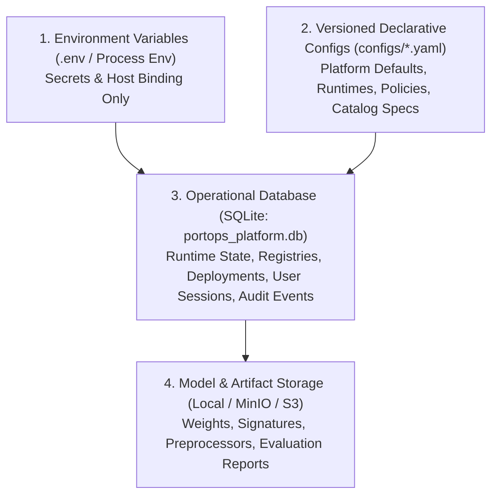

# Source of Truth Specification — amp-cont-ai (v1.0.0)

This document formalizes the hierarchy and authoritative boundaries of configuration and state across the `amp-cont-ai` MLOps framework.

---

## 1. Single Source of Truth Hierarchy

### Layer Definitions

| Layer | Path / Medium | Responsibility | Mutability |
| :--- | :--- | :--- | :--- |
| **Secrets & Host Binding** | `.env` / Process Env | Master encryption keys, database URI, JWT secret, external API tokens. | Static on boot |
| **Declarative Defaults** | `configs/*.yaml` | Initial catalog declarations, runtime templates, tool definitions, default ABAC policies. | Version-controlled in Git |
| **Operational State** | `data/enterprise_db/portops_platform.db` | Users, roles, model versions, live deployment instances, tool access requests, audit trail. | Dynamic via Platform APIs |
| **Artifact Storage** | `artifacts/` or MinIO/S3 | GGUF/Safetensors weights, pickles, tokenizer assets, evaluation metrics JSONs. | Write-Once-Read-Many (WORM) |

---

## 2. Directory Standards

- `configs/platform.yaml`: Main platform settings, host bind, active plugins, telemetry.
- `configs/runtimes.yaml`: Declarations of local vLLM, Ollama, Triton, and OpenAI-compatible endpoints.
- `configs/models.yaml`: Seed declarative model definitions for local and external catalogs.
- `configs/policies.yaml`: RBAC + ABAC policy definitions for model and tool access.
- `configs/tools.yaml`: Declarative MCP tools and execution safety levels.
- `configs/agents.yaml`: Agent definitions, souls, and coordination policies.
- `db/migrations/`: SQL migration files managing schema lifecycle.
- `plugins/portops/`: Domain-specific maritime plug-in components.
