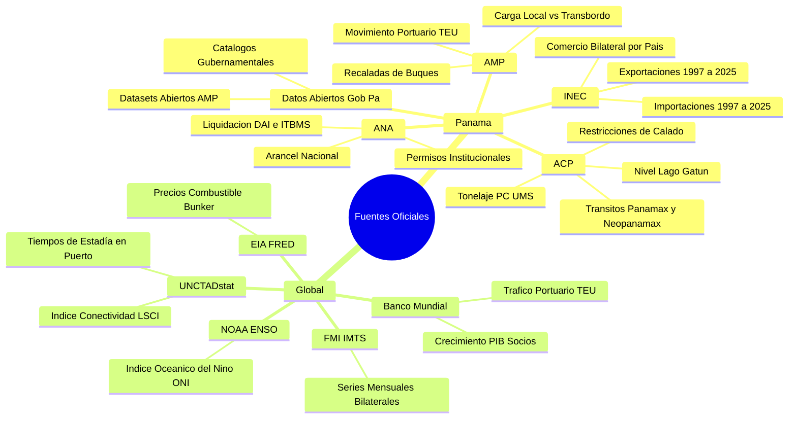

# BRAIN SYSTEM: ONTOLOGÍA Y CONTEXTO REAL DE AMP-CONT-AI
## Framework MLOps de Inteligencia Artificial para la Logística y Comercio Exterior de Panamá
**Autor:** Ing. Miguel Antonio Benítez González (Egresado de la Universidad Tecnológica de Panamá - UTP)  
**Licencia:** GNU General Public License v3.0 (GPL-3.0) con Atribución Obligatoria (Sección 7)  
**Versión de Plataforma:** v2.0.0 (Master Engine)  
**Fecha de Actualización:** Octubre 2026

---

## 1. MISIÓN Y PROPÓSITO DEL PROYECTO
El proyecto **amp-cont-ai** es un framework MLOps de código abierto diseñado para modelar, predecir y optimizar la cadena logística estratégica de la República de Panamá:
1. **Movimiento de Contenedores Portuarios (TEUs):** Análisis de volumen y rendimiento de los cinco puertos del Sistema Portuario Nacional: Balboa (Pacífico), PSA Panama International Terminal Rodman (Pacífico), Manzanillo International Terminal - MIT (Atlántico), Cristóbal (Atlántico), y Colón Container Terminal - CCT (Atlántico).
2. **Tránsito de Buques por el Canal de Panamá:** Modelado del flujo de buques de calado profundo por las esclusas Panamax y Neopanamax, tonelaje PC/UMS, reservas de cupos de tránsito, tiempo de espera en fondeadero y restricciones operativas por nivel hídrico del Lago Gatún y Alhajuela.
3. **Comercio Exterior y Aduanas de Panamá:** Integración de la serie histórica (1997-2025) de importaciones y exportaciones por capítulo e inciso arancelario (SAC/SIECA), liquidación tributaria (DAI, ITBMS, ISC), y validación de permisos fitosanitarios y de seguridad (MIDA, MINSA, APA, MiAmbiente, DIASP).
4. **Impacto Macroeconómico Global:** Modelado de elasticidades y correlaciones con socios comerciales estratégicos (Estados Unidos, China, Japón, Corea del Sur, Chile, Colombia), índices de fletes marítimos mundiales (WCI, SCFI, BDI), precios de búnker (VLSFO, MGO, Brent, WTI) y fenómenos climáticos (ENSO / El Niño - La Niña).

---

## 2. MAPA DE FUENTES OFICIALES Y COBERTURA TEMPORAL



---

## 3. ARQUITECTURA MEDALLION LAKEHOUSE & GOBERNANZA DE DATOS

### 3.1 Capa Bronce (RAW - Local GitIgnored)
- **Directorio:** `data/raw/` o almacenes externos locales (`datasets_imports`, `datasets_exports`, `datasets_aduanas`).
- **Política de Privacidad Estricta:** Ningún archivo crudo de declaraciones aduaneras o manifiestos que contenga PII (nombres de empresas importadoras, consignatarios, montos declarados privados) debe subirse a Git ni publicarse en repositorios remotos. Se ignoran en `.gitignore` y se auditan mediante `brain/releases/PUBLIC_FILE_ALLOWLIST.yaml`.
- **Formato:** Archivos `.csv` y `.xlsx` tal como fueron generados por los servidores de las entidades oficiales.

### 3.2 Capa Plata (Silver - Normalizada y Anonimizada)
- **Directorio:** `data/silver/`
- **Formato:** Apache Parquet particionado con compresión Snappy.
- **Transformaciones:**
  - *Anonimización Criptográfica:* El campo `CONSIGNATARIO` se transforma mediante `HMAC-SHA256(nombre, salt)` permitiendo estudios analíticos de recurrencia sin revelar identidades corporativas.
  - *Saneamiento de Caracteres:* Corrección de encodings mixtos (`utf-8-sig`, `iso-8859-1`, `windows-1252`).
  - *Normalización de Encabezados:* Mapeo de columnas SSRS (`textbox32`, `textbox2`) a nomenclatura unificada en español técnico.
  - *Tablas Principales:*
    - `clean_importaciones_panama_1997_2025.parquet`
    - `clean_exportaciones_panama_1997_2025.parquet`
    - `dim_tariff_panama.parquet`
    - `dim_tariff_historical.parquet`

### 3.3 Capa Oro (Gold - Feature Store & Model Tensors)
- **Directorio:** `data/gold/`
- **Formato:** Tablas Parquet optimizadas para consulta y matrices de entrenamiento.
- **Entidades y Features:**
  - `fact_port_throughput_monthly`: Volumen mensual por puerto, ratio Pacífico/Atlántico, cuota de transbordo, lags (1m, 3m, 6m, 12m), medias móviles (3m, 12m).
  - `fact_canal_transits_monthly`: Buques Neopanamax, calado promedio, nivel de Gatún, desvío porcentual respecto a la media histórica.
  - `fact_macro_trade_monthly`: Valor CIF total, FOB total, índice de precios de fletes mundiales, indicador ONI.

---

## 4. CATÁLOGO DE MODELOS Y CAPACIDAD DE TUNING

El framework ofrece una suite desacoplada de algoritmos de Machine Learning y Deep Learning para pronóstico logístico:
1. **LightGBM Quantile Regressors (Champion v1.0):** Modelado probabilístico en cuantiles $p10$ (escenario pesimista), $p50$ (mediana esperada) y $p90$ (escenario de alta demanda).
2. **XGBoost Regressor:** Optimización por gradiente con regularización $L_1$ y $L_2$ para captura de picos estacionales de carga en agosto-noviembre (temporada alta previa a fin de año).
3. **CatBoost Regressor:** Especializado en el tratamiento nativo de variables categóricas (puerto, tipo de carga, naviera, bandera de buque).
4. **Modelos Estadísticos de Series Temporales:** SARIMAX y Prophet para descomposición de tendencia, ciclo estacional de 12 meses y eventos de choque exógenos (sequía de 2023-2024, apertura del tercer juego de esclusas en 2016).
5. **Simulación Estocástica de Monte Carlo:** Inferencia de 1,000 trayectorias sintéticas mediante descomposición de Cholesky de la matriz de covarianza de puertos para evaluar riesgo de congestión y resiliencia de la cadena.
6. **Capacidad de Tuning:** Interfaz y API para ajuste dinámico de hiperparámetros (`learning_rate`, `n_estimators`, `max_depth`, `subsample`, `alpha`) con registro automático en MLflow.

---

## 5. TOPOLOGÍA DEL SISTEMA Y FLUJO DE COMUNICACIÓN

```text
[Cliente Web / App]
       │
       ▼ (Puerto 8000)
┌────────────────────────────────────────────────────────┐
│  Go API Gateway (cmd/gateway/main.go)                  │
│  - Concurrencia masiva Go 1.26                         │
│  - Rate Limiter (Token Bucket por IP)                  │
│  - Servidor de Estáticos Ultrarrápido                  │
│  - Pre-validación de Tokens JWT                        │
│  - Métricas Prometheus (/metrics)                      │
│  - Health Probes (/health/live, /health/ready)         │
└──────────────────────────┬─────────────────────────────┘
                           │ (HTTP/2 Reverse Proxy)
                           ▼ (Puerto Interno 8001)
┌────────────────────────────────────────────────────────┐
│  FastAPI Backend Core (src/serving/api.py)             │
│  - Rutas REST MLOps & Gobernanza                       │
│  - Inferencia y Simulación Monte Carlo                 │
│  - Asistente Aduanero RAG                              │
│  - Orquestación de Agentes LangGraph & MCP             │
│  - Control de Acceso RBAC/ABAC                         │
│  - Base de Datos Operativa (portops_platform.db)       │
└────────────────────────────────────────────────────────┘
```

---

## 6. PROTOCOLO DE SEGURIDAD Y PRIMER ARRANQUE (FIRST-RUN)

Para garantizar un entorno de producción seguro y cumplir con estándares ISO 27001 e ISO 42001:
1. **Credenciales Temporales de Bootstrap:** Durante la instalación se genera una clave temporal criptográfica en `.bootstrap/root-credentials.txt`.
2. **Bloqueo de Primer Uso:** Al acceder por primera vez, el sistema redirige al usuario a la interfaz de aprovisionamiento seguro. No permite operaciones administrativas con la contraseña por defecto.
3. **Validación de Cambio:** El usuario debe ingresar la contraseña actual, suministrar la nueva clave (mínimo 10 caracteres, mayúsculas, minúsculas, dígitos y símbolos) y confirmarla exactamente.
4. **Matriz de Roles Mínimos Obligatorios:**
   - `admin`: Administración de infraestructura y políticas.
   - `mlops_engineer`: Entrenamiento de modelos, tuning y registro en MLflow.
   - `port_operator`: Visualización de métricas de muelle, alertas y validación ISO 6346.
   - `customs_auditor`: Consulta de liquidación arancelaria y RAG aduanero.

---

## 7. ATRIBUCIÓN Y DERECHOS DE AUTOR
Conforme a la Sección 7 de la Licencia GNU General Public License v3.0 (GPL-3.0), toda distribución, compilación, contenedor Docker, interfaz web y microservicio derivado de esta obra debe mantener de forma obligatoria e inalterable el reconocimiento de autoría:

> **Diseño Original y Arquitectura:** Ing. Miguel Antonio Benítez González  
> **Institución de Egreso:** Universidad Tecnológica de Panamá (UTP)  
> **Proyecto:** amp-cont-ai (v2.0)  
> **Licencia:** GNU GPL-3.0 with Section 7 Mandatory Attribution
