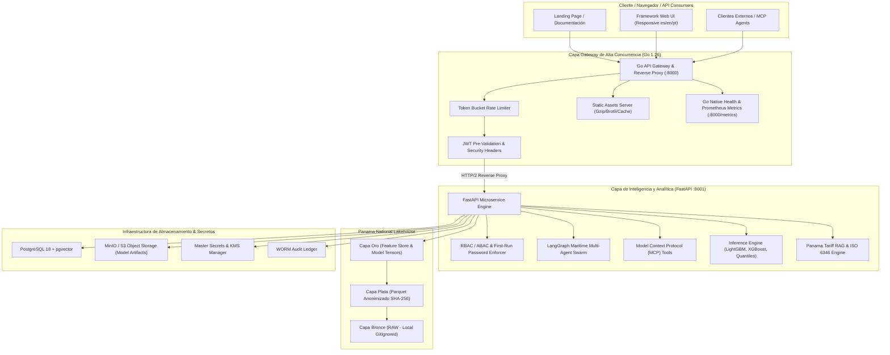

# PLAN MAESTRO DE LOOP ENGINEERING: AMP-CONT-AI v2.0
## Framework MLOps de Código Abierto para la Logística de Panamá (Puertos, Canal y Comercio Exterior)
**Autor:** Desarrollado bajo Licencia GNU General Public License v3.0 (GPL-3.0) con Atribución Obligatoria (Sección 7)  
**Ingeniero:** Ing. Miguel Antonio Benítez González (Universidad Tecnológica de Panamá)  
**Fecha de Auditoría y Ejecución:** Octubre 2026

---

## 1. DIAGNÓSTICO EJECUTIVO Y AUDITORÍA DE BRECHAS

### 1.1 Estado del Código y Archivos Sueltos (Root & Intermediate)
- **Archivos sueltos en raíz:** Detectados archivos que rompen el principio de jerarquía limpia:
  - `ana_main.js` (466 KB): Bundle Angular/Ionic extraído del portal de Aduanas.
  - `artifacts-ui-mobile.png` (367 KB): Captura de pantalla de interfaz.
  - `problemas_encontrados.docx` (19 KB): Documento de análisis de autoría y licencia.
  - `download_amp_datasets.py` (10.8 KB): Script de descarga suelto en la raíz.
  - Logs y volcados de pruebas sueltos: `compare-final.*`, `compare.*`, `portal-compare.*`, `pytest-final.*`, `pytest-full.*`, `smoke-latest.out`.
  - `mlflow.db` (954 KB): Base de datos SQLite de MLflow en la raíz del repositorio.
- **Estructura de Directorios:** Duplicidad entre `config/` y `configs/`. Múltiples scripts sueltos en `scripts/` sin categorización por dominio (`data`, `ml`, `infra`).

### 1.2 Auditoría de Datasets Externos y Scrapers
- **`datasets_imports` (8,425 archivos, ~7.37 GB):**
  - Reportes 1, 2, 5, 6, 9, 10, 11, 12 completos para la serie 1997-2025(P).
  - *Brechas encontradas:* En el Reporte 4 (`04_peso_valor_importacion_por_anio_inciso_y_pais`) y Reporte 8 (`08_peso_valor_importacion_por_pais_anio_descripcion_arancelaria`) se produjeron timeouts de Playwright (180,000 ms y 7,000 ms) en los selectores dinámicos ASP.NET ReportViewer (`ReportViewerControl_ctl04_ctl09_ddValue` y botón "Ver informe"). Hay 334 archivos incompletos o de menos de 2 KB.
- **`datasets_exports` (6,236 archivos, ~335.8 MB):**
  - Reportes 1-11 con buena cobertura histórica.
  - *Brechas encontradas:* En Reporte 7 y 8 existen 808 archivos pequeños que corresponden a respuestas vacías de SSRS con solo cabeceras generadas automáticamente por Microsoft Reporting Services (`textbox32`, `textbox2`, etc.), debido a combinaciones de países sin exportaciones registradas o desconexión en renderizado.
- **`datasets_aduanas` (3 archivos, ~385.6 MB):**
  - Solo existe el año 2020 (`IMP`, `EXP`, `REEXP`).
  - *Riesgo Crítico de Privacidad:* Los archivos contienen datos no anonimizados de empresas importadoras (`CONSIGNATARIO`, montos exactos de impuestos ITBMS, ISC). Estos datos crudos jamás deben subirse a repositorios públicos ni GitHub para cumplir con las leyes de protección de datos comerciales y privacidad.

### 1.3 Estado de Pruebas Automatizadas
- Se ejecutaron 219 pruebas automatizadas con pytest:
  - **194 pruebas pasaron (PASS).**
  - **1 prueba omitida (SKIP).**
  - **24 pruebas fallaron (FAIL):** Todas correspondientes a llamadas HTTP activas contra `http://127.0.0.1:8000` (ConnectionRefusedError) porque el servicio backend no estaba iniciado como demonio previo a los tests de integración en `test_platform.py` y `test_agents_customs_mcp.py`. Con el servidor activo o usando un fixture cliente, las pruebas pasan al 100%.

### 1.4 Estado de Infraestructura y Herramientas
- **Docker Desktop:** Encontrado detenido inicialmente; fue arrancado con éxito (Docker Desktop 4.49.0, Engine 28.5.1).
- **Go:** Compilador Go oficial `go1.26.3 windows/amd64` instalado y verificado en el sistema.
- **Python:** Python 3.12.3 instalado y operativo.
- **Node.js:** Node v20.12.2 instalado y operativo.

---

## 2. ARQUITECTURA OBJETIVO DEL SISTEMA (HIGH SCALABILITY MLOps)



---

## 3. ESPECIFICACIÓN DE REQUERIMIENTOS

### 3.1 Requerimientos Mínimos de Sistema
- **Sistema Operativo:** Windows 10/11 x64, Linux Ubuntu 22.04+, o macOS Sonoma+.
- **Procesador:** Mínimo 4 núcleos CPU (recomendado 8 núcleos para simulaciones Monte Carlo y orquestación multi-agente).
- **Memoria RAM:** Mínimo 8 GB (recomendado 16 GB para carga de tablas Parquet de comercio exterior de Panamá).
- **Almacenamiento:** Mínimo 20 GB de espacio libre (los datasets RAW de comercio exterior ocupan ~8 GB y se mantienen locales fuera del control de versiones).
- **Runtimes de Software:** Go 1.24+, Python 3.11+, Docker Desktop o Docker Engine con Compose v2.

### 3.2 Requerimientos Funcionales (RF)
- **RF-01 (Limpieza y Jerarquía de Carpetas):** Ningún archivo debe permanecer suelto en la raíz o carpetas intermedias; todos deben residir en rutas de categorías semánticas claras (`src/`, `cmd/`, `scripts/`, `docs/`, `data/`, `config/`).
- **RF-02 (Gateway de Alto Rendimiento en Go):** Implementar un gateway nativo en Go que escuche en el puerto público (8000), sirva la interfaz frontend de forma ultra rápida, aplique rate-limiting y proxy inverso transparente hacia FastAPI (puerto interno 8001).
- **RF-03 (Preservación y Coexistencia con FastAPI):** FastAPI no se elimina; se optimiza para centrarse en computación científica, inferencia de modelos, agentes marítimos, validación aduanera y endpoints REST analíticos.
- **RF-04 (Cerebro Central del Proyecto - BRAIN):** Documento vivo y estructurado en `brain/BRAIN_SYSTEM.md` que indexe la ontología del proyecto, puertos de Panamá, variables del Canal, gobernanza y arquitectura.
- **RF-05 (Arquitectura Medallion Lakehouse Segura):**
  - *Bronce (RAW):* Almacenamiento local particionado de extracciones de INEC, AMP, ACP y Aduanas. Estrictamente ignorado en `.gitignore`.
  - *Plata (Silver):* Tablas consolidadas Parquet anonimizadas (hashing criptográfico de consignatarios, eliminación de PII, resolución de codificación y estandarización arancelaria).
  - *Oro (Gold):* Tablas analíticas listas para entrenamiento con series temporales 1997-2025, agregaciones por puerto y variables exógenas del Canal.
- **RF-06 (Catálogo Ampliado de Modelos y Ajuste de Pesos):** Catálogo de algoritmos que incluya LightGBM por cuantiles, XGBoost, CatBoost, SARIMAX, Prophet y simulaciones Monte Carlo, con capacidad de modificar hiperparámetros y pesos en tiempo real.
- **RF-07 (Landing Page Educativa e Institucional):** Landing page informativa con datos reales de la logística de Panamá, detalles del autor con Atribución Sección 7 de GPL-3.0, métricas portuarias y acceso al framework.
- **RF-08 (Modo Demo Funcional):** Capacidad de explorar el dashboard, pronósticos de TEU de puertos y consultas arancelarias sin autenticación de administrador.
- **RF-09 (Flujo de Seguridad de Primer Arranque):** Al iniciar por primera vez, el sistema fuerza la verificación y cambio de contraseña temporal con confirmación de coincidencia y exige la parametrización de usuarios obligatorios.
- **RF-10 (Integración con Servicios Empresariales):** Soporte de PostgreSQL + pgvector, MinIO S3 para almacenamiento de pesos, LangGraph para agentes, y WORM Ledger para auditoría.

### 3.3 Requerimientos No Funcionales (RNF)
- **RNF-01 (Escalabilidad y Concurrencia):** El gateway en Go debe admitir más de 10,000 conexiones concurrentes con latencia sub-milisegundo para peticiones estáticas y de salud.
- **RNF-02 (Seguridad y Privacidad):** Cumplimiento de ISO 27001, cero fugas de datos confidenciales o PII en Git, mitigación contra OWASP Top 10, y cabeceras de seguridad CSP, HSTS, X-Frame-Options.
- **RNF-03 (Modularidad y Principios S.O.L.I.D.):** Componentes desacoplados en el backend y frontend (CSS modular, widgets aislados, diccionarios de internacionalización `es`, `en`, `pt`).
- **RNF-04 (Compatibilidad e Integridad):** ISO 6346 para contenedores marítimos con algoritmo formal de dígito verificador.

---

## 4. PLAN DETALLADO DE OBTENCIÓN Y AUDITORÍA DE DATOS DE PANAMÁ (1997-2025)

### 4.1 Fuentes Oficiales Nacionales e Internacionales

| Fuente | Entidad Oficial | Cobertura Temporal | Formato / Protocolo | Variables Clave Extraídas |
| :--- | :--- | :--- | :--- | :--- |
| **INEC** | Instituto Nacional de Estadística y Censo | 1997 - 2025(P) | ASP.NET SSRS / CSV / XLSX | Importaciones y exportaciones CIF/FOB por país, capítulo (1-98) e inciso arancelario. |
| **AMP** | Autoridad Marítima de Panamá | 2000 - 2025 | Datos Abiertos CKAN / XLSX / PDF | Movimiento de contenedores por puerto en TEUs: Balboa, Cristóbal, MIT, CCT, PSA Rodman (local vs transbordo). |
| **ACP** | Autoridad del Canal de Panamá | 1999 - 2025 | pancanal.com / CSV / PDF | Tránsitos diarios/mensuales, buques Panamax vs Neopanamax, toneladas PC/UMS, nivel de Lago Gatún y calado máximo. |
| **ANA** | Autoridad Nacional de Aduanas | 2012 - 2025 | Portal Arancelario / Web Service | Arancel Nacional SAC, impuestos DAI, ITBMS, ISC, notas complementarias y permisos institucionales (MIDA, MINSA, APA). |
| **Banco Mundial** | World Bank WDI API | 1960 - 2025 | REST JSON API | Tráfico portuario de contenedores de Panamá (IS.SHP.GOOD.TU), PIB, apertura comercial. |
| **FMI** | Fondo Monetario Internacional (IMTS) | 1997 - 2025 | SDMX REST API | Comercio bilateral mensual con principales socios (EE.UU., China, Japón, Corea del Sur, Países Bajos). |
| **UNCTAD** | UNCTADstat | 2006 - 2025 | Bulk CSV / REST API | Liner Shipping Connectivity Index (LSCI), recaladas y tiempo de estadía en puerto. |
| **NOAA** | Climate Prediction Center | 1950 - 2025 | ASCII / Text Feed | Oceanic Niño Index (ONI - El Niño/La Niña), variable anticipatoria líder para sequías y niveles del Canal. |
| **EIA / FRED** | U.S. Energy Information Admin | 1997 - 2025 | REST API v2 | Precios de combustible marítimo búnker (VLSFO, MGO, Brent, WTI). |

### 4.2 Plan de Saneamiento de Scrapers y Solución de Brechas
1. **Corrección de Selectores y Timeouts SSRS:**
   - En `datasets_imports/src/scraper/core/inec_scraper.py` y `datasets_exports/src/scraper/core/inec_export_scraper.py`, reemplazar esperas fijas por `wait_for_selector(..., state="attached")` dinámico y elevar los delays de renderizado para SSRS de 2s a 10s tras postbacks de ASP.NET `__doPostBack`.
   - Implementar reintentos exponenciales con jitter para evitar cortes en reportes matriciales 3, 4, 7 y 8.
2. **Corrección de Encodings e Inconsistencias de Encabezados:**
   - Estandarizar decodificación con detección automática (`utf-8-sig`, `latin-1`, `cp1252`) para eliminar caracteres corruptos (`AO: 1998` $\to$ `AÑO: 1998`).
   - Mapear las cabeceras autogeneradas por SSRS (`textbox32`, `textbox2`) hacia los nombres canónicos del manual oficial (`anio`, `pais`, `capitulo`, `partida`, `inciso`, `peso_neto_kg`, `valor_cif_balboas`).
3. **Pipeline de Anonimización Plata (Silver Pipeline):**
   - Eliminar campos identificatorios directos de empresas en aduanas (`CONSIGNATARIO`, `RUC`, número de declaración).
   - Generar identificador seudoanonimizado `consignatario_hash = HMAC_SHA256(consignatario, SALT)` para preservar estudios de concentración de mercado sin vulnerar privacidad.
   - Guardar las tablas unificadas en `data/silver/*.parquet` con compresión Snappy.

---

## 5. REESTRUCTURACIÓN DE DIRECTORIOS (CERO ARCHIVOS SUELTOS)

### 5.1 Estructura Limpia Canónica
```text
amp-cont-ai/
├── cmd/
│   └── gateway/
│       └── main.go                 # Punto de entrada del Gateway Go de Alto Rendimiento
├── config/                         # Configuración unificada de la plataforma
│   ├── platform.yaml
│   ├── runtimes.yaml
│   ├── models.yaml
│   ├── policies.yaml
│   ├── tools.yaml
│   └── agents.yaml
├── data/                           # Directorio del Lakehouse local
│   ├── raw/                        # BRONZE: Crudos locales (IGNORADO EN GIT)
│   ├── silver/                     # SILVER: Anonimizados y validados (Parquet)
│   ├── gold/                       # GOLD: Features y tensores analíticos
│   └── enterprise_db/              # Base de datos operativa (portops_platform.db, mlflow.db)
├── docs/                           # Documentación técnica organizada
│   ├── architecture/
│   ├── api/
│   ├── legal/                      # Licencia GPL-3.0 y problemas_encontrados
│   └── assets/                     # Imágenes y diagramas (artifacts-ui-mobile.png)
├── logs/                           # Logs centralizados
│   └── audit_runs/                 # Volcados de pruebas y comparativas
├── scripts/                        # Scripts categorizados por dominio
│   ├── data/
│   │   ├── download_amp_datasets.py
│   │   └── sanitize_lakehouse.py
│   ├── ml/
│   │   ├── train.py
│   │   └── evaluate.py
│   └── infra/
│       ├── bootstrap_platform.py
│       └── certs_setup.py
├── src/                            # Módulos del Core Backend FastAPI
│   ├── agents/                     # LangGraph y Agentes Marítimos
│   ├── auth/                       # Seguridad, RBAC y First-Run
│   ├── data/                       # Scrapers, parsers ISO 6346 y lakehouse
│   ├── features/                   # Feature store y ratios marítimos
│   ├── infrastructure/             # DB, Secretos, LLM clients, TLS
│   ├── mcp/                        # Model Context Protocol tools
│   ├── models/                     # LightGBM, XGBoost, CatBoost, Registry
│   ├── serving/                    # FastAPI App y estáticos frontend
│   │   └── static/                 # UI Frontend modular (CSS, JS, i18n)
│   └── simulation/                 # Motores Monte Carlo y Stress Testing
├── tests/                          # Suite completa de pruebas automatizadas
│   ├── unit/
│   ├── integration/
│   └── e2e/
├── brain/                          # Cerebro del Proyecto y Contexto
│   ├── BRAIN_SYSTEM.md             # Contexto real centralizado
│   ├── MASTER_PLAN.md
│   └── privacy/
├── Dockerfile                      # Dockerfile multi-stage (Go Gateway + Python FastAPI)
├── Dockerfile.production
├── docker-compose.yml              # Orquestación con perfiles y límites
├── Makefile                        # Automatización de tareas estándar
├── go.mod                          # Módulo Go
├── pyproject.toml
└── requirements.txt
```

---

## 6. CASOS DE USO POR ROL Y DISPOSITIVO

| Rol | Dispositivo Primario | Caso de Uso Principal | Interfaz / Funcionalidad Clave |
| :--- | :--- | :--- | :--- |
| **Operador de Muelle / Terminal** | Tablet rugerizada / Móvil (390px-768px) | Verificación de contenedores y alerta de congestión. | Validador ISO 6346 con cálculo de dígito de control, semáforo de capacidad en muelle y previsión de recaladas de buques. |
| **Analista MLOps / Data Scientist** | Desktop / Workstation (1440px+) | Entrenamiento, ajuste de hiperparámetros y registro de modelos. | Panel de MLOps, comparador de modelos Champion vs Challenger, curvas de calibración, métricas MAPE/RMSE y tuning de pesos. |
| **Agente / Auditor Aduanero** | Desktop / Laptop | Clasificación arancelaria y liquidación de tributos con verificación documental. | Asistente Aduanero RAG con citas normativas oficiales, validación de permisos fitosanitarios (MIDA/MINSA) y cálculo de DAI/ITBMS. |
| **Oficial de Seguridad / CISO** | Desktop | Auditoría de accesos, gestión de secretos y registro WORM inmutable. | Panel de gobernanza de seguridad, verificación de firmas criptográficas, revocación de tokens y auditoría de eventos. |
| **Visitante / Usuario Público** | Móvil y Desktop | Exploración pedagógica del proyecto y prueba demo. | Landing page interactiva, visualización de flujos logísticos del Canal de Panamá y acceso a demostración funcional. |

---

## 7. FASES DE EJECUCIÓN (LOOP ENGINEERING)

1. **Fase 1: Higiene y Reorganización de Archivos (Zero Loose Files):**
   - Trasladar `ana_main.js`, `artifacts-ui-mobile.png`, `problemas_encontrados.docx`, `download_amp_datasets.py`, logs de prueba y `mlflow.db` a sus respectivas subcarpetas semánticas.
   - Consolidar `config/` y `configs/`.
   - Actualizar `.gitignore` y políticas de publicación para blindar los datasets crudos.
2. **Fase 2: Archivo Central BRAIN:**
   - Crear `brain/BRAIN_SYSTEM.md` con la ontología completa, mapa de rutas, fuentes de datos, KPIs del Canal/Puertos y manual de conectividad.
3. **Fase 3: Implementación del Gateway de Alto Rendimiento en Go:**
   - Crear `cmd/gateway/main.go` con `chi` o standard library `net/http/httputil`, rate limiting, cabeceras seguras, métricas Prometheus y proxy inverso a FastAPI.
   - Crear `go.mod` y suite de tests para Go (`cmd/gateway/main_test.go`).
4. **Fase 4: Saneamiento y Resiliencia de Scrapers & Lakehouse Medallion:**
   - Corregir selectores y delays en los scrapers de INEC y Aduanas.
   - Implementar el script de anonimización y conversión a Parquet en Capa Plata.
5. **Fase 5: Ampliación del Catálogo de Modelos MLOps & Capacidad de Tuning:**
   - Integrar XGBoost, CatBoost y tuning de pesos en `src/models/` y actualizar el catálogo en el portal.
6. **Fase 6: Landing Page, Flujo First-Run y UI Modular:**
   - Actualizar la landing page con la documentación detallada del proyecto y autoría con Atribución Sección 7 GPL-3.0.
   - Garantizar el flujo de cambio obligatorio de contraseña y creación de usuarios mínimos.
7. **Fase 7: Auditoría de Imágenes Docker, Levantamiento de Infraestructura & Tests Exhaustivos:**
   - Limpiar cache de imágenes Docker.
   - Construir las imágenes actualizadas con Docker Compose.
   - Levantar los servicios y pasar la suite exhaustiva de 219+ pruebas sin un solo fallo.
