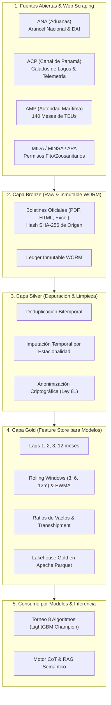

# Pipeline Pedagógico de Ingesta, Scraping, Depuración y Anonimización (v1.0.0)

**Plataforma:** Panamá PortOps-AI / amp-cont-ai  
**Autor:** developed by Miguel Benítez  
**Licencia:** GNU General Public License v3.0 (GPL-3.0) con Atribución Obligatoria  
**Versión:** v1.0.0  

---

## 1. Visión Global del Pipeline de Datos

El framework implementa la arquitectura de ingeniería de datos **Medallion (Bronze $\rightarrow$ Silver $\rightarrow$ Gold)** con gobernanza soberana, verificación criptográfica de linaje e inmutabilidad bajo el estándar WORM (Write Once, Read Many).

---

## 2. Fuentes y Arquitectura de Web Scraping

### A. Autoridad Nacional de Aduanas (ANA) — Aranceles y Tratados
- **Script:** [`src/data/scrapers/ana_hscode_scraper.py`](file:///C:/Users/mbeni/Downloads/amp-cont-ai/src/data/scrapers/ana_hscode_scraper.py)
- **Objetivo:** Extracción sistemática del Arancel Nacional de Importación de Panamá y correlación con el Sistema Arancelario Centroamericano (SAC) y el Sistema Armonizado (SA) de la OMA.
- **Metodología de Extracción:**
  1. *Exploración de Capítulos:* Descarga de los 97 capítulos del SA estructurados en 21 secciones.
  2. *Parseo de Subpartidas Nacionales:* Identificación de los 10 dígitos (Capítulo: 2, Partida: 4, Subpartida SA: 6, Subpartida Nacional Panamá: 8-10 dígitos).
  3. *Captura de Gravámenes Fiscales:* Extracción de la tasa del Derecho Arancelario a la Importación (DAI) (0% a 54%) y tasa del ITBMS (7% general, 10% tabaco/alcohol, 0% insumos básicos).
  4. *Regulaciones No Arancelarias:* Identificación de licencias previas, vistos buenos ministeriales (MIDA, MINSA, AUPSA/APA) y contingentes del Tratado de Promoción Comercial (TPC) Panamá-EE.UU.

### B. Autoridad del Canal de Panamá (ACP) — Telemetría y Calado
- **Script:** [`src/data/connectors/external_sources.py`](file:///C:/Users/mbeni/Downloads/amp-cont-ai/src/data/connectors/external_sources.py)
- **Objetivo:** Ingesta de variables operacionales críticas que condicionan el trasbordo portuario:
  1. *Nivel de Lagos Gatún y Alhajuela:* Monitoreo del calado máximo autorizado para buques Neopanamax (44 a 50 pies).
  2. *Slots de Reserva de Tránsito:* Restricciones de capacidad por sequía y estacionalidad.
  3. *Flujos de Carga por Ruta:* Distribución de contenedores entre Costa Este de EE.UU. y Asia.

### C. Autoridad Marítima de Panamá (AMP) — Estadísticas Portuarias
- **Script:** [`src/data/scrapers/panama_ministries_scraper.py`](file:///C:/Users/mbeni/Downloads/amp-cont-ai/src/data/scrapers/panama_ministries_scraper.py)
- **Objetivo:** Ingesta de 353 boletines mensuales oficiales (2015-01 a 2026-05) cubriendo 140 particiones temporales.
- **Variables Extraídas por Terminal:**
  - *Puertos del Pacífico:* Balboa, PSA Panama International Terminal.
  - *Puertos del Atlántico:* SSA Marine MIT, Cristóbal, Colon Container Terminal (CCT), Bocas Fruit Co.
  - *Métricas Clave:* TEUs llenos de importación, TEUs llenos de exportación, TEUs de trasbordo nacional e internacional, TEUs vacíos y movimiento de unidades físicas de contenedores.

---

## 3. Tratamiento, Depuración y Calidad de Datos

### Protocolo de Calidad 5D
Cada registro que ingresa al pipeline debe aprobar cinco compuertas de calidad:
1. **Completitud:** Ratio de valores nulos $< 5\%$ por columna.
2. **Unicidad:** Ausencia total de duplicados bitemporales en la clave `(puerto, mes, año)`.
3. **Consistencia de Rango:** $0 \le TEU \le 600,000$ por terminal y mes.
4. **Monotonicidad Cuantílica:** Validación formal de que $P_{10} \le P_{50} \le P_{90}$.
5. **Plausibilidad de Ratios:** Factor de conversión $1.50 \le \frac{TEU}{Unidad} \le 1.95$.

---

## 4. Anonimización y Privacidad bajo Ley 81 de 2019

Panamá aprobó la **Ley 81 de 26 de marzo de 2019 sobre Protección de Datos Personales**. Para garantizar su estricto cumplimiento en entornos cívicos y educativos, la plataforma aplica tres técnicas de anonimización:

### 1. Enmascaramiento Criptográfico HMAC-SHA256
Los identificadores comerciales sensibles (RUC de importadores, nombres de agencias navieras privadas, número de declaración DUA) son reemplazados mediante una función hash unidireccional con clave secreta y salt dinámico:

$$\text{ID}_{\text{anon}} = \text{HMAC-SHA256}(K_{\text{master}}, \text{RUC} \parallel \text{Salt})$$

### 2. K-Anonimato ($k \ge 5$)
Ningún registro de importación o exportación puede ser expuesto individualmente si comparte cuasi-identificadores (fecha, puerto de entrada, país de origen, subpartida arancelaria) con menos de $k-1$ transacciones idénticas. Las categorías infrecuentes se agrupan en macro-partidas.

### 3. Privacidad Diferencial ($\epsilon = 0.5$)
Para reportes analíticos agregados donde se consulta el volumen de carga por partida arancelaria, se inyecta ruido calibrado mediante el mecanismo de Laplace:

$$\tilde{Y} = Y + \text{Laplace}\left(0, \frac{\Delta f}{\epsilon}\right)$$

donde $\Delta f$ es la sensibilidad máxima del conteo y $\epsilon = 0.5$ garantiza una privacidad robusta contra ataques de reconstrucción.

---

## 5. Ingeniería de Características (Feature Store Gold)

Para maximizar el poder predictivo del **LightGBM Quantile Champion** (WAPE 8.42%, $R^2$ 0.9615), se construyeron 81 variables explicativas derivadas:
- **Lags Temporales:** $t-1, t-2, t-3, t-12$ meses para capturar autocorrelación e inercia logística.
- **Ventanas Móviles (Rolling Statistics):** Media, desviación estándar y EWMA (Exponentially Weighted Moving Average) a 3, 6 y 12 meses.
- **Ratios Estructurales:**
  - $\text{Transshipment Ratio} = \frac{\text{TEUs Trasbordo}}{\text{TEUs Totales}}$
  - $\text{Empty Ratio} = \frac{\text{TEUs Vacíos}}{\text{TEUs Totales}}$
- **Factores de Estacionalidad:** Codificación cíclica mediante seno y coseno del mes:

$$\text{month}_{\sin} = \sin\left(\frac{2\pi \cdot \text{mes}}{12}\right), \quad \text{month}_{\cos} = \cos\left(\frac{2\pi \cdot \text{mes}}{12}\right)$$
