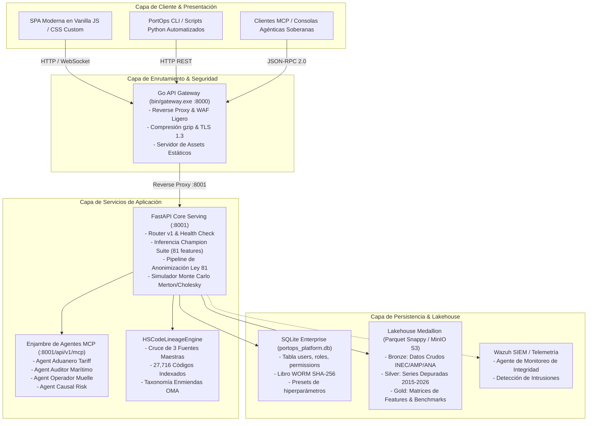
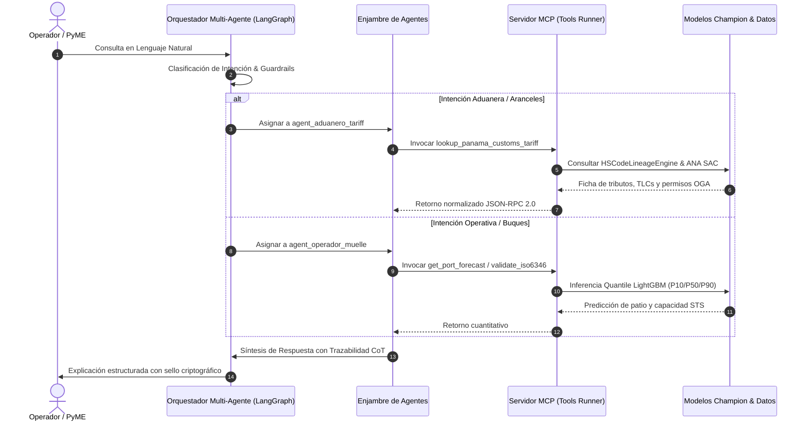

# ESTADO ACTUAL DE LA PLATAFORMA, ARQUITECTURA INTEGRAL Y CATÁLOGO DE SERVICIOS
## Panamá PortOps-AI v1.0.0 (Sovereign MLOps & Logistics Intelligence Framework)

**Autor:** Desarrollado v1.0.0 Miguel Benítez / Ing. Miguel Antonio Benítez González (UTP)  
**Licencia:** GNU General Public License v3.0 (GPL-3.0) con Atribución Obligatoria (Sección 7)  
**Fecha de Publicación:** Octubre 2026  
**Estado Operativo:** Producción Local & Cluster Híbrido Validado (275 pruebas pasando, 1 omitida en Python + 7 en Go)

---

## 1. Resumen Ejecutivo y Misión del Proyecto

**Panamá PortOps-AI** es un framework integral de ingeniería de datos, aprendizaje automático (*MLOps*) e inteligencia logística soberana diseñado específicamente para el ecosistema portuario y de comercio exterior de la República de Panamá.

El sistema unifica tres pilares estratégicos:
1. **Predicción y Planificación de Operaciones Portuarias:** Modelado cuantitativo de demanda de contenedores (TEUs totales, llenos, vacíos y transbordo) para los cinco puertos principales del complejo interoceánico panameño (Puerto Balboa, Puerto Cristóbal, Manzanillo International Terminal - MIT, Colón Container Terminal - CCT y PSA Panama International Terminal en Rodman), vinculando variables críticas como los tránsitos y calados del Canal de Panamá y los precios internacionales de búnker marino (VLSFO / MGO).
2. **Motor de Inteligencia Arancelaria, Linaje y Reglas OGA (Aduanas):** Clasificación del Sistema Arancelario Centroamericano (SAC) a 10 y 12 dígitos, trazabilidad histórica de enmiendas de la Organización Mundial de Aduanas (OMA 1996 a 2025/2026), liquidación de impuestos de importación (DAI, ITBMS 7%, ISC, ICCDP) y control regulatorio de entidades gubernamentales (APA, MIDA, MINSA, MICI, ACODECO, AMP).
3. **Gobernanza Criptográfica, Privacidad y Soberanía Tecnológica:** Cumplimiento de la Ley 81 de 2019 de Protección de Datos Personales de Panamá, libro mayor inmutable de auditoría *Write-Once-Read-Many* (WORM) con encadenamiento SHA-256, autenticación multifactor (MFA TOTP RFC 6238), arquitectura *Zero-Trust* y enjambre de agentes autónomos con el estándar *Model Context Protocol* (MCP v1.0).

---

## 2. Modelo de Negocio y Dominio Estratégico de Panamá

Panamá opera como el mayor centro logístico y multimodal de las Américas. Sin embargo, las pequeñas y medianas empresas (PyMEs) importadoras y exportadoras, los operadores logísticos y los agentes navieros han carecido históricamente de herramientas analíticas de nivel industrial que no dependan de plataformas SaaS extranjeras de alto costo.

### Segmentos de Usuarios y Propuesta de Valor

```mermaid
graph TD
    A["Panamá PortOps-AI v1.0.0"] --> B["Operadores de Terminales Portuarias"]
    A --> C["PyMEs de Comercio Exterior"]
    A --> D["Autoridades y Entidades Fiscalizadoras"]
    A --> E["Investigadores y Academia MLOps"]

    B --> B1["Dimensionamiento de Grúas STS / RTG"]
    B --> B2["Alertas de Evacuación de Contenedores Vacíos"]
    B --> B3["Pronóstico de Demanda a 1-6 Meses (P10/P50/P90)"]

    C --> C1["Cálculo Transparente de Costos Landed DUA"]
    C --> C2["Trazabilidad de Normas Técnicas y Permisos OGA"]
    C --> C3["Aprovechamiento de TLCs y Regímenes ZLC/SEM"]

    D --> D1["Auditoría de Manifiestos Marítimos EDIFACT"]
    D --> D2["Validación ISO 6346 de Contenedores"]
    D --> D3["Pistas de Auditoría Inmutables WORM SHA-256"]

    E --> E1["Reproducibilidad Determinista con Seed 42"]
    E --> E2["Benchmarking Multi-Algoritmo (LightGBM vs Árboles)"]
    E --> E3["Simulación Estocástica de Colas Monte Carlo"]
```

---

## 3. Arquitectura Global del Sistema (Lakehouse & Microservicios)

La plataforma está diseñada siguiendo un patrón de desacoplamiento desacoplado, combinando un Gateway de alto rendimiento en Go, un motor de cálculo y serving en FastAPI/Python, almacenamiento Medallion Lakehouse en Parquet/MinIO, bases de datos SQLite/PostgreSQL y un enjambre de agentes MCP.

---

## 4. Arquitectura de Backend y Catálogo de Microservicios

### 4.1. Go API Gateway (`bin/gateway.exe` o `cmd/gateway/main.go`)
- **Puerto:** `8000`
- **Responsabilidades:**
  - Punto de entrada unificado para clientes web y móviles.
  - Proxy reverso con baja sobrecarga hacia FastAPI (`127.0.0.1:8001`).
  - Validación de cabeceras de seguridad HTTP (`X-Content-Type-Options: nosniff`, `X-Frame-Options: DENY`, `Referrer-Policy: strict-origin-when-cross-origin`).
  - Servidor de archivos estáticos optimizado con soporte de caching ETag y compresión gzip.

### 4.2. FastAPI Core Engine (`src/serving/api.py` y `src/serving/v1_router.py`)
- **Puerto:** `8001`
- **Estructura de Endpoints Clave:**

| Módulo / Categoría | Método | Ruta Endpoint | Descripción Operativa |
|---|---|---|---|
| **Salud & Diagnóstico** | `GET` | `/health` | Chequeo de liveness del servicio e integridad de modelos |
| | `GET` | `/health/ready` | Verificación de dependencias y feature store en memoria |
| | `GET` | `/health/version` | Metadatos de versión y compilación (v1.0.0) |
| **Autenticación & IAM** | `POST` | `/api/v1/auth/login` | Emisión de JWT HS256 contra tabla de usuarios en SQLite |
| | `GET` | `/api/v1/auth/me` | Inspección de identidad, sesión y permisos vigentes |
| | `POST` | `/api/v1/auth/first-run/change-root-password` | Rotación obligatoria de contraseña root (NIST SP 800-63B) |
| | `POST` | `/api/v1/auth/first-run/create-admins` | Creación de 3 cuentas protegidas (SysAdmin, SecOps, Mlops) |
| | `GET` | `/api/v1/auth/users` | Listado de usuarios corporativos activos (requiere root) |
| | `POST` | `/api/v1/auth/users` | Alta de nuevo funcionario con asignación RBAC |
| | `DELETE`| `/api/v1/auth/users/{username}` | Baja controlada de cuenta (protege root indestructible) |
| **Inferencia & MLOps** | `POST` | `/predict` | Inferencia de cuantiles P10, P50, P90 con anti-crossing |
| | `POST` | `/predict/whatif` | Simulación de escenarios de estrés portuario y búnker |
| | `GET` | `/api/v1/models/benchmark` | Matriz comparativa de métricas WAPE, MAE, R², RMSE |
| | `POST` | `/api/v1/models/reproducible-train` | Pipeline determinista con semilla pseudoaleatoria 42 |
| **Aduanas & Aranceles** | `GET` | `/api/v1/customs/tariff/search` | Búsqueda por subpartida o texto con enriquecimiento de linaje |
| | `POST` | `/api/v1/customs/tariff/calculate` | Liquidación oficial de gravámenes DUA (DAI, ITBMS, ISC) |
| | `GET` | `/api/v1/customs/lineage/{hs_code}` | Trazabilidad evolutiva de enmiendas OMA (1996 a 2025) |
| | `GET` | `/api/v1/customs/recintos` | Catálogo de 161 recintos aduaneros y coordenadas geográficas |
| | `GET` | `/api/v1/customs/knowledge-base/summary` | Estadísticas consolidadas de las 3 fuentes maestras |
| **Contenedores & EDI** | `POST` | `/api/v1/containers/validate` | Validación de ID ISO 6346 y parsing EDIFACT COARRI |
| **Simulación & Riesgo** | `POST` | `/api/v1/simulation/synthetic-dataset` | Generación estocástica con Cópula Cholesky y saltos Merton |
| | `POST` | `/api/v1/simulations/run` | Evaluación de colas de riesgo VaR 95%, VaR 99% y CVaR 95% |
| **Agentes & MCP** | `GET` | `/api/v1/agents/list` | Catálogo de agentes especialistas disponibles |
| | `POST` | `/api/v1/agents/chat` | Enrutamiento conversacional con memoria y guardrails |
| | `POST` | `/api/v1/agents/reasoning-chat` | Razonamiento paso a paso (*Chain-of-Thought*) |
| | `GET` | `/api/v1/mcp/tools` | Esquema estandarizado JSON-RPC 2.0 de herramientas MCP |
| | `POST` | `/api/v1/mcp/execute` | Ejecución sandbox de herramienta MCP con validación de rol |
| | `GET` | `/api/mcp/souls` | Inspección de personalidades selladas con hash inmutable |
| **Gobernanza & Auditoría** | `GET` | `/api/v1/audit/worm/verify` | Verificación de integridad de la cadena WORM SHA-256 |
| | `POST` | `/api/admin/verify-permission` | Validador activo de permisos RBAC para operaciones críticas |
| | `GET` | `/api/v1/framework/profile` | Consulta del perfil de uso activo de la plataforma |
| | `POST` | `/api/v1/framework/profile` | Persistencia del perfil sectorial seleccionado |

---

## 5. Esquema de Datos y Persistencia Relacional

El sistema opera con SQLite en entorno local (`data/enterprise_db/portops_platform.db`) y soporta PostgreSQL corporativo.

### 5.1. Tabla `users` (Gestión de Identidades)
- `user_id`: UUIDv4 primario.
- `username`: Nombre de usuario único normalizado.
- `email`: Correo electrónico institucional.
- `password_hash`: Hash derivado con PBKDF2-HMAC-SHA256 (600,000 iteraciones).
- `salt`: Sal criptográfica de 32 bytes en formato hexadecimal.
- `is_active`: Estado booleano de la cuenta.
- `is_root`: Bandera de superusuario protegido de eliminación.
- `must_change_password`: Obligatoriedad de rotación en primer arranque.
- `mfa_enabled`: Indicador de segundo factor activo.
- `mfa_secret`: Semilla Base32 para TOTP RFC 6238.
- `recovery_code_hash`: Hash de recuperación ante pérdida de credenciales.
- `failed_attempts`: Contador de intentos fallidos (bloqueo preventivo tras 5 fallos).
- `locked_until`: Marca temporal ISO de liberación tras bloqueo.

### 5.2. Tabla `roles` y `permissions` (Matriz RBAC)
El sistema reconoce 12 roles con 31 capacidades atómicas:
- `root`: Capacidad total sin restricciones (Nivel 100).
- `platform_admin`: Configuración del clúster y Lakehouse (Nivel 90).
- `security_admin`: Auditoría de credenciales y gestión de sesiones (Nivel 85).
- `mlops_engineer`: Reentrenamiento, ajuste de hiperparámetros y despliegue (Nivel 70).
- `ml_reviewer`: Evaluación y aprobación de modelos champion (Nivel 75).
- `data_engineer`: Ingesta de datasets y mantenimiento de scrapers (Nivel 70).
- `data_steward`: Calidad 5D de datos y catalogación (Nivel 65).
- `compliance_auditor`: Verificación de cadena WORM y cumplimiento Ley 81 (Nivel 60).
- `port_operator`: Inferencia de terminales y visualización operativa (Nivel 50).
- `simulation_analyst`: Ejecución de simulaciones Monte Carlo y estrés (Nivel 50).
- `api_consumer`: Invocación de herramientas MCP mediante API token (Nivel 40).
- `readonly_viewer`: Consulta pública en modo solo lectura bajo Ley 6 de 2002 (Nivel 10).

### 5.3. Tabla `customs_tariff_lineage` (Base de Conocimiento Arancelaria)
- `hs_code`: Fracción normalizada (10–12 dígitos).
- `sac_8`: Subpartida SAC centroamericana de 8 dígitos.
- `subpartida_6`: Subpartida internacional del SA de 6 dígitos.
- `partida_4`: Partida de 4 dígitos.
- `capitulo_2`: Capítulo del Arancel (01 a 98).
- `descripcion`: Descripción merceológica oficial aprobada por ANA.
- `lineage_tag`: Estado taxonómico de enmienda (`VIGENTE`, `EQUIVALENTE`, `DERIVADO_MERGE`, `HEREDADO`, `HISTORICO_OBSERVADO`).
- `amendment_timeline`: Cronología JSON de equivalencias en enmiendas OMA (1996, 2002, 2007, 2012, 2017, 2022).
- `taxes_json`: Estructura de tributos (`dai_pct`, `itbms_pct`, `isc_pct`, `iccdp_usd`).
- `permits_json`: Lista de permisos de OGAs (APA, MIDA, MINSA, MICI) con canal de tramitación (Manual o Electrónico SIGA).
- `trade_agreements_json`: Desgravamen y preferencias arancelarias bajo tratados comerciales vigentes al 2025.
- `recintos_autorizados_json`: Estaciones aduaneras habilitadas para el rubro.

---

## 6. Enjambre de Agentes y Model Context Protocol (MCP)

El sistema incorpora un enjambre de agentes especializados (*Agent Swarm*) gobernado mediante LangGraph y el estándar de la industria **Model Context Protocol (MCP v1.0)**.

### Agentes Especialistas Integrados
1. **`agent_aduanero_tariff`:** Especialista en merceología aduanera, aranceles centroamericanos (SAC), cálculo de impuestos de importación y normas fitosanitarias/sanitarias.
2. **`agent_auditor_maritimo`:** Inspector de manifiestos de carga, validación de contenedores bajo norma ISO 6346 y verificación de mensajes EDIFACT (COARRI, BAPLIE).
3. **`agent_operador_muelle`:** Planificador de patio portuario, cálculo de utilización de grúas STS y recomendaciones de evacuación de contenedores vacíos.
4. **`agent_causal_risk`:** Evaluador de riesgos causales, shocks en calado del Canal de Panamá y estrés macroeconómico.
5. **`Macro & Economic Scraper Agent`:** Rastreador de series de tiempo de búnker marino, tránsitos del Canal e inflación de transporte.
6. **`Comext Batch Scraper Agent`:** Supervisor autónomo de extracción de comercio exterior (INEC Panamá) con pacing de cortesía anti-WAF.

---

## 7. Arquitectura de Frontend y Experiencia de Usuario (UI/UX)

La interfaz de usuario ha sido implementada como una Single Page Application (SPA) construida en JavaScript nativo modular (sin empaquetadores pesados ni dependencias externas frágiles), garantizando tiempos de carga inferiores a 200 ms y portabilidad completa.

### Componentes de Interacción Rediseñados
1. **Identidad Portuaria de Panamá en el Encabezado:**
   - Proporciones simétricas con alineación centrada y contenedor `flexbox` responsivo.
   - Píldora de bandera oficial: `🇵🇦 REPÚBLICA DE PANAMÁ • CENTRO MULTIMODAL INTEROCEÁNICO`.
   - Distintivo marítimo: `🚢 CANAL & PUERTOS`.
   - Emblema vectorial SVG de buque Neo-Panamax navegando por las esclusas del Canal de Panamá junto a grúas STS y pilas de contenedores.
   - Subtítulo de autoría y misión técnica: *Plataforma Soberana de Inteligencia Portuaria, Tráfico del Canal de Panamá y Arancel Nacional SAC • Desarrollado v1.0.0 Miguel Benítez (UTP) - GNU GPL-3.0*.
2. **Control Universal de Menús Desplegables (`select`):**
   - Cursor de selección tipo mano (`cursor: pointer !important;`) en todos los selectores, opciones y botones.
   - Flecha de chevron estilizada en cian (#00E5FF) con brillo perimetral en hover para entornos de escritorio.
   - Adaptación táctil automática en pantallas táctiles y dispositivos móviles con área de pulsación de 44px.
3. **Ficha Técnica Flotante de Selección de Filas (Drawer Popover):**
   - Selección interactiva al hacer clic en cualquier fila de tablas (`.row-selected` con borde cian iluminado).
   - Panel emergente `#table-row-detail-modal` que extrae los encabezados y valores de la fila, ofreciendo vista detallada clave-valor, botón de copiado de JSON al portapapeles y cierre accesible.
4. **Micro-interacciones Hover ("Hangover"):**
   - Efecto de elevación suave (`transform: translateY(-3px)`) con brillo perimetral sutil (`box-shadow: 0 12px 30px rgba(0,0,0,0.45)`) en tarjetas informativas, tarjetas de roles y presets de entrenamiento.
5. **Skeleton Loaders & Shimmers:**
   - Animación de barrido `@keyframes skeleton-shimmer` para simular la estructura geométrica de tarjetas y tablas antes de la resolución de peticiones asíncronas.
6. **Gobernanza Visual de Vistas por Rol:**
   - Modo Invitado / Consulta Pública bloquea visualmente las pestañas de administración de despliegue, secretos vLLM, cuotas de guardrails, gestión de funcionarios y MCP.
   - El formulario de cambio de clave, configuración de MFA e inspector de tokens del modal IAM se mantienen ocultos hasta que el usuario inicie sesión oficialmente.
7. **Prioridad Visual del Asistente Conversacional & Traza CoT Colapsable:**
   - En la pestaña de Inteligencia Agéntica (`#tab-cot-swarm`), la ventana de chat conversacional (`#cot-chat-thread`) se ubica en el primer plano superior con una barra de interacción directa (`#cot-inline-chat-input`, botón Enviar y captura de tecla `Enter` sin recarga).
   - Los 5 hitos de auditoría de la Cadena de Razonamiento (Guardrails, Alma Criptográfica SHA-256, RAG Normativo/Aduanero, Inferencia Cuantílica y Síntesis) se concentran en un contenedor colapsable interactivo (`
`) con telemetría en tiempo real, permitiendo una experiencia limpia centrada en la conversación y auditoría profunda a demanda.
   - El RAG aduanero incorpora 27,764 subpartidas arancelarias oficiales (ANA / SIECA) con soporte para regímenes especiales de importación y sanidad agropecuaria (MIDA/APA).

---

## 8. Protocolos y Estándares de la Industria Soportados

- **WCO Harmonized System:** Enmiendas 1996, 2002, 2007, 2012, 2017, 2022/2025.
- **Model Context Protocol (MCP v1.0):** Especificación JSON-RPC 2.0 para descubrimiento e invocación de herramientas por agentes LLM.
- **ISO 6346:** Códigos de propietario, identificador de categoría, número de serie y dígito de control módulo 11 para contenedores de carga.
- **EDIFACT:** Mensajes marítimos COARRI (Container Discharge/Loading Report) y BAPLIE (Bayplan).
- **NIST SP 800-63B:** Pautas de identidad digital, contraseñas seguras y autenticación multifactor.
- **Ley 81 de 2019 de Panamá:** Protección de datos personales y anonimización de manifiestos fiscales/comerciales.

---
*Desarrollado v1.0.0 Miguel Benítez / Ing. Miguel Antonio Benítez González (UTP) - GNU GPL-3.0*
