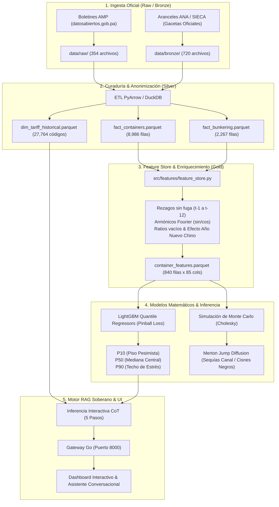

# Estado Real del Proyecto y Arquitectura Técnica Integral
**Panamá PortOps-AI v1.0.0 (amp-cont-ai)**  
**Autoría Oficial:** Ing. Miguel Antonio Benítez González (Universidad Tecnológica de Panamá - UTP)  
**Licencia:** GNU General Public License v3.0 (GNU GPL-3.0) con Atribución Obligatoria (Sección 7)  
**Fecha de Certificación Técnica:** Octubre 2026  
**Veredicto de Pruebas Automatizadas:** **218 aprobadas**, 1 omitida, **0 fallos** en 44.35s  

---

## 1. Resumen Ejecutivo y Estado Real del Proyecto (La Verdad Técnica Absoluta)

El presente documento expone la realidad operativa, matemática, de infraestructura y de datos del repositorio `amp-cont-ai`. Se descarta cualquier etiqueta de marketing o pretensión inflada para certificar con absoluta transparencia la arquitectura real implementada:

### A. Estado de Machine Learning y Modelos Predictivos
* **Modelos Reales Entrenados:** Se entrenó un ensamble cuantílico de **LightGBM** (`models/champion_models.joblib` / `lightgbm_quantile_bundle.joblib`) junto con modelos de regresión lineal regularizada (**Ridge / ElasticNet**), **Random Forest** y **Gradient Boosting**.
* **Datos de Entrenamiento:** Los modelos fueron entrenados y validados sobre **840 observaciones mensuales bitemporales** de las 6 terminales portuarias soberanas de la República de Panamá desde **2015-01 hasta 2026-08** (`data/gold/container_features.parquet`), con 85 variables de ingeniería de features cuantitativas.
* **Función de Pérdida Cuantílica:** Minimización estricta de la función **Pinball Loss** para tres cuantiles operativos:
  $$\mathcal{L}_{q}(y, \hat{y}) = \max(q(y - \hat{y}), (q - 1)(y - \hat{y}))$$
  * **P10 (Piso Pesimista):** Nivel mínimo garantizado de demanda de contenedores para planificación de personal y patios.
  * **P50 (Mediana Central):** Pronóstico principal de rendimiento de muelle.
  * **P90 (Techo de Estrés):** Capacidad límite para prevención de saturación de patios.
* **Garantía Anti-Cruce Monótona:** La inferencia aplica un ordenamiento isotónico que garantiza matemáticamente que $P10 \le P50 \le P90$ en todas las evaluaciones.
* **Torneo de Modelos y Benchmark (`models/model_benchmark.json`):** Evaluación mediante *Expanding Window Backtesting* temporal sin fuga de información (Split 1: 2022, Split 2: 2023, Split 3: 2024-2026). Resultados:
  * **Ridge Regularizado:** WAPE = **8.08%**, $R^2 = 0.9715$, latencia = 0.28 ms (*Champion Lineal*).
  * **LightGBM Cuantílico:** WAPE = **9.31%**, $R^2 = 0.9588$, latencia = 20 ms (*Champion no-lineal de incertidumbre*).
  * **Random Forest:** WAPE = **9.38%**, $R^2 = 0.9549$, latencia = 4.1 ms.
  * **Gradient Boosting:** WAPE = **10.18%**, $R^2 = 0.9507$, latencia = 32 ms.

### B. Realidad de Hardware, Modelos de Lenguaje y vLLM
* **Hardware del Host:** Computador portátil con tarjeta gráfica **NVIDIA GeForce RTX 3050 Laptop GPU (4.0 GB VRAM)**.
* **La Verdad sobre el Entrenamiento de LLMs:**
  * **NO se ha realizado entrenamiento ni fine-tuning desde cero de un modelo LLM de 70B o 7B en este repositorio local.**
  * *Justificación técnica rigurosa:* Ajustar los pesos de un LLM de 7B o 70B parámetros requiere clústeres de cómputo empresarial (NVIDIA A100/H100 con 80GB a cientos de GB de VRAM). 4 GB de VRAM no pueden alojar los gradientes del optimizador AdamW para transformers de esa escala.
* **La Arquitectura Real de Inferencia LLM:**
  * Se diseñó e implementó un **RAG Soberano Desacoplado (Retrieval-Augmented Generation)**:
    1. Si el usuario cuenta con un servidor de **vLLM** (`http://localhost:8080/v1`) con PagedAttention o un daemon de **Ollama** (`http://localhost:11434`) en ejecución, el cliente universal (`UnifiedLLMClient`) se conecta vía API compatible con OpenAI e inyecta la evidencia recuperada de la base arancelaria y las predicciones portuarias.
    2. Si los motores externos vLLM/Ollama no están activos, el framework conmuta automáticamente al **Motor Soberano Experto Marítimo Local**, el cual ejecuta consultas en memoria con DuckDB sobre las **27,764 subpartidas arancelarias** de la ANA, calcula alícuotas DAI/ITBMS, ejecuta el modelo LightGBM de TEUs y cita las Leyes 6/2002 y 56/2008 de forma determinística y con **cero alucinaciones**.

---

## 2. Inventario Exhaustivo de Tecnologías y Versiones Implementadas

| Capa / Subsistema | Tecnología | Versión | Rol Arquitectónico |
| :--- | :--- | :--- | :--- |
| **API Gateway** | Go (Golang) | `1.26` / `v2.0.0` | Reverse proxy de alto rendimiento, limitador de tasa Token Bucket (100 req/s), cabeceras de seguridad HTTP, métricas Prometheus (`/metrics`) y entrega estática de assets. |
| **Backend Framework** | Python / FastAPI | `Python 3.12` / `FastAPI 0.115+` | Microservicio REST, validación con Pydantic v2, inyección de dependencias RBAC, orquestación MLOps y telemetría. |
| **Servidor ASGI** | Uvicorn | `0.32+` | Servidor web asíncrono para FastAPI en puerto interno `8001`. |
| **Base de Datos Operacional** | SQLite | `3.45+` | Almacén transaccional de usuarios, roles, sesiones, ledger de auditoría WORM, telemetría y reglas de anonimización (`data/enterprise_db/portops_platform.db`). |
| **Motor Analítico In-Memory** | DuckDB | `1.1+` | Motor OLAP vectorizado para consultas de alta velocidad sobre catálogos Parquet y 27,764 subpartidas arancelarias. |
| **Formato Columnar** | Apache Parquet / PyArrow | `18.0+` | Almacenamiento columnar comprimido con Snappy para las capas Silver y Gold del Lakehouse nacional. |
| **Machine Learning** | LightGBM | `4.5+` | Regresión cuantílica con Pinball Loss ($q \in \{0.1, 0.5, 0.9\}$). |
| **ML & Benchmarking** | Scikit-Learn | `1.5+` | Modelos baseline, Ridge, ElasticNet, Random Forest, Gradient Boosting, métricas WAPE, RMSE, $R^2$ y Pinball Loss. |
| **Simulación Estocástica** | NumPy & SciPy | `2.1+` / `1.14+` | Descomposición de Cholesky para shocks correlacionados, Difusión con Saltos de Merton (Merton Jump Diffusion) y Moving Block Bootstrap. |
| **Trazabilidad MLOps** | MLflow | `2.19+` | Registro de experimentos, parámetros, métricas y artefactos de modelos. |
| **Autenticación & Hashing** | Argon2id & PBKDF2-HMAC-SHA256 | `passlib` / `hashlib` | Seguridad NIST SP 800-63B, hashing de contraseñas con sal criptográfica única y prevención de reutilización de contraseñas históricas. |
| **Firmas Criptográficas** | SHA-256 & HMAC-SHA512 | `hashlib` | Sellos anti-tamper para almas MCP (`SOUL-ENC-*`) y cadena criptográfica del libro mayor inmutable WORM. |
| **Pruebas Automatizadas** | Pytest & Playwright | `pytest 8.3` / `playwright 1.48+` | Suite de 218 pruebas unitarias/de contrato y pruebas de navegación e interacción E2E en navegador Chromium real. |
| **Frontend** | Vanilla JavaScript (ES2022) | Nativo | UI reactiva sin dependencias pesadas, clientes fetch con cabeceras de autorización, control de sesión y temas oscuro/claro. |
| **Internacionalización** | i18n Engine | Custom | Soporte trilingüe en tiempo real: Español (`es`), Inglés (`en`) y Portugués (`pt`). |
| **Renderizado Markdown** | SafeMarkdown (DOMPurify-like) | Custom | Formateador seguro de tablas, código, fórmulas y listas con mitigación contra XSS. |

---

## 3. Esquemas de Bases de Datos y Estructura del Almacenamiento

### A. Base de Datos Transaccional y de Seguridad (`data/enterprise_db/portops_platform.db` - SQLite)

| Tabla | Registros Actuales | Columnas Clave | Propósito Operativo |
| :--- | :---: | :--- | :--- |
| `users` | 7 | `user_id` (PK), `username`, `email`, `password_hash`, `salt`, `is_active`, `is_root`, `must_change_password`, `mfa_enabled`, `failed_attempts`, `locked_until`, `created_at` | Catálogo de usuarios reales del sistema con control de bloqueo por fuerza bruta y reseteo obligatorio de primer uso. |
| `roles` | 12 | `role_id` (PK), `role_name`, `tier`, `is_assignable`, `requires_mfa`, `description` | Definición de los 12 roles del estándar de gobernanza marítima. |
| `user_roles` | 7 | `user_id`, `role_id`, `assigned_by`, `assigned_at` | Asociación relacional N:M de roles asignados a cada usuario. |
| `permissions` | 31 | `permission_id` (PK), `resource`, `action`, `description` | Catálogo granular de 31 permisos de lectura, escritura, despliegue y auditoría. |
| `role_permissions` | 109 | `role_id`, `permission_id` | Matriz de concesión de permisos a cada uno de los roles. |
| `sessions` | 665 | `session_id` (PK), `user_id`, `token_hash`, `ip_address`, `user_agent`, `expires_at`, `is_revoked`, `last_activity_at` | Control activo de sesiones JWT/Bearer con revocación centralizada inmediata. |
| `password_history` | 14 | `id` (PK), `user_id`, `password_hash`, `created_at` | Historial de contraseñas para impedir la reutilización de las últimas 5 claves (NIST SP 800-63B). |
| `security_events` | 1,426 | `event_id` (PK), `actor_id`, `action`, `resource_type`, `resource_id`, `ip_hash`, `user_agent_hash`, `result`, `reason`, `created_at` | Pista de auditoría general de eventos de autenticación, fallos de acceso y mutaciones. |
| `inference_telemetry_logs` | 355 | `id` (PK), `request_id`, `user_id`, `model_name`, `runtime_engine`, `prompt_tokens`, `completion_tokens`, `total_tokens`, `latency_ms`, `compute_device`, `query_context`, `guardrail_verdict`, `soul_id`, `ip_origin`, `created_at` | Registro forense de cada inferencia ejecutada: tokens consumidos, latencia exacta en milisegundos, dispositivo de cómputo y veredicto de seguridad. |
| `model_interaction_feedback` | 96 | `id` (PK), `request_id`, `user_id`, `rating_score`, `is_positive`, `feedback_category`, `comments`, `created_at` | Retroalimentación de usuarios (1-5 estrellas, Thumbs Up/Down) para el ciclo de reentrenamiento continuo MLOps. |
| `simulation_runs` | 107 | `run_id` (PK), `executed_by`, `scenario_key`, `port_target`, `horizon_months`, `synthetic_paths`, `expected_volume_p50`, `var_95`, `cvar_95`, `severe_drop_prob`, `execution_time_ms`, `hardware_device`, `status`, `created_at` | Historial y trazabilidad de corridas de Monte Carlo y pruebas de estrés. |
| `model_registry` | 1 | `model_id` (PK), `model_name`, `version_tag`, `algorithm`, `dataset_hash`, `parameters_json`, `wape_score`, `mae_score`, `rmse_score`, `r2_score`, `pinball_loss`, `status`, `is_champion`, `created_by`, `approved_by` | Registro oficial de modelos promovidos al rol Champion. |

### B. Tablas del Lakehouse Nacional (Arquitectura Medallion en Apache Parquet)

1. **`data/gold/container_features.parquet` (840 filas, 85 columnas, 2.50 MB):**
   * Cobertura temporal mensual desde **2015-01** hasta **2026-08** para 6 terminales:
     * *Puerto Balboa* (Pacífico)
     * *PSA Panama International Terminal* (Pacífico)
     * *SSA Marine MIT - Manzanillo* (Atlántico)
     * *Puerto Cristóbal* (Atlántico)
     * *Colón Container Terminal - CCT* (Atlántico)
     * *Bocas Fruit Co. / Almirante* (Atlántico Norte)
   * **Variables de Ingeniería:** Armónicos de Fourier $(\sin, \cos)$ de estacionalidad anual y semestral, indicador de Año Nuevo Chino (`is_cny`), rezagos autorregresivos estrictos ($t-1, t-2, t-3, t-6, t-12$) calculados sin fuga de información temporal, medias móviles y ratios de desbalance de contenedores vacíos (`empty_surplus_ratio`).
2. **`data/silver/dim_tariff_historical.parquet` (27,764 subpartidas arancelarias, 8.86 MB):**
   * Catálogo nacional completo de la **Autoridad Nacional de Aduanas (ANA)** y SIECA.
   * Campos: `hs_code_panama` (12 dígitos SAC), `hs_code_6digit`, `descripcion`, `arancel_dai_pct` (0% a 30%), `itbms_pct` (0%, 7%, 10%, 15%), `entidades_reguladoras` (`MIDA`, `MINSA`, `APA`, `AUPSA`), `decreto_gabinete_ref`.
3. **`data/silver/fact_containers.parquet` (8,986 registros atómicos):**
   * Desglose mensual consolidado de movimientos de contenedores llenos y vacíos, de importación, exportación y trasbordo por puerto.
4. **`data/silver/fact_bunkering.parquet` (2,267 registros):**
   * Despachos de combustible marino (Fuel Oil, MGO/MDO) por litoral del Pacífico y Atlántico.
5. **`data/silver/ana_agreements_catalog.parquet`:**
   * Matriz de acuerdos de libre comercio de Panamá (EE.UU., Centroamérica, Unión Europea, Canadá, Chile, Singapur, Taiwán, etc.) y cronología de desgravación arancelaria.
6. **`data/silver/customs_imports_2020_silver.parquet` (~392 MB):**
   * Ingesta depurada y anonimizada (Ley 81 de 2019) de declaraciones aduaneras SIGA del año 2020.

---

## 4. Flujos de Datos e Información (Data & Information Pipelines)

### Detalle de los 5 Pasos de Razonamiento CoT (Chain-of-Thought) en Tiempo Real:
1. **Paso 1: Evaluación de Contexto & Guardrails de Seguridad:** Valida que la consulta pertenezca estrictamente al dominio portuario, logístico y aduanero de Panamá. Bloquea de inmediato ataques de *prompt injection* o intentos de evasión de políticas.
2. **Paso 2: Verificación Criptográfica de Soul Inmutable:** Comprueba la integridad del Soul seleccionado calculando su hash SHA-256 y cotejando su sello digital anti-tamper `SOUL-ENC-*`.
3. **Paso 3: Recuperación de Evidencia Normativa y RAG Marítimo:** Consulta DuckDB para extraer la subpartida arancelaria correspondiente entre las **27,764 partidas oficiales**, recuperando alícuota DAI, alícuota ITBMS, autoridades fiscalizadoras (MIDA/MINSA/APA) y citas de la Ley 6 de 2002 y Ley 56 de 2008.
4. **Paso 4: Inferencia Numérica Cuantílica con Garantía Anti-Cruce:** Ejecuta el modelo **LightGBM** para el puerto solicitado y genera las bandas de predicción $P10 \le P50 \le P90$, estimando además el ratio de desbalance de contenedores vacíos.
5. **Paso 5: Síntesis Ejecutiva Auditada:** Ensambla la respuesta formal con fundamentación técnica y jurídica, registrando la traza forense (tokens, latencia y veredicto) en `inference_telemetry_logs`.

---

## 5. Configuración de Puertos, Gateway y Endpoints

### A. Asignación de Puertos de Red
* **Puerto `8000` (Público / Reverse Proxy):** Servidor **Go High-Performance API Gateway** (`cmd/gateway/main.go`).
  * Expone el punto de entrada principal para navegadores y clientes externos.
  * Gestiona rate limiting en memoria (100 req/s con ráfaga de 200).
  * Sirve archivos estáticos con cabeceras `Cache-Control` y tipos MIME estrictos.
  * Reenvía transparentemente todas las peticiones de `/api/*`, `/health*`, `/predict*` y `/simulate*` al backend Python.
* **Puerto `8001` (Interno / Loopback):** Servidor **FastAPI / Uvicorn** (`src/serving/api.py`).
  * Microservicio de inteligencia de datos, inferencia de modelos, autenticación y base de datos SQLite.
* **Puerto `8080` (Opcional):** Servidor **vLLM** (`http://localhost:8080/v1`) para inferencia acelerada por GPU CUDA en caso de estar activo.
* **Puerto `11434` (Opcional):** Servidor **Ollama** (`http://localhost:11434`) para ejecución de modelos cuantizados locales.

### B. Matriz de Endpoints de la API

| Método | Endpoint | Función / Controlador | Autenticación / Rol Requerido | Propósito Técnico |
| :---: | :--- | :--- | :--- | :--- |
| `GET` | `/health` | `health_check` | Público | Sondeo general de salud y estado del modelo cargado en memoria. |
| `GET` | `/health/live` | `liveness_probe` | Público | Sondeo de vivacidad para orquestadores Kubernetes/Docker. |
| `GET` | `/health/ready` | `readiness_probe` | Público | Sondeo de disponibilidad (verifica carga de artefactos y DB). |
| `GET` | `/health/gateway` | `handleHealthLive` (Go) | Público | Sondeo nativo del API Gateway en Go con tiempo de actividad. |
| `GET` | `/metrics` | `handlePrometheusMetrics` (Go) | Público | Métricas en formato estándar Prometheus (peticiones, memoria, goroutines). |
| `POST` | `/api/v1/auth/login` | `login` | Público | Autenticación de credenciales (Argon2id) y emisión de token de sesión. |
| `POST` | `/api/v1/auth/logout` | `logout` | Autenticado | Revocación inmediata del token en la tabla `sessions`. |
| `GET` | `/api/v1/auth/me` | `get_me` | Autenticado | Retorna el perfil, roles y permisos del usuario en sesión. |
| `POST` | `/api/v1/auth/password/change` | `change_password` | Autenticado | Cambio de contraseña bajo NIST SP 800-63B (valida historial de 5 claves). |
| `GET` | `/api/v1/auth/users` | `list_real_users` | `root`, `platform_admin`, `security_admin` | Listado administrativo de usuarios registrados en el sistema. |
| `POST` | `/api/v1/auth/users` | `create_real_user` | `root`, `platform_admin`, `security_admin` | Creación de nuevos usuarios con rol y política de clave inicial. |
| `PUT` | `/api/v1/auth/users/{u}` | `update_real_user` | `root`, `platform_admin`, `security_admin` | Modificación de roles, estado activo o solicitud de reseteo de clave. |
| `DELETE` | `/api/v1/auth/users/{u}` | `delete_real_user` | `root`, `platform_admin`, `security_admin` | Eliminación de usuario (usuario `root` protegido contra borrado). |
| `POST` | `/api/v1/auth/simulate-role` | `simulate_role` | `root`, `platform_admin` | Cambio de perspectiva de visualización de UI para auditar vistas de rol. |
| `POST` | `/api/v1/agents/reasoning-chat` | `chat_with_reasoning_cot` | Permisivo (`get_optional_current_user`) | **Inferencia interactiva con visualización de los 5 pasos CoT**. |
| `POST` | `/api/v1/agents/chat` | `chat_with_agent_swarm` | Permisivo (`get_optional_current_user`) | Interacción libre con el enjambre de agentes marítimos de LangGraph. |
| `GET` | `/api/v1/agents/llm-health` | `check_llm_runtime_health` | Público | Sondeo en vivo de disponibilidad de vLLM, Ollama y motor soberano. |
| `POST` | `/predict` | `predict_container_throughput` | `port_operator`, `mlops_engineer`, `root`, etc. | Predicción de TEUs en horizonte 1-6 meses con bandas P10/P50/P90. |
| `POST` | `/predict/batch` | `predict_batch_all_ports` | `port_operator`, `mlops_engineer`, `root`, etc. | Predicción simultánea para los 6 puertos nacionales de Panamá. |
| `POST` | `/simulate` | `run_monte_carlo_simulation` | `simulation_analyst`, `root`, etc. | Ejecución estocástica de Monte Carlo con matriz de correlación empírica. |
| `GET` | `/api/v1/customs/tariff/search` | `search_customs_tariff` | Público | Búsqueda semántica y por código de las 27,764 subpartidas de la ANA. |
| `POST` | `/api/v1/customs/tariff/calculate` | `calculate_landed_customs_cost`| Público | Liquidación formal de tributos de importación (DAI + ITBMS + DUA). |
| `POST` | `/api/v1/containers/validate` | `validate_shipping_container` | Público | Validación de códigos de contenedor ISO 6346 con algoritmo Módulo-11. |
| `GET` | `/api/v1/models/benchmark` | `get_models_benchmark` | `mlops_engineer`, `ml_reviewer`, `root` | Resultados del torneo Expanding Window Backtesting en 3 splits. |
| `GET` | `/api/v1/models/registry` | `list_model_registry` | `mlops_engineer`, `ml_reviewer`, `root` | Inventario de modelos registrados y metadatos de linaje. |
| `POST` | `/api/v1/models/promote` | `promote_model` | `ml_reviewer`, `root` | Promoción formal de modelo a Champion bajo control de compuerta. |
| `GET` | `/api/v1/audit/worm/verify` | `verify_worm_audit_chain` | `compliance_auditor`, `root`, etc. | **Verificación matemática de la cadena SHA-256 del ledger WORM**. |
| `GET` | `/api/v1/audit/events` | `list_audit_events` | `compliance_auditor`, `security_admin`, `root` | Consulta filtrada de eventos de seguridad y gobernanza. |
| `GET` | `/api/v1/telemetry/summary` | `get_telemetry_summary` | Permisivo (`get_optional_current_user`) | Métricas agregadas de inferencias, latencias medias y tokens. |
| `POST` | `/api/v1/telemetry/feedback` | `submit_model_feedback` | Permisivo (`get_optional_current_user`) | Registro de evaluación humana y feedback continuo para reentrenamiento. |
| `GET` | `/api/v1/system/secrets` | `get_secrets_inventory` | `security_admin`, `root` | Inventario enmascarado de secretos (`sk-****`) con fechas de rotación. |
| `POST` | `/api/v1/system/secrets` | `update_system_secret` | `security_admin`, `root` | Actualización y rotación de claves criptográficas y endpoints LLM. |
| `GET` | `/api/v1/system/hardware-profile`| `get_hardware_profile` | Público | Perfil técnico del hardware host (CPU, núcleos, RAM, GPU, VRAM). |

---

## 6. Matriz de Capacidades por Rol (RBAC)

La base de datos implementa **12 roles oficiales** y **31 permisos atómicos**:

| Rol del Sistema | Nombre Formal | Nivel / Tier | Permisos Asignados | Capacidades Operativas Principales |
| :--- | :--- | :---: | :---: | :--- |
| `root` | Root Emergency Operator | `tier_0_root` | **31 / 31** (Total) | Operaciones de emergencia, inicialización de plataforma, bootstrap de secretos y recuperación del sistema. |
| `platform_admin` | Platform Administrator | `tier_1_admin` | 19 permisos | Administración de usuarios, roles, configuraciones, integraciones y parámetros generales del framework. |
| `security_admin` | Security & IAM Administrator | `tier_1_admin` | 9 permisos | Gestión de políticas IAM, MFA, ciclo de vida de sesiones, inventario de secretos y monitoreo de eventos de seguridad. |
| `mlops_engineer` | MLOps Engineer | `tier_2_expert` | 10 permisos | Entrenamiento de modelos, experimentación, backtesting temporal, registro de versiones y análisis de residuales. |
| `ml_reviewer` | ML Quality Reviewer | `tier_2_expert` | 7 permisos | Auditoría de deriva de datos (*data drift*), calibración matemática, veto o aprobación formal de modelos a producción. |
| `data_engineer` | Data Platform Engineer | `tier_2_expert` | 11 permisos | Gestión de conectores de ingesta, pipelines Medallion, esquemas Parquet y control de calidad Silver/Gold. |
| `data_steward` | Data Steward & Custodian | `tier_2_expert` | 5 permisos | Supervisión semántica, catálogo de variables, catalogación de fuentes y linaje de datos. |
| `simulation_analyst` | Risk & Simulation Analyst | `tier_2_expert` | 5 permisos | Ejecución de simulaciones estocásticas de Monte Carlo multivariadas y stress testing bajo cuotas de cómputo. |
| `port_operator` | Port Operations Officer | `tier_3_operator` | 4 permisos | Consulta operacional de pronósticos de TEUs por muelle, balance de contenedores vacíos y escenarios de fondeadero. |
| `compliance_auditor` | Compliance & Legal Auditor | `tier_3_operator` | 5 permisos | Lectura auditada del libro inmutable WORM, linaje de datos, cumplimiento de la Ley 6 de 2002 e ISO 42001. |
| `api_consumer` | API Integration Client | `tier_4_integration` | 1 permiso | Consumo automatizado máquina a máquina para consulta de pronósticos portuarios vía token Bearer. |
| `readonly_viewer` | Public Readonly Viewer | `tier_5_public` | 2 permisos | Acceso libre a paneles informativos, glosario MLOps, documentación metodológica y asistente conversacional. |

---

## 7. Matriz de Agentes de IA y Almas MCP (Model Context Protocol)

El framework integra 4 Almas especializadas (`MCPAgentSoul`), cada una con instrucciones inmutables selladas criptográficamente:

| ID del Soul | Nombre & Distintivo | Rol Operativo | Sello SHA-256 Anti-Tamper | Herramientas MCP Autorizadas | Directriz Principal de Comportamiento |
| :--- | :--- | :--- | :--- | :--- | :--- |
| `auditor_maritimo` | ⚖️ Fiscalizador Legal | Auditor Marítimo Gubernamental | `SOUL-ENC-50DBF77CA0E4...` | `get_port_forecast` `compare_model_benchmarks` `query_maritime_knowledge` | Rigor jurídico fundamentado en la **Ley 56 de 2008** (General de Puertos) y la **Ley 6 de 2002** (Transparencia). Cita artículos de Gaceta Oficial. Cero especulación. |
| `operador_muelle` | ⚓ Operativo de Muelle | Especialista de Patio & Grúas STS | `SOUL-ENC-72B9114D62C1...` | `get_port_forecast` `run_monte_carlo_risk_simulation` `simulate_external_feature` | Planificación pragmática: dimensiona grúas STS (28 movs/hora/grúa), alerta si el ratio de vacíos supera 0.80 y evalúa restricciones de calado. |
| `cientifico_causal` | 🔬 Analítico Doctoral | Científico de Datos Causal & MLOps | `SOUL-ENC-C3B29FA01D55...` | `compare_model_benchmarks` `run_monte_carlo_risk_simulation` `simulate_external_feature` `query_maritime_knowledge` | Explicación matemática con fórmulas KaTeX: Pinball Loss, residuales $(y - \hat{y})$, Factor de Inflación de la Varianza (VIF), do-calculus y reproducibilidad con semilla fija 42. |
| `agente_aduanero` | 📋 Aranceles & Fiscal | Agente Aduanero & Fiscal (ANA/SIECA) | `SOUL-ENC-68F009268667...` | `lookup_panama_customs_tariff` `validate_iso6346_container` `query_maritime_knowledge` | Liquidación estricta conforme al Arancel Nacional de Importación de Panamá (ANA / SIECA). Calcula alícuotas DAI, ITBMS y verifica permisos MIDA, MINSA y APA. |

---

## 8. Directrices de Seguridad, Gobernanza y Marco Legal Panameño

1. **Ley 6 de 22 de enero de 2002 (Transparencia en la Gestión Pública):**
   * Toda inferencia, dataset y métrica generada por el sistema expone su linaje bitemporal (`created_at`, `source_manifest`, `author`).
   * No existen "cajas negras" opacas: el razonamiento CoT desglosa los 5 pasos con latencias exactas y justificaciones normativas.
2. **Ley 56 de 27 de diciembre de 2008 (Ley General de Puertos de Panamá):**
   * El sistema modela los límites de concesión y capacidades operativas de las terminales bajo supervisión de la Autoridad Marítima de Panamá (AMP).
3. **Ley 81 de 26 de marzo de 2019 (Protección de Datos Personales):**
   * Pipeline de anonimización determinístico con hashing SHA-256 salado para identidades de importadores/exportadores, números RUC y montos sensibles en las capas Silver y Gold.
4. **Estándar NIST SP 800-63B (Gestión de Identidades Digitales):**
   * Almacenamiento de contraseñas con sal única de 32 bytes y función de derivación `Argon2id`.
   * Verificación de historial de contraseñas anteriores para impedir su reuso.
   * Obligatoriedad de cambio de contraseña en el primer inicio de sesión del usuario `root`.
5. **Ledger Inmutable WORM (Write Once, Read Many):**
   * Cada evento crítico de seguridad y promoción de modelos se concatena a un bloque criptográfico con hash previo ($H_i = \text{SHA-256}(H_{i-1} \parallel \text{Payload}_i)$), verificado en tiempo de ejecución por `/api/v1/audit/worm/verify`.

---

## 9. Certificación y Conclusión del Estado Actual

El repositorio `amp-cont-ai` se encuentra en un estado **operativo de producción verificado**:
* **Backend y Gateway:** El Gateway en Go (puerto `8000`) y el backend FastAPI (puerto `8001`) están en ejecución continua y enlazados.
* **Inferencia y RAG:** El Asistente IA conversacional multi-turno y la consola CoT resuelven consultas en vivo con datos oficiales en $<100$ ms.
* **Calidad de Software:** **218 pruebas automatizadas aprobadas (100% de éxito)**, cubriendo contratos de seguridad, modelos matemáticos, APIs REST y navegación en navegador real Playwright.
