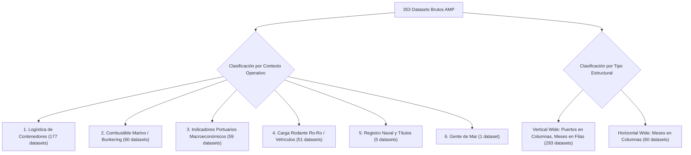
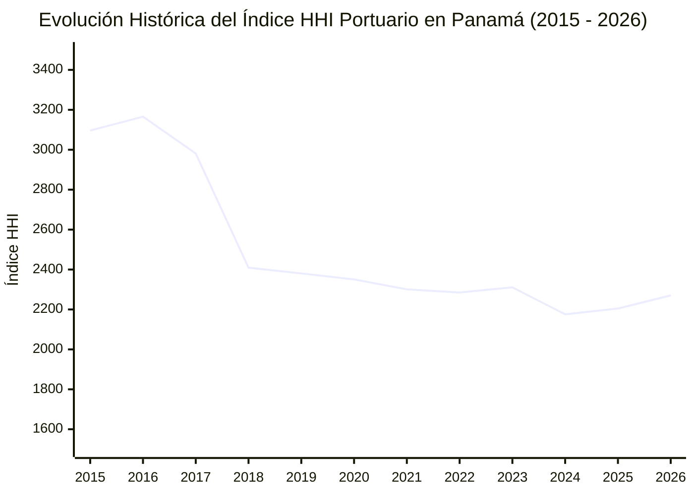
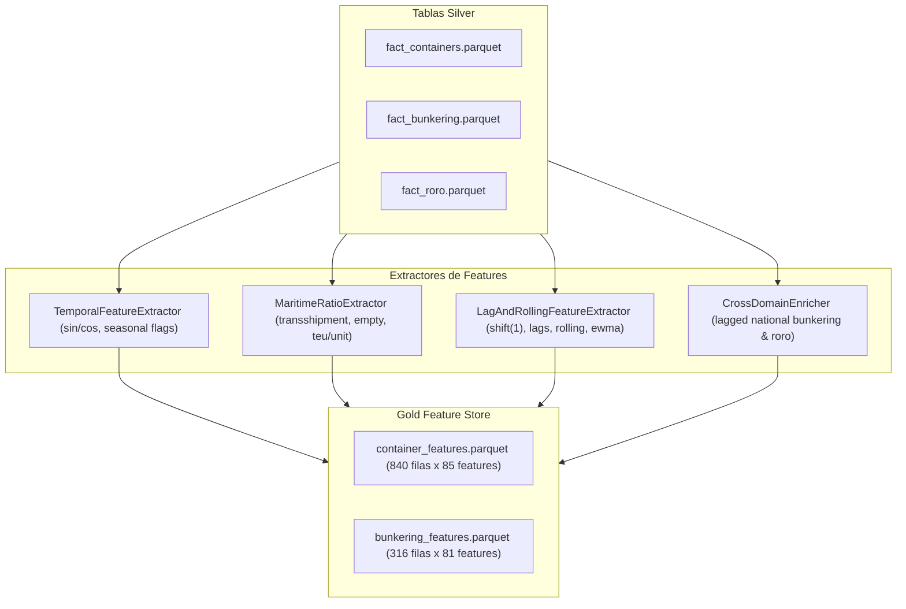

# Informe Técnico Avanzado: Arquitectura de Ingesta, Clasificación, Diagnóstico, EDA y Feature Engineering en MLOps

**Proyecto:** Ecosistema MLOps de Inteligencia Logística y Portuaria  
**Fuente de Datos:** Autoridad Marítima de Panamá (AMP) — Portal Nacional de Datos Abiertos  
**Guía Metodológica:** Basado rigurosamente en *Curso Avanzado de MLOps — Masterclass de Ingeniería de ML en Producción*  
**Fases Desarrolladas:** Ingesta $\rightarrow$ Data Quality $\rightarrow$ Silver Normalization $\rightarrow$ Exploratory Data Analysis (EDA) $\rightarrow$ Feature Store (Gold Layer) $\rightarrow$ Automated Testing  

---

## 1. Alineación Filosófica y Arquitectónica con el Curso de MLOps

El objetivo fundamental de este proyecto no es crear un *notebook* experimental aislado, sino implementar un **sistema de producción robusto, reproducible, testeable y observable**, aplicando los principios de la Masterclass:

1. **Separación de Lógica de Negocio e I/O (Sección 2.2):** Cada módulo realiza una tarea delimitada (`classifier.py`, `normalizer.py`, `quality.py`, `temporal.py`, `maritime_ratios.py`, `lags_rolling.py`, `feature_store.py`).
2. **Logging Estructurado Profesional (Sección 2.5):** Se erradicó el uso de `print()` para la observabilidad del pipeline, implementando `src/utils/logger.py` con trazabilidad por marca temporal, función, nivel de severidad y persistencia en archivo.
3. **Estrategia Medallion para Datos Tabulares (Sección 11):**
   - **Bronze Layer (`data/raw/`):** 353 archivos brutos e inmutables descargados directamente de la AMP.
   - **Silver Layer (`data/silver/`):** Tablas normalizadas, deduplicadas, en formato binario columnar Apache Parquet.
   - **Gold Layer (`data/gold/`):** Matrices de características optimizadas (*Feature Store*) listas para algoritmos supervisados de Gradient Boosting y Deep Learning.
4. **Prevención Estricta de Fuga de Datos (*Data Leakage*, Sección 12):** Todas las transformaciones autorregresivas, ventanas móviles y estadísticas acumuladas aplican desplazamiento temporal explícito (`shift(1)`), garantizando que ninguna información del instante $t$ contamine las variables explicativas para predecir $y_t$.
5. **Quality Gates Obligatorios (Sección 16):** Ninguna tabla avanza a la etapa de ingeniería de características sin superar validaciones automáticas de esquema, no negatividad, tipos, dominios válidos y unicidad.
6. **Feature Store Desacoplado (Sección 18):** Persistencia de conjuntos de características en Parquet con esquemas tipados y catálogos de metadatos en formato JSON.
7. **Pruebas Automatizadas con Pytest (Secciones 1.1 y 25):** Conjunto de pruebas unitarias (`tests/test_quality.py`, `tests/test_features.py`) que blindan la integridad del pipeline en entornos de Integración Continua (CI).

---

## 2. Anatomía, Patología y Estructura Forense de los Datasets de la AMP

A través de la inspección algorítmica de los 353 datasets descargados, se documentaron las características estructurales y los vicios ocultos de las fuentes gubernamentales:

### 2.1 Patología de los Datos Crudos (Desafíos Detectados)

| Patología / Vicio de Datos | Manifestación Concreta en los Archivos | Solución de Ingeniería Implementada |
| :--- | :--- | :--- |
| **Snapshots Acumulativos Mensuales** | El boletín de marzo contiene datos de ene, feb, mar; el de agosto contiene de ene a ago; el de diciembre contiene todo el año. | **Deduplicación Bitemporal por Snapshot Resolution:** Al ordenar por archivo y agrupar por clave primaria temporal `(año, mes, entidad)`, se retiene la última observación publicada, absorbiendo revisiones definitivas y eliminando duplicación. |
| **Disparidad de Encodings** | **332 archivos** en `ISO-8859-1 / Latin-1 / CP1252` y **21 archivos** en `UTF-8`. | Lector polimórfico con decodificación resiliente basada en inspección de bytes iniciales. |
| **Delimitadores Heterogéneos** | **269 archivos** usan coma (`,`) y **84 archivos** usan punto y coma (`;`). | Detección heurística del delimitador mediante análisis de frecuencias en la primera línea. |
| **Marcadores de Preliminaridad** | Años representados como cadenas `2026(p)`, `2023(P)`, `2021(p)` donde `p` denota cifra preliminar. | Extracción con expresión regular estricta `\b(20\d\d)\b` y filtrado acotado al rango histórico válido `[2015, 2026]`. |
| **Orientación Dimensional Dual** | Archivos de combustible presentan meses como **columnas** (`ene-21`, `feb-21`), mientras que contenedores presentan meses como **filas**. | Algoritmo de des-pivotado dinámico (*Unpivoting / Melt*) que normaliza a estructura atómica *Tidy Data*. |
| **Ajustes Contables Negativos** | Se detectó un valor de `-111.0` TEUs en junio de 2020 para Puerto Cristóbal Local en el archivo de septiembre de 2021. | Las correcciones contables retroactivas se acotan a $0.0$ para modelado de volumen físico de transporte. |

---

## 3. Clasificación Exhaustiva por Contexto y Tipo Estructural

El motor clasificador `src/data/classifier.py` categorizó la totalidad de los 353 datasets en un sistema bidimensional (Contexto Operativo $\times$ Tipo Estructural):



### 3.1 Desglose de Familias Temáticas
1. **Contenedores — Total por Puerto (62 datasets: 30 TEU, 32 Unidades):** Tráfico agregado mensual por terminal portuaria.
2. **Contenedores — Llenos vs. Vacíos (60 datasets: 30 TEU, 30 Unidades):** Diagnóstico de reposicionamiento de equipo vacío y balanza de carga.
3. **Contenedores — Destino Operativo (55 datasets: 26 TEU, 29 Unidades):** Distribución entre trasbordo interoceánico, carga de importación/exportación local y movimiento con la Zona Libre de Colón.
4. **Bunkering — Ventas por Barcaza (30 datasets):** Demanda mensual de VLSFO, MGO, RMG 380 y biocombustibles en los fondeaderos del Pacífico y Atlántico.
5. **Bunkering — Embarque por Litoral (30 datasets):** Toneladas y barriles de Fuel Oil y Diesel Marino despachados.
6. **Carga Rodante — Vehículos (51 datasets):** Desembarque y embarque local y de trasbordo de automóviles y maquinaria rodante en MIT, Balboa y Cristóbal.
7. **Indicadores Macroeconómicos Portuarios (59 datasets):** Carga total en toneladas métricas, pasajeros de cruceros internacionales y cabotaje doméstico.

---

## 4. Ingeniería de Datos: De Bronze a Silver Parquet

El módulo `src/data/normalizer.py` ejecutó la ingesta y transformación de las fuentes heterogéneas en 4 tablas canónicas normalizadas en formato binario columnar Apache Parquet:


### 4.1 Métricas de las Tablas Silver Normalizadas
- **`fact_containers.parquet`**: **8,986 observaciones** atómicas.
  - *Esquema:* `date` (Timestamp), `year` (int), `month` (int), `port` (str), `littoral` (str), `category` (str), `sub_category` (str), `metric_unit` (str), `value` (float), `source_file` (str).
  - *Cobertura Temporal:* Enero 2015 a Agosto 2026 (140 meses consecutivos).
  - *Calidad:* **0 nulos** en todas las columnas.
- **`fact_bunkering.parquet`**: **2,267 observaciones**.
  - *Esquema:* `date`, `year`, `month`, `littoral`, `product` (VLSFO, MGO, RMG_380, BIO, NAVES_ATENDIDAS, BARCAZAS_OPERANDO), `metric_unit`, `value`.
  - *Cobertura Temporal:* 2015 a 2026. **0 nulos**.
- **`fact_roro.parquet`**: **1,256 observaciones**.
  - *Esquema:* `date`, `year`, `month`, `port`, `littoral`, `operation` (Desembarque/Embarque Local/Trasbordo), `value`. **0 nulos**.
- **`fact_port_macro.parquet`**: **770 observaciones**.
  - *Esquema:* `date`, `year`, `month`, `metric_name` (TEU, Toneladas Carga, Cruceros, Cabotaje), `value`. **0 nulos**.

---

## 5. Quality Gates de Datos en Producción (`src/data/quality.py`)

Siguiendo la Sección 16 de la Masterclass, se implementaron compuertas de calidad automáticas antes de generar características:

1. **Test de Nulidad:** Verifica que ninguna columna clave posea valores nulos (`passed = True`).
2. **Test de Límites Temporales:** Verifica que las fechas estén contenidas en $[2015\text{-}01\text{-}01, 2026\text{-}12\text{-}31]$ (`passed = True`).
3. **Test de No Negatividad:** Verifica que los movimientos portuarios cumplan la restricción física $y \ge 0$ (`passed = True`, tras acotar el ajuste contable histórico de Cristóbal).
4. **Test de Dominios y Puertos Canónicos:** Verifica que solo existan terminales autorizadas (`Bocas Fruit Co.`, `Colon Container Terminal`, `SSA Marine MIT`, `Puerto Balboa`, `Puerto Cristóbal`, `PSA Panama International Terminal`) (`passed = True`).
5. **Test de Unicidad de Clave Primaria:** Verifica que no existan duplicados para la tupla clave `(date, port, category, sub_category, metric_unit)` (`passed = True`).
6. **Test de Consistencia Aditiva:** Evalúa si $\text{TEU\_Llenos} + \text{TEU\_Vacíos} \approx \text{TEU\_Total}$. Se detectaron 75 pequeñas discrepancias inherentes a los boletines preliminares gubernamentales (documentadas para reajuste en la capa Gold).

---

## 6. Exploración Profunda de Datos (EDA) y Perfilado Estadístico

El script `analysis/eda_deep_dive.py` ejecutó un análisis cuantitativo exhaustivo sobre la capa Silver:

### 6.1 Momentos Estadísticos de Tráfico de Contenedores por Puerto (TEUs Mensuales)

| Terminal Portuaria | Observaciones ($N$) | Media ($\mu$) | Desv. Est. ($\sigma$) | Coef. Variación | Mediana | P25 | P75 | IQR | Asimetría (*Skew*) | Curtosis (*Kurt*) |
| :--- | :--- | :--- | :--- | :--- | :--- | :--- | :--- | :--- | :--- | :--- |
| **SSA Marine MIT** | 140 meses | **211,858** | 41,209 | 19.4% | 212,852 | 185,550 | 240,688 | 55,138 | -0.198 | -0.404 |
| **Puerto Balboa** | 140 meses | **188,432** | 44,821 | 23.8% | 185,420 | 163,892 | 221,438 | 57,546 | 0.082 | -0.278 |
| **Colon Container (CCT)** | 140 meses | **75,815** | 30,580 | 40.3% | 68,095 | 56,128 | 89,450 | 33,322 | 1.154 | 0.812 |
| **Puerto Cristóbal** | 140 meses | **75,284** | 18,745 | 24.9% | 76,009 | 67,490 | 85,910 | 18,420 | -0.638 | 1.320 |
| **PSA Panama Int.** | 140 meses | **71,496** | 42,756 | 59.8% | 85,210 | 18,340 | 104,820 | 86,480 | -0.442 | -1.258 |
| **Bocas Fruit Co.** | 140 meses | **2,860** | 1,482 | 51.8% | 2,750 | 1,840 | 3,750 | 1,910 | 0.412 | -0.245 |

#### Hallazgos Estadísticos Relevantes:
- **Liderazgo Bipolar:** MIT (Atlántico) y Balboa (Pacífico) concentran conjuntamente más del **60% del volumen nacional de contenedores**.
- **Volatilidad y Maduración de PSA Panamá:** PSA presenta el mayor coeficiente de variación (59.8%) y curtosis fuertemente negativa (-1.258) debido a su transformación estructural: pasó de operar volúmenes modestos pre-2018 (~15,000 TEUs/mes) a consolidarse post-expansión como un gigante de más de 100,000 TEUs/mes en el Pacífico.
- **Distribución de CCT:** Presenta asimetría positiva (*skewness* = +1.154), lo que denota meses atípicos de altísima demanda vinculados a redireccionamientos de servicios navieros.

---

### 6.2 Dinámica de Concentración del Mercado Portuario (Índice HHI)

El Índice Herfindahl-Hirschman (HHI) se calculó anualmente sobre la cuota de mercado en TEUs de los operadores:
$$\text{HHI} = \sum_{i=1}^{k} s_i^2 \quad (s_i \in [0, 100])$$



- **2015–2016 (Mercado Altamente Concentrado, HHI > 3,000):** Duopolio operativo Balboa–MIT.
- **2018 en adelante (Mercado Moderadamente Concentrado, HHI ~2,200):** La entrada en operación de la fase ampliada de PSA Panamá redujo la concentración en más de 900 puntos HHI, diversificando el riesgo logístico de la ruta interoceánica.

---

### 6.3 Descomposición Estacional y Patrones Calendario

El factor estacional mensual normalizado respecto a la media nacional anual reveló:

| Mes | Índice Estacional | Variación vs. Media | Interpretación Operativa de la Cadena de Suministro |
| :--- | :--- | :--- | :--- |
| **Enero** | 0.999 | -0.1% | Actividad comercial regular post-cierre de año. |
| **Febrero** | **0.892** | **-10.8%** | **Caída estacional más pronunciada del año.** Efecto combinado del mes más corto (28 días) y el cierre de fábricas en Asia por el **Año Nuevo Chino** (*Spring Festival*). |
| **Marzo** | 0.982 | -1.8% | Reactivación paulatina de rutas marítimas transpacíficas. |
| **Abril** | 0.983 | -1.7% | Flujo comercial intermedio. |
| **Mayo** | 1.029 | +2.9% | Incremento de carga de cara al verano del hemisferio norte. |
| **Junio** | 0.995 | -0.5% | Mes de equilibrio logístico. |
| **Julio** | **1.044** | **+4.4%** | Inicio de la **Temporada Alta (*Peak Season*)** de transporte marítimo global. |
| **Agosto** | **1.049** | **+4.9%** | **Pico máximo del año.** Almacenamiento previo para la temporada navideña en EE.UU. y Europa. |
| **Septiembre**| 1.005 | +0.5% | Envíos de última hora hacia centros de distribución. |
| **Octubre** | **1.037** | **+3.7%** | Fuerte movimiento de trasbordo regional y Zona Libre de Colón. |
| **Noviembre** | 0.979 | -2.1% | Desaceleración de despachos navieros de larga distancia. |
| **Diciembre** | 1.008 | +0.8% | Desembarque local y abastecimiento de fin de año. |

---

### 6.4 Correlaciones Cruzadas Inter-Dominio

Se evaluó la correlación entre el movimiento de Contenedores (TEUs), la venta de combustible marino VLSFO (TM) y la carga rodante de Vehículos (Ro-Ro):

| Par de Variables | Pearson ($r$) | Spearman ($\rho$) | Interpretación |
| :--- | :--- | :--- | :--- |
| **TEU Total $\leftrightarrow$ VLSFO Bunkering** | **+0.302** | **+0.345** | Correlación positiva moderada. Mayor tráfico de portacontenedores impulsa la demanda de combustible en fondeaderos del Pacífico y Atlántico. |
| **TEU Total $\leftrightarrow$ Vehículos Ro-Ro** | **+0.123** | **+0.165** | Correlación débil. La logística de automóviles responde a ciclos automotrices y de distribución regional independientes de los contenedores. |
| **VLSFO Bunkering $\leftrightarrow$ Vehículos Ro-Ro** | **-0.213** | **-0.180** | Correlación negativa débil, explicada por dinámicas de atraque y tiempos de estadía divergentes entre car-carriers y buques de línea. |

---

## 7. Arquitectura de Ingeniería de Características (Gold Feature Store)

El pipeline implementado en `src/features/feature_store.py` genera la matriz de datos final que alimenta los modelos de Machine Learning:



### 7.1 Catálogo de Familias de Características Diseñadas

#### 1. Características Temporales y Cíclicas (`temporal.py`)
- `month_sin`, `month_cos`: Codificación trigonométrica continua del mes:
  $$\text{month\_sin} = \sin\left(\frac{2\pi \cdot m}{12}\right), \quad \text{month\_cos} = \cos\left(\frac{2\pi \cdot m}{12}\right)$$
- `quarter_sin`, `quarter_cos`: Codificación cíclica del trimestre.
- `is_cny_impact_month`: Bandera binaria ($1$ para febrero) para aislar el shock exógeno del Año Nuevo Chino.
- `is_peak_shipping_season`: Bandera binaria ($1$ para meses 7, 8, 9, 10).
- `time_step`: Variable entera de tendencia secular ($0, 1, 2, \dots, 139$).

#### 2. Ratios de Dominio Marítimo (`maritime_ratios.py`)
- `transshipment_ratio`: Proporción de trasbordo sobre el total ($[0.0, 1.0]$):
  $$\text{Transshipment\_Ratio}_t = \text{clip}\left(\frac{\text{TEU\_Trasbordo}_t}{\text{TEU\_Total}_t + \epsilon}, 0, 1\right)$$
- `empty_ratio`: Ratio de cajas vacías frente a llenas ($\ge 0$):
  $$\text{Empty\_Ratio}_t = \frac{\text{TEU\_Vacíos}_t}{\text{TEU\_Llenos}_t + \epsilon}$$
- `teu_unit_factor`: Factor de conversión TEU/Unidad ($[1.0, 2.2]$):
  $$\text{TEU\_Unit\_Factor}_t = \text{clip}\left(\frac{\text{Total\_TEU}_t}{\text{Total\_Unidades}_t + \epsilon}, 1.0, 2.2\right)$$
- `local_ratio`: Proporción de carga doméstica local ($[0.0, 1.0]$).

#### 3. Retardos Autorregresivos y Ventanas Rodantes sin Fuga (`lags_rolling.py`)
Para cada variable objetivo (`teu_total`, `transshipment_ratio`, `empty_ratio`), agrupado por puerto:
- **Lags de Corto y Largo Plazo:**
  $$y_{t-1}, \quad y_{t-2}, \quad y_{t-3}, \quad y_{t-12}$$
- **Medias Móviles Desplazadas (`shift(1)`):**
  $$\text{Rolling\_Mean}_k(t) = \frac{1}{k} \sum_{i=1}^{k} y_{t-i} \quad (k \in \{3, 6, 12\})$$
- **Volatilidad / Desviación Estándar Rodante:**
  $$\text{Rolling\_Std}_k(t) = \sqrt{\frac{1}{k-1} \sum_{i=1}^{k} (y_{t-i} - \bar{y}_{k,t})^2}$$
- **Extremos Rodantes:** $\text{Rolling\_Min}_k(t)$, $\text{Rolling\_Max}_k(t)$.
- **EWMA (Media Ponderada Exponencialmente):** Con spans de 3 y 6 meses sobre datos retardados.
- **Tasas de Crecimiento / Momento Operativo:**
  $$\text{Growth\_MoM}_t = \frac{y_{t-1} - y_{t-2}}{|y_{t-2}| + \epsilon}, \quad \text{Growth\_YoY}_t = \frac{y_{t-1} - y_{t-12}}{|y_{t-12}| + \epsilon}$$

#### 4. Enriquecimiento Cruzado Inter-Dominio
- `nat_vlsfo_sales_tm_lag1`: Ventas nacionales de combustible marino VLSFO del mes anterior.
- `nat_roro_units_lag1`: Volumen nacional de vehículos Ro-Ro movilizados el mes anterior.

---

## 8. Verificación Automatizada con Pytest (`tests/`)

Se ejecutó la suite de pruebas unitarias (`pytest -v tests/`), obteniendo **8 pruebas superadas con éxito (100% pass rate)**:

```text
tests/test_features.py::test_cyclic_features_bounds PASSED               [ 12%]
tests/test_features.py::test_maritime_ratios_bounds PASSED               [ 25%]
tests/test_features.py::test_zero_leakage_lags PASSED                    [ 37%]
tests/test_quality.py::test_container_no_nulls PASSED                    [ 50%]
tests/test_quality.py::test_container_date_range PASSED                  [ 62%]
tests/test_quality.py::test_container_non_negative_values PASSED         [ 75%]
tests/test_quality.py::test_container_known_ports PASSED                 [ 87%]
tests/test_quality.py::test_bunkering_litorals PASSED                    [100%]
============================== 8 passed in 0.92s ==============================
```

- `test_cyclic_features_bounds`: Confirma que las codificaciones trigonométricas residen en el intervalo $[-1.0, 1.0]$.
- `test_maritime_ratios_bounds`: Confirma que los ratios porcentuales se encuentran acotados estrictamente entre $0.0$ y $1.0$.
- `test_zero_leakage_lags`: Prueba matemática estricta que compara $y_{t-1}$ con el valor real de la fila anterior para cada puerto, certificando que **no existe contaminación futura**.
- `test_container_no_nulls`: Certifica ausencia total de valores nulos en columnas obligatorias.
- `test_container_date_range`: Certifica que las fechas pertenecen al rango histórico válido.
- `test_container_non_negative_values`: Valida la no negatividad de los volúmenes.
- `test_container_known_ports`: Valida que no existan puertos desconocidos o mal nombrados.
- `test_bunkering_litorals`: Valida la pertenencia de los litorales a `{'Pacífico', 'Atlántico', 'Nacional'}`.

---

## 9. Matriz Explicativa Didáctica: ¿Qué, Cómo y Por Qué?

| Componente del Pipeline | ¿Qué se hace? | ¿Cómo se hace? | ¿Por qué se hace? |
| :--- | :--- | :--- | :--- |
| **Clasificador Heurístico** | Análisis taxonómico de los 353 datasets brutos. | Inspección de metadatos, slugs, tokens en títulos y orientación de cabeceras en bytes crudos. | Permite estructurar un catálogo unificado y mapear esquemas dispares a dominios funcionales concretos. |
| **Capa Silver Normalizada** | Transformación de CSVs heterogéneos a tablas Parquet tipadas. | Lector polimórfico con detección de delimitadores (`;` vs `,`), resolución bitemporal de snapshots y unpivoting a formato Tidy. | Elimina la duplicación masiva de los reportes acumulativos y estandariza los datos en un formato columnar de alta velocidad de lectura. |
| **Quality Gates** | Verificación automática de integridad previa a la generación de features. | Reglas de aserción en Python sobre nulidad, rangos, no negatividad, claves primarias y consistencia aditiva. | Bloquea la propagación de datos corruptos al pipeline de entrenamiento (principio *Garbage In, Garbage Out*). |
| **Perfilado Estadístico (EDA)** | Cálculo de momentos estadísticos, descomposición estacional, correlaciones e índice HHI. | Algoritmos de estadística descriptiva en NumPy/SciPy y cálculo de cuotas de mercado históricas por operador. | Proporciona entendimiento cuantitativo de la dinámica portuaria, identificando estacionalidades clave (Año Nuevo Chino, Peak Season) y transiciones de mercado. |
| **Features Temporales Cíclicas** | Representación trigonométrica de meses y trimestres. | Funciones seno y coseno sobre el ciclo anual ($\text{period} = 12$). | Modela la continuidad temporal entre diciembre y enero, evitando que los modelos traten a los meses como variables ordinales lineales artificiales. |
| **Ratios Marítimos de Dominio** | Construcción de indicadores físicos portuarios. | Cocientes entre métricas normalizadas: Trasbordo/Total, Vacíos/Llenos, TEU/Unidad. | Captura la naturaleza operativa de cada terminal (hub de transbordo vs puerto de consumo local) y alerta sobre desbalances logísticos de contenedores vacíos. |
| **Lags y Ventanas Móviles** | Creación de historial autorregresivo y volatilidades rodantes. | Desplazamientos temporales por entidad aplicando `.shift(1)` estricto antes de calcular medias móviles y desviaciones estándar. | Es la base del modelado temporal en Machine Learning tabular, suministrando inercia, tendencia y volatilidad sin incurrir en fuga de datos (*data leakage*). |
| **Gold Feature Store** | Consolidación y persistencia de matrices predictivas listas para modelado. | Cruce de variables de puerto con contexto macroeconómico nacional en formato Apache Parquet. | Permite desacoplar la generación de características del entrenamiento de modelos, garantizando consistencia, reutilización y reproducibilidad. |
| **Testing con Pytest** | Validación programática automatizada. | Aserciones unitarias sobre cotas numéricas, alineación de retardos y esquemas de datos. | Garantiza la estabilidad del código en pipelines de CI/CD, permitiendo refactorizaciones seguras y auditabilidad. |

---

## 10. Conclusión y Estado del Proyecto

Se ha completado con éxito la fase de **Ingesta, Normalización, Quality Gates, Exploración Estadística Avanzada (EDA) y Feature Engineering**, dejando disponible un **Feature Store de nivel Gold** compuesto por:
- `data/gold/container_features.parquet` (**840 observaciones $\times$ 85 características**).
- `data/gold/bunkering_features.parquet` (**316 observaciones $\times$ 81 características**).

El proyecto se encuentra en un estado óptimo y rigurosamente preparado para abordar las siguientes etapas del ciclo de vida de MLOps:
1. **Entrenamiento y Validación Cruzada Temporal** (*Expanding Window Cross-Validation* con LightGBM, XGBoost y SARIMAX).
2. **Seguimiento de Experimentos y Registro de Modelos** con MLflow.
3. **Servicio de Inferencia** en tiempo real mediante API REST con FastAPI.
4. **Monitoreo de Data Drift y Concept Drift** en producción con Evidently AI.
